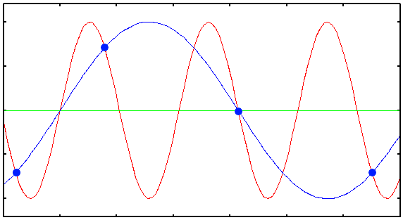

\pagebreak

# Music

## Human senses

Before starting this chapter, I'm expecting you to understand that human brains are biologically evolved computers. They are massive networks of interconnected cause/effect gates, which can dynamically change their behavior (Unlike a silicon computer gate, which has a fixed behavior over time) to learn stuff. These interconnected gates excite each other through electrical impulses. Electrical impulses are the language with which our neurons talk with each other. So, in order to sense something from the external world, some kind of translation is needed, and that's why we have **Senses**.

There are 6 different kinds of ways a human brain can make sense of the external world. Here is the list, we used to call it the 5 main senses, but there are actually 6 (Do not confuse it with the paranormal sixth sense in the fictions!):


| Name    | Organ      | Stimulus                    | Stimulator    |
|---------|------------|-----------------------------|---------------|
| Sight   | Eyes       | Light                       | Physical self |
| Hearing | Ears       | Sound                       | Larynx        |
| Balance | Inner-ears | Acceleration                | ?!            |
| Smell   | Nose       | Chemical substances         | Sweat         |
| Taste   | Tongue     | Chemical substances         | ?!            |
| Touch   | Skin       | Position/Motion/Temperature | Touch/Hit     |

Human brains need to communicate with each other in order to maximize their evolutionary goals, but they are not directly wired to each other (Imagine they were actually connected to each other directly through wires, an interesting question would be, would they then become a single person?) So what is the solution? How can a conscious piece of meat trapped inside a hard skull communicate with other brains? Pretty much like regular computers you have in your home, brains do also have external auxillary hardware connected to them. Eyes, ears, nose, tongue and skin are examples of devices that are connected to the brain to allow it to sense effects of the external world.

After all, our brain's language is the flow of electricity inside denderites and axons. Before reading the answer, let's imagine we are The Creator and we are going to design a communication system for our creatures to transfer data t

In this chapter I would like to talk about one of the pleasurable inventions of human beings, music. You hear it everyday, whether as an artistic piece to please your ears, or the sound you hear from your phone when you press a key. I believe composing and playing sounds is one of the most important applications of a computer, which is very underrated topic in computer science. Musical notes are lego pieces of our mind. Putting the right notes in the right order can manipulate a mind, bringing sadness, happiness, excitement, horror, magic and all kinds of emotions in a human brain. The good news is, sound waves, which are the most primitive components of music, can be easily generated a computer, because there are ways to convert electrical causes to mechanical effects. Guess what kind of effect a computer is good at generating it? With the current technology, it’s not trivial to generate “smell” effects. We will go through the history of sound and we will try to understand it by breaking a music to its most primitive parts, and in the end of this chapter, we will be able to make your hear a symphony of beethoven by writing a program that outputs nothing but numbers.

Understanding music will make you a better programmer, because music itself is all about playing with lego pieces, which is what we programmers basically do everyday.

## History of vibration

Thomas Alva Edison, some people think of him as a bad guy who stole Tesla’s ideas. We are not here to judge, anyways, he was an inventor and made inventions through his life that had big impacts in our history and were inspiring many people. Here I want to talk about one of his inventions which I myself find very primitive and impressive, the Phonograph (Nowadays we call them Gramophone too) (1877).

Phonographs, as defined in Wikipedia, are devices that can record and reproduce music. The idea behind it is both very smart and simple. Imagine a needle on a rotating disk, where the needle is connected to something like a loudspeaker, which vibrates when someones speaks near it. The needle drills holes on the disk when it vibrates. As the disk rotates, there will be different holes with different depths over time, effectively recording the intensity of air pressure over time.

There is an organ in our body that can vibrate the air in different rates, larynx. When people speak, a neural effect is effectively causing a mechanical effect, which is vibration of the larynx. (Unrelated to this section, but can't resist to tell you that when you speak, somebody hears, and that hearing will cause neural effects. So human communcations are basically neural transistors, capable of building complicated computers which are able to do weird stuff)

Here is a cause/effect analysis of a phonograph: a mechanical effect (Vibrating air) will cause another mechanical effect (Vibrating needle) which will itself cause another mechanical effect which is drilling holes on the disk.

Now imagine we stop recording, rotate the disk in reverse direction so that the needle is on its original position and start again. The holes on the disk will cause vibration on the needle which will itself cause vibration of the loudspeaker which will cause vibration of the air will cause vibration of our eardrum, which will end up as an electrical signal in our brain.

Here is a very useful engineering principle for you: a rotating disk, or basically anything (Physical or conceptual) that can capture the intensity of a world property, can record it. This tape can later be replayed.

If you look closely, you will figure that there is also something familiar and interesting happening when a phonograph plays a music, the vibration applied on the phonograph needle is not able to vibrate the air around it and create sound, but the vibration is routed to the mechanical loudspeaker and somehow intensified there, before reaching our ears, very similar to an electrical amplifier. That's exactly what happens in a transistor, with the difference that the type of cause and effects in a transistor is electricity.

How do we hear? To answer this question, we have to first figure how a vibration (Mechanical effect) is causing a neural stimulation (Electrical effect) in our brain.

Sound is the result of flowing of a mechanical wave through the air. Air is the context here, in a vacuum environment, sound won’t pass. Humans are able to shake the air in their lungs and generate sound. This sound passes through the air and reaches to ears of other humans. Through this process, neural effects in one brain causes neural effects in another brain. Building a meta computer that we call it “society”. (Though, this is not the only medium, people can record their neural effects on a piece of paper by writing, causing neural effects in humans of the future)

Now I want you to think about the translation process here. How is a neural effect translated into a sound in our system? And how is a mechanical cause converted to a neural effect when the sound reaches our ears? Before analyzing a human larynx, I would like to you how a electrical speaker works. The way an electrical speaker generates sound is actually much simpler than a human. An electrical speaker is basically a electromagnet (A magnet in which magnetic field is generated by the flow of electricity through a coil), that is installed besides another magnet which is connected to an elastic plate. When current flows in the coil, the imposed magnetic field will pull the other magnet and the plate. When the current stops flowing, magnetic field goes away and the plate will go back to its original position. You can see the obvious conversion of an electrical wave into a mechanical wave here.

Another interesting fact is that, the same system can act like an electrical microphone too (Remember a phonograph could both record and play music?). Vibration of air will vibrate the magnet which is connected to the plate, and that magnet will impose an electrical flow inside the coil. Voila!

## Primitive sounds

We now know that a single electrical signal is enough to generate voices and also, a single mechanical signal is enough to hear voices. But unfortuantely, that's not how a brain generates/analyzes sounds. The reason is that analyzing a single signal is too complicated, and the nature has not been smart enough to design a brain that is able to hear with a single signal.

When you are in a party, everybody dancing to a loud music, you still can hear what your friend is saying, which is very amazing, because, sound is a single signal, a single stream of intensities. The loud music and the voice of your friend are combined into a single signal and mixed together. The reason you can hear your friend even in a loud room is the same reason you can recognize the taste of an energy drink inside a cocktail, even when it has too many ingredients (Loud in some sense!), even though everything is mixed together. Because there are different receptors that can recognize different primitive elements of that sense, whether hearing or tasting. In case of tasting, the primitive elements of a taste are probably sweetness, sourness, bitterness and etc. But what is the primitive element of an audio signal?

Joseph Fourier, the french mathematician, described that a function/signal can be expressed as the sum of a series of sine or cosine terms. This means that pure sine functions can be primitive elements that form a signal. If we combine two different sine terms of different frequencies by summing them, we can still get them back after a conversion, which is called a Fourier Transform.

So theoritically, if someone speaks in some frequency range, and someone else speak in another frequency range, our brain will be able to distinguish between these two, even if they speak at the same time. If their frequency ranges are too close, it will become hard for brain to understand what each of them is saying. So, human larynx has evolved in a way so that everyone has a unique frequency range!

Enough talking, let's write a program to generate sounds of different frequencies, and their combinations, and then hear how it sounds. This will help you understand the concept much better!

In order to generate a wave of frequency $f$, you can use this formula:

$sin(2\pi ft)$

There is a program in Linux distributions named `pacat`. PulseAudio Cat's goal is to allow you directly put sound samples on your computer's speaker. It does this at default rate of 44100 samples per second. By default, it gets signed 16bit integer from its standard input and plays it on your speaker by differentiating the voltage applied on the speakers magnet plate. When the sample has lowest possible value (-32768), maximum negative voltage is applied and the plate is pulled, and when the samples has highest possible value (32767), the plate is pushed. A sample of value 0 means zero voltage which means zero magnetic field and the plate remains in its orginal position. Given that the sample ratio is 44100, we should substitute the $t$ variable with $\frac{n}{44100}$ where $n$ is the sample number: $sin(2\pi f\frac{n}{44100})$

```python=
import sys
import struct
import math


# Send sound sample to stdout as a 16-bit signed integer
def put(x):
    sys.stdout.buffer.write(struct.pack("h", int(x * 32767)))


sample_rate = 44100  # Rate per second
step = 1 / sample_rate
length = 5  # Seconds
freq = 440


def f(t):
    return math.sin(t * 2 * math.pi * freq)


t = 0
for _ in range(sample_rate * length):
    put(f(t))
    t += step
```

`put(x)` function is getting a floating point value $-1 \leq x \leq 1$ as its input and putting a signed short integer between $-32768 \leq s \leq 32767$ into the stdout. It is the main gate which allows us to convert an electrical cause to a mechanical effect, by vibrating a magnetic plate in your computer!

Redirect your script's output to the `pacat` program and hear the voice of your program:

```bash
pacat <(python3 music.py)
```

Now let's combine two frequencies and hear how it sounds!

```python
def f(t):
    a = math.sin(t * 2 * math.pi * 440)
    b = math.sin(t * 2 * math.pi * 660)
    return (a + b) / 2
```

We are taking an average from `a` and `b` so that the output value remains between -1 and 1.

If you hear this function, you will actually notice that it consists of two sounds. Your brain can successfully decomposite the output wave into two sounds, and this is amazing! The reason that you can recognize the 440Hz and 660Hz sound in the output of this script is the same reason you can hear your friend in a loud room full of noise, your brain is able to decouple sounds with different frequencies.

Now that we are able to generate sounds of different frequencies, I want you to do an experiment. Try generating frequencies that are of the form $2^nf$. E.g. try hearing these frequencies: $440, 880, 1760, 3520, \dots$

```python=
def f(t):
    sec = t * sample_rate
    if sec < 1:
        return math.sin(t * 2 * math.pi * 440)
    elif sec < 2:
        return math.sin(t * 2 * math.pi * 440 * 2) # 880Hz
    elif sec < 3:
        return math.sin(t * 2 * math.pi * 440 * 2 * 2) # 1760Hz
    elif sec < 4:
        return math.sin(t * 2 * math.pi * 440 * 2 * 2 * 2) # 3520Hz
```

In the code above, we are generating different frequencies through time. We start with 440Hz, and we double the frequency every 1 second.

Hear them carefully, and then compare how they sound when their frequency is doubled. Try a different coefficient. Generate sounds that are of the form: $1.5^nf$: $440, 660, 990, 1485, \dots$

We can discover something very strange and important here. Sounds that are generated when the frequency is doubled each time, are very similar to each other (At least, to our brain). While in the second experiment, sounds seem to be different with each other. If the sounds that are generated in the first experiment are similar, then what makes them different?

Let's try another experiment (This time without coding!). Play one of your favorite musics and try to sing on it. Try to sing on it with lower and higher pitches. Even though you have changed your voice, your singing still "fits" the song. By singing on a song with higher pitch, you won't shift your frequency by some number, but you will actually multiplying it by a power of two. A man and woman with totally different frequency ranges can both sing on the same song, but both of the singings will "fit" on the song, as long as the frequencies are multiplies of powers of 2. I think it's now safe two say, frequencies that are twiced every time, have same feelings.

Let's start with 300Hz. We calculate powers of two multiplied by the base frequency. Here is what we get:


`..., 37.5Hz, 75Hz, 150Hz, 300Hz, 600Hz, 1200Hz, 2400Hz, ...`

Let's agree that they are all basically the same "sound", and let's put a name on them. Let's call them S1.

Whatever frequency we take from the range 300Hz-600Hz, there will also exist the corresponding "same-feeling" sound in ranges 75-150, 150-300, 600-1200, 1200-2400 and etc.

Conversely, we can also conclude that any random frequncy have an corresponding "same-feeling" frequency in 300Hz-600Hz range. In order to find its same-feeling frequency, we just need to halve/double it, until it gets between 300Hz-600Hz. (E.g. let's start with 1500Hz, we halve it 2 times and we get 375Hz which exists in the range, so 375Hz is the equivalent same-feeling sound of 1500Hz). We know there are infinite number of frequencies between 300Hz-600Hz. A single S1 is not enough for creating beautiful pieces of music. We could only build Morse codes out of the single sounds! So let's discover and define other sounds in the same range.

Imagine we define S2 as a sound that is in the middle of two S1s. Given that the self-feeling sounds are repeated in a loop, here is what we should expect:

```
S1 - 75Hz
S2 - ?Hz
S1 - 150Hz
S2 - ?Hz
S1 - 300Hz
S2 - ?Hz
S1 - 600Hz
S2 - ?Hz
S1 - 1200Hz
```

What is the definition of middle? Let's say, $C$ is in the middle of $A$ and $B$, when the distance between $C$ and $A$ is equal with the distance between $C$ and $B$. How is *distance* defined in case of frequencies? As a first guess, we can take the average of two S1 frequencies in order to find the S2 frequency.

```
S1 - 75Hz
S2 - (75 + 150)/2 = 112.5Hz
S1 - 150Hz
S2 - (150 + 300)/2 = 225Hz
S1 - 300Hz
S2 - (300 + 600)/2 = 450Hz
S1 - 600Hz
S2 - (600 + 1200)/2 = 900Hz
S1 - 1200Hz
```

As you can see in the calculations, you can get other S2 sounds by multiplying/dividing any S2 sound by powers of 2, just like what happened with S1. So the derived S2 frequencies are all valid and all same in terms of their feelings.

This is not the only way one can define the "middle" frequency here. Imagine instead of taking the average, we multiply the numbers, and take their square-root instead. This is called an "multiplicative" average, or a geometric mean (As opposed to an arithmetic-mean that we used in the first example):

$m=\sqrt{ab}$

We know that the frequencies are doubled in each iteration, so $b=2a$. Substituting this in the equation we get: $m=\sqrt{2a^2}=a\sqrt{2}$

```
S1 - 75Hz
S2 - 75 x sqrt(2) = 106.06Hz
S1 - 150Hz
S2 - 150 x sqrt(2) = 212.13Hz
S1 - 300Hz
S2 - 300 x sqrt(2) = 424.26Hz
S1 - 600Hz
S2 - 600 x sqrt(2) = 848.52Hz
S1 - 1200Hz
```

As you can see, both of these definitions of "middle" give us valid sounds (By valid, I mean they are frequencies that are same-feeling), that indeed are in the middle of the S1 frequncies. The first definition of "middle" gives us numbers that have same arithmetic distance with the S1 frequencies ($m-a=b-m$), while in the second definition, the results are numbers that have same multiplicative distance with the S1 frequencies ($\frac{m}{a}=\frac{b}{m}$). Unfortunately, each of these defintions of middle is giving us different middle frequencies.

So, the million dollar question is, which one is the more appropriate defintion of "middle" here?

Let's look to those numbers again, this time without considering the middle frequencies. Take 3 consecutive S1s in a row. (E.g `300Hz 600Hz 1200Hz`). By definition, if we take 3 consecutive sounds, the second one is in the middle of the first and third sound. If we forget about our artificial middle frequencies and take a stream of S1s as our reference sounds, are the middle frequencies the artithmetic or the geometric mean of the other frequencies? 

Let's say our 3 consecutive sounds are $2^ka$, $2^{k+1}a$ and $2^{k+2}a$. How can we calculate the middle frequency if we only had the values for the first and the third frequency? Let's try both artithmetic and geometric means.

$m_a=\frac{2^ka+2^{k+2}a}{2}=\frac{2^k(a+4a)}{2}=5\times 2^{k-1}a$

$m_g=\sqrt{2^ka \times 2^{k+2}a}=2^{k+1}a$

Obviously, geometric mean is the natural definition of "middle" in a raw stream of S1 frequencies, so it makes a lot of sense to define middle as the geometric mean.

Good to mention that another bug also happens when we try to define middle frequencies with arithmetic means. Although S2 resides in the middle of two S1s, S1s do not reside in the middle of S2s! $\frac{112.5 + 225}{2} \neq 150$. This does not happen when we use geometric means: $\sqrt{106.06 \times 212.13}=150$.

Fortunately, we have been able to find a way to halve frequency ranges and create new same-feeling sounds out of them! But are 2 sounds enough for making a song? Well, we don't have to stop here. We can still find the middle of a S1 and a S2 and define a new S3 sound. The middle of the gap between an S2 and the next S1 can also define a new S4 sound. We can build infinitely many sounds just by halving the frequency gaps!

Enough explanation. Given that you now know how same-feeling sounds are derived, let's talk about the standard frequencies that are used in the music we hear everyday. Just like how we defined a base frequency S1 for deriving new sounds, music composers also defined a base frequency (That is 440Hz) and derived the other sounds out of it. They called their base frequency **A**, splitted the gap between two consecutive **A**s into 12 different sounds (Probably because 12 was big enough to make big variations of music and small enough so that the sounds remain distinguishable for human ears) and named the 11 other derived sounds as `A# B C C# D D# E F F# G G#`. How can you take 12 sounds out of a base frequency? New sounds can be derived by multiplying the previous sound by $\sqrt[12]2 \simeq 1.05946$. Starting from $A$ sound, if you do this 12 times, you get back to the next same-feeling A sound again, because $\sqrt[12]2^{12}=2$.

```
A = 440Hz
A# = 440 * 1.05946 = 466.16
B = 440 * 1.05946^2 = 493.88
C = 440 * 1.05946^3 = 523.25
C# = 440 * 1.05946^4 = 554.37
D = 440 * 1.05946^5 = 587.33
D# = 440 * 1.05946^6 = 622.25
E = 440 * 1.05946^7 = 659.25
F = 440 * 1.05946^8 = 698.46
F# = 440 * 1.05946^9 = 739.99
G = 440 * 1.05946^10 = 783.99
G# = 440 * 1.05946^11 = 830.61
```

Let's get our hands dirty and play some melodies with these sounds!

`E E E _ E E E _ E`


-----

After playing some melodies by generating different frequencies in a sequence, you might nag that the notes are very pure, emotionless, and not at all close to what we hear when we press a key on a piano, and you are right. We are generating pure sine-waves, meaning that what we hear contains only a single frequency. If you analyze the sound coming out of a musical instrument, you will notice that not only it contains frequencies other than the main frequency, but also the strength of those frequencies change over time.

It's not easy to generate a piano sound using pure sine frequencies, but there are other ways we can oscillate a loud-speaker, letting us to get more creative and generate sounds that are more interesting and weird.

Imagine sharp jumpings to -1 and +1 instead of smoothly going up and down like a sine wave. This will make a square wave that feels very differently. Square-waves have vintage feeling, since the game consoles back then didn't have speakers with enough precision for generating sound with needing smoother movement of the speaker's magnetic plate. All they could do was to sharply pull and push the magnetic plate!

Here are some other forms you can oscillate a speaker. Try hearing them all!

**Different oscillators - Sawtooth - Square - Triangle**

## Sine

```python
import math

def Sine(freq):
    def f(t):
        return math.sin(2 * math.pi * freq * t)
    return f
```

## Square

```python
import math

def Square(freq):
    def f(t):
        if math.floor(2 * t) % 2 == 0:
            return 1
        else:
            return -1
    return f
```

## Sawtooth

```python
def Sawtooth(freq):
    def f(t):
        ...
    return f
```

## Triangle

```python
def Triangle(freq):
    def f(t):
        ...
    return f
```

## Delay

```python
def Delay(sampler, delay):
    def f(t):
        return sampler(t - delay)
    return f
```

## Compose

```python
def Compose(samplers):
    def f(t):
        v = sum([sampler(t) for sampler in samplers])
        return v
    return f
```

## Playing notes

```python
music = Compose([
    Delay(Adsr(Sine(440), 1, 1, 1, 1, 1, 0.7), 0),
    Delay(Adsr(Sine(440), 1, 1, 1, 1, 1, 0.7), 1.5),
    Delay(Adsr(Sine(440), 1, 1, 1, 1, 1, 0.7), 3),
    Delay(Adsr(Sine(440), 1, 1, 1, 1, 1, 0.7), 4.5),
])
```


**ADSR**

Hearing all these compositions of different oscillators, you may still notice that the sounds are far from being pleasant to your ears, and one of the main reasons is that the intensity of those sounds is constant in time, while in real-world, a note gets loud with a delay, and will smoothly lose its intensity as time passes. One way we can bring such effect in our simulation is to actually manipulate the volume of our oscillator through time.

One of those methods, known as ADSR (Attack, Delay, Sustain, Release), assumes that a musical note starts with a volume of 0, quickly reaches its peak volume and then quickly gets down to relatively quieter volume, stays there for a longer time and then starts decreasing its intensity until it reaches zero.

These timings might be different for different instruments, and they do not neccessarrily change linearly. For the sake of simplicity, we will assume the changes all happen in a linear fashion. Here is a graph:

[ADSR chart]

Fortunately, applying an ADSR effect is as simple as multiplying the ADSR function with the oscillator function!

```python
def Adsr(sampler, a_dur, d_dur, s_dur, r_dur, a_level, s_level):
    def f(t):
        if t < 0:
            coeff = 0
        elif t < a_dur:
            coeff = (t / a_dur) * a_level
        elif t < a_dur + d_dur:
            coeff = a_level - ((t - a_dur) / s_dur) * (a_level - s_level)
        elif t < a_dur + d_dur + s_dur:
            coeff = s_level
        elif t < a_dur + d_dur + s_dur + r_dur:
            coeff = s_level - ((t - a_dur - d_dur - s_dur) / r_dur) * s_level
        else:
            coeff = 0
        return sampler(t) * coeff
    return f
```

## Macro Music Language

Macro Music Language (MML) is a very old and deprecated music description language for storing melodies on computers. MML was originally designed to be used in video games back in 70s, so you probably can't find a lot of software that can play MML files, though I chose to introduce and implement this format since it's fairly simple to implement and there are plenty of music available in this format which you can test your synthesizer with. Here is a brief spec of this language:

[TODO: MML Spec]

[TODO: MML Composer]

```python
def ComposeMML(mml):
    return Compose([
        # ...
    ])
```

## Frequency Modulation

One of the interesting sounds you can try to generate is the sound of a siren. A siren is a device that can generate a loud sound, with alternating frequency. The frequency is alternated itself in a sine pattern. Assuming the sound's frequency alternates between $f_1$ and $f_2$, we can calculate frequency, by time, as follows:

$f=f_1 + (f_2-f_1)\frac{sin(t) + 1}{2}$

We already know altering the intensity of a sound is as simple as applying a coefficient to its sampler function. If you multiply the above function with an oscillator, its volume will alternate. Knowing that we can generate sine wave with frequency $f$ with $sin(2.\pi.f)$, you may conclude that the sound of a siren can be modeled by substituting $f$ with the alternating $f$ formula:

$sin(2.\pi.(f_1 + (f_2-f_1)\frac{sin(t) + 1}{2}))$

Try to generate and play this sound. It will sound weird, not at all like a siren. But why?

[TODO: Frequency modulation]

How can we emulate an ear in a computer

$X_k=\sum\limits_{n=0}^{N-1}{x_n.e^{-i2\pi kn/N}}$


## Reverb, sound tracing and …

## Sound is data

## Electromagnetism

Sounds are the result of vibrating air propagating through space. Sound is a kind of wave. When you disturb a still water from some point, the disturbance will start propagating from that point. A cause on a point will have effects on points far from the original point. Just like water (Or any other liquid), waves can be propagated through gases too. Waves are a very important mean of communication. Humans mainly use sound waves for communication. They disturb the air by vibrating their larynx, and the diturbance will propagate in air until it reaches the ears of the listener. Computers can communicate through sound too. Using what you have learnt so far, you can write programs that can encode data as sound and send it through the air to another computer.

Since the sounds we make are propagated through air, without air, we won't able to speak with each other. If you put two people in a vacum space, all they'll see is their friend's lips moving without hearing anything! That's why astronomers communicate through walkie-talkies with each other!

World is a strange place, besides particles and materials, there are non-mechanical things too. Even wondered what prevents two magnets with same poles to get close to each other? If you try to get them close, you'll feel there is "something" in between them, but there actually is nothing. It turns out that moving that "thing" (As the result of moving the magnet), can disturb the area around it too, just like when you move inside water.

Here's another way to think about it: Imagine your entire body is floating in the water in a swimming pool. Assume that the water is completely still, and it will remain so as long as you also remain still and don't move any part of your body. A very slight movement of your hand will create a disturbance in the water (in this case, the water represents the context). Your hand's disturbance will start propagating and reach all parts of the pool. The effect is not immediate, and it will take some time for the motion to reach other areas of the pool. If you start vibrating your hand with some frequency, you will soon see that a slighter vibration (with the same frequency) will begin happening in other parts of the water. The farther the destination point, the more time it takes for the motion to reach, and the less powerful the vibration will be. The very same thing happens in the air. We are all floating in a pool of air, and any movement in the air will have effects on the way air moves. That's why we can communicate with each other. In this case, the context is "air."

Now, there exists a more unusual kind of context in which waves can occur. We can assume that space is filled with some kind of unknown matter that gets distorted when magnets/electrons move through it. This is the context where electromagnetic waves can propagate. This is the context which our cell-phones, wireless networks, gps satellites, remote controls communicate through. The disturbances in this medium are propagates with speed of light, and that’s one of the reasons why we building our computers to communicate through sounds ( which propagate through air, with a speed of 300ms, a lot less than the speed of light)

Metals are also isolated environments in which certain kind of waves can propagate. Imagine having two wires, connected to a power source with a voltage of 5V. Assume we slowly decrease the voltage to 0. The fact is, the effect is not immediate, and the decrease in voltage will reach the end of the wire with some delay!

Einstein claimed that there can’t be anything faster than light [TODO]

If you even remove the sun from the solar system, the earth will keep orbiting around the missing sun for about 7 minutes, [TODO]

Heinrich Hertz, the German physicist, was the first to prove the existence of electromagnetic waves (that's why the unit of frequency is Hertz). James Clerk Maxwell (we'll learn more about his work in the next chapters) predicted the existence of such waves even before Hertz. However, Hertz was the first to show that they truly exist. He accomplished this by capturing the transmitted waves through an antenna he built himself. It's amusing to know that Hertz believed his invention was worthless and had no use, as he said:

"It's of no use whatsoever... this is just an experiment that proves Maestro Maxwell was right—we have these mysterious electromagnetic waves that we cannot see with the naked eye. But they are there."

It's challenging to imagine our world nowadays without his invention. Hertz's story is a good example that demonstrates the potential and impact of studying seemingly useless science in our lives.

Hertz's transmitter and antenna were straightforward, and you can build one yourself if you're curious enough.

Although your computer can generate electromagnetic waves in specific frequency ranges (such as WiFi and Bluetooth), unfortunately, it's not possible to generate arbitrary electromagnetic waves. I always wished there was a way to generate electromagnetic waves by putting wave samples on a wave generator hardware (just like what we do with audio). There are good reasons why manufacturers have not included hardware for that in your computer. If you could generate arbitrary waves, you could interfere with many government-controlled facilities, including national television and radio.

Waves are waves, whether mechanical or electromagnetic; they all share very similar traits. The most important and useful feature of a wave is its ability to transfer data.

Studying waves and how you can utilize them to connect people together is a fascinating topic in both computer and electrical engineering. As I always say, experimenting is the best way to learn. So, throughout the next sections, we are going to experiment with waves using an easy-to-generate kind of wave. We know that it's not possible to generate electromagnetic waves with your computer, and we have also seen how easy it is to generate sound waves. Therefore, we will stick to sound waves and try to transfer different kinds of data between computers through sounds!

## Distribute sound, radio stations

Sound is the primary medium of communication for humans, but unfortunately, speaking becomes ineffective when your audience is far away, and the reason is that sound waves lose energy as they propagate in the space.
The world was a very different place before the invention of telecommunication technologies. The only way you could communicate with your beloved ones (Who were far away), was to send them physical letters. In the best case, your letter could be delivered in the time it took to transfer a physical object from you to your destination (Which was not very fast obviously). There are faster things in universe by which you can transfer messages of course, light is an example. Lights are also waves, just like sounds, but unfortunately we can't "hear" electromagnetic waves, so we can't use them directly, as a medium of "verbal" communication. We can try to design an intermediary language for translating sentences to visual effects and vice versa. The simplest example of such protocol, is some coding technique known as Morse codes.

Invented in the 1830s by an American artist, Samuel Morse (Yes, sometimes artists are pioneers of technology), Morse code is a method for encoding/decoding latin-alphabet letters into a series of signals (Electrical or visual). It is worth noting that Morse-codes are designed in a way such that the most frequent letters in latin-alphabet have shorter signal representations.

{ width=250px }

## Hearing with your computer

PulseAudio's `pacat` program lets you to put raw audio samples on your computer's speakers. On the other hand, there is another program `parec` which allows you to record audio samples. `pacat` puts whatever it gets through stdin on your computer's speaker, while `parec` puts audio samples it gets through your computer's microphone on stdout. Using these commands together you can record and play audio:

```
parec > record.wav
pacat < record.wav
```

Another interesting thing to experiment is to pipe the the `parec`'s output into `pacat`. Spoiler alert! Your voice will be echoed:

```
parec | pacat
```

Now let's try to pass the `parec`'s input through a filter that we'll write in Python, and hear its output via `pacat`:

`parec | python3 filter.py | pacat`

Here is a simple filter that allows only half of the samples to go through (`filter.py`):

```python
import sys, struct

def get():
    return struct.unpack('h', sys.stdin.buffer.read(2))[0] / 32767

def put(x):
    sys.stdout.buffer.write(struct.pack("h", int(x * 32767)))

while True:
    get() # Skip one sample
    put(get())
```

You will hear a high-pitched version of your voice! (Since skipping the waves-samples will make the waves in the input sound to seem like they are alternating two times faster).

By skipping one of the samples per every two sample, we were able to halven the length of the sound, increasing the speed and frequency of the input sound by a factor of two.

Looking carefully, by skipping the samples, what we are actually doing is taking the samples like this:

$out[i] = in[2i]$

Changing the coefficient to 3, makes our input sound 3 times faster. but what if we want to make it only x1.5 faster?

$out[i] = in[1.5i]$

Unfortunately, all kinds of digital signals which we process in a computer are discrete, meaning that they are sequences of numbers, the result of sampling the signal over a fixed interval, and you don’t directly have the signal in between two intervals. Although we don’t have the signal data between two intervals, we can predict them with a good accuracy! A very simple prediction model assumes that the distance between two consecutive samples goes through a line!

In other words, you can assume that $inp[5.5] \simeq \frac{inp[5] + inp[6]}{2}$

So far, we have had done a lot of experiments using the `pacat` command, and now it's the time to see what can be done if we allow other computers to receive wave-samples. We have learnt to compose sounds, now its time to decompose them! Putting samples on your computer’s speaker allows you to make disturbance in the air around your computer’s speaker. The disturbance, as seen in the previous sections, will propagate in the space finally reach your ears and you will hear it. Computers can hear those disturbances too, through microphones. Using these two devices together you can build protocols with which computers can talk with each othrr, without any wire connection.

The disturbance doesn’t necessarily need to happen in the air, for example you can basically build devices that can disturb the water in a pool in one side and build a device to detect and listen to the disturbances in the other side of the pool. Using these two, two computers may communicate with each other through water waves!

## Fourier Transform

Fourier-Transform is a method/algorithm by which you can extract frequencies within a wave-form. Remember we could generate sounds that were compositions of two sine-waves with different frequencies? When hearing those sounds, your brain is able to successfully recognize the presence of two different frequencies in what it hears, and that is actually why we are able to understand what someone is saying in a crowded environment with a lot of noise. Our brain is able to focus on a certain frequency (Which is the frequency-range of your friend's larynx). If our brains are able to decompose sounds by their frequency, it's reasonable to think that computers can do that too. Fourier-Transform is the answer. Given a list of signal samples, it will tell you what frequencies are present in that signal. Here is an example:

```python
import cmath  # Math for complex numbers
import math
import matplotlib.pyplot as plt


def fft(x):
    N = len(x)
    if N <= 1:
        return x
    even = fft(x[0::2])
    odd = fft(x[1::2])
    T = [cmath.exp(-2j * cmath.pi * k / N) * odd[k] for k in range(N // 2)]
    return [even[k] + T[k] for k in range(N // 2)] + [
        even[k] - T[k] for k in range(N // 2)
    ]


def get_freqs(x):
    result = [abs(v) / (len(x) / 2) for v in fft(x)]
    return result[: len(x) // 2]


def sine(freq, t):
    return math.sin(2 * math.pi * freq * t)


def sampler(t):
    return sum(
        [
            sine(440, t)
            + 5 * sine(1000, t)
            + 2 * sine(2000, t)
            + 0.5 * sine(9000, t)
            + 8 * sine(16000, t)
        ]
    )


samples = [sampler(t / 32768) for t in range(32768)]
freqs = get_freqs(samples)

plt.plot(freqs)
plt.show()
```


Assuming our sample-rate is $2^n$, the $get_freqs$ function will get an array of size $2^n$ (The signal samples), and will return an array of size $2^{n-1}$. The $i$th element of this array tells your the presence of a sine wave with $i$Hz frequency in your input signal. The reason that the output array has half of the number of elements in the input array comes back to the fact that, in order to be able to recognize a signal of frequency $f$, you need to at least have $2f$ samples of that signal (E.g you can't recognize a 20000Hz frequency in a signal, if your sample-rate is 30000).



Humans are able to hear sounds with frequencies as high as around 20000Hz, that's why the typical sample-rate for audio files is something around twice of 20000. (A sample-rate of 44100 is pretty popular!).

## Noises, noises everywhere...

Unfortunately, the air is full of noises, if you start speaking while two computers are transmitting data through audio, the disruption may corrupt data, leading unwanted data to be sent on the destination computer. Even the echo/reflections of the sound in the environment may have negative effects (Remember, all waves share similar traits, reflections happen for electromagnetic waves too)

There are methods and algorithms by which you can detect and correct errors in data transfers.

For the sake of simplicity, we won’t discuss error correction. We will try to provide an effective way for error detection, and ask the sender computer to resend the data in case it detects errors.


Telephone 1896 grahambell

Alec Reeves - inventor of pcm 1930s

James Russel - 1978 - store music on optical

Hdd 1956 IBM

Digital data transfer samuel morse early 19th

1950 computers connected dedicated communication lines

Aliasing claude shannon

Humans love to store and copy. If you can copy or store something, you can transfer it. You can write your thoughts on a letter and then give it to your lover to read

Humans dream: being able to share their past experience to the present and future. To the people that are not near them. To people in the future even after they physically die, because life has evolved in a way to keep you alive as long as possible, sometimes the conceptual version of you, and not the physical you. That’s probably why people proudly compromise their lives for something they believe in, because it will make them eternal. Life is strange.