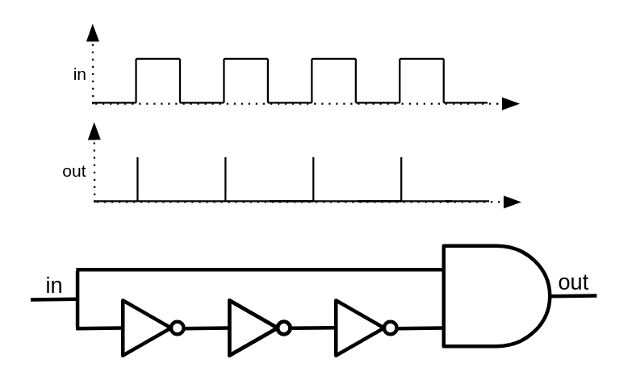

# Build!

## Which came first? The chicken or the egg?

Imagine, for a second, that a catastrophic event occurs, causing us to lose all the technology we once had. Nothing but ashes will remain, and our situation will be similar to that of humans millions of years ago, with one difference: We still can read, and fortunately, there are plenty of books available explaining how our modern technology worked. Now here is an interesting question: How much time will it take to reach the point of advancement we are in right now?

My prediction is that we will get back on track only after a few decades, and the only reason this could take longer than expected is that we will need tools for building other tools. Obviously, we can't start building a modern CPU even though we have the specification and the detailed design of that CPU. We will first need to rebuild tools that we need for building complex electronic circuits. If we are completely out of technology (as we assumed), we will need to learn again how we can find and extract the materials we want from the earth and use them to build the simple tools we'll need, which will then be used for building more complicated tools. Here is a very important fact that makes all the technological progress we have had viable: ***technology can help accelerate its own creation***!

Just like the chicken and egg paradox, I was always wondering how people built the very first compilers and assemblers for the first time. What language did they use for describing the very first assembly languages? Did they have to write the early assembler programs directly in 0s and 1s? After a bit of research, I figured that the answer is yes. In fact, as an example, the process of building a C compiler for the first time is as follows:

1. You write a C compiler directly in machine-assembly (Or some other language),
2. You'll rewrite the same C compiler in C.
3. You'll compile the new source-code using the compiler written in assembly.
4. Now you can completely ignore the assembly implementation, and assume that, your C compiler was written in C in the first place!

See this beautiful loop here? Technology maintains and reproduces itself, which kind of means, ***technology is a form of life!*** The simpler computer language (in this example, machine-assembly) helped the C-compiler to emerge, but after the compiler started to live, it could stand on its own feet. We won't need the machine-assembly implementation of it anymore, since there is nothing preventing us from describing a C-compiler in the C programming language!

Now let's get back to our original question. Which one was first, the chicken or the egg? If you look through the history of evolution, you will see that the creatures millions of years ago were not reproducing by dropping eggs. Basic living cells, for example, never had to reproduce like that; they would only cut themselves into two pieces. As living creatures get more complicated, phenomena like dropping eggs will "slowly" start to emerge. The very first chicken-like animal, which started to lay eggs, didn't necessarily come out of an egg. It could just be a mutation that brought about the egging behavior for a new generation, just like how a C compiler started to live, without depending on an assembly implementation of it!

## When the dominos fall

If you ask someone who is really into computers about how computers work at very deep levels, he will most probably start by telling you about electronic switches, transistors, and logic gates. Well, I'm also going to do the same, but in a slightly different way! Even though transistors are the basic building blocks of almost all modern computers, the real magic that makes computers do their thing is something I'd like to refer to as "Cause & Effect" chains.

I would like you to start by listing a few examples of "Cause & Effect" scenarios that happen in everyday life. Here is my list (please think and add yours too):

 - You press a key on your computer -> A character appears on the screen -> **END**
 - You push the first domino -> The next domino falls -> The next domino falls -> ...
 - You ask someone to open the window -> He opens the window -> **END**
 - You tell a rumor to your friend -> He tells the rumor to his friend -> ...
 - You toggle the switch -> The light bulb turns on -> **END**
 - A neuron fires in your brain -> Another neuron gets excited as a result and fires -> ...

Now, let's think about why some of these cause-and-effect chains keep going on and on, while others stop after just a few steps. Why do some things set off a series of events, while others don't?

There's a crucial pattern here: The long-lasting (i.e., interesting) effects emerge from cause-and-effect chains where ***the effects have the same type as the causes***, which essentially means these chains are interesting when they can form cycles. For instance, when a "mechanical" cause has another "mechanical" effect (like dominos), or when an "electrical" cause leads to another electrical effect (like electronic circuits).

The most complex thing you can create with components that transform a single cause into a single effect is no different than a chain of falling domino pieces (another example is when rumors circulate in a company). It's still impressive and has its interesting aspects, but we don't want to stop there. We want to build things that can transform multiple causes into a single effect (all with the same types), and that's when Cause & Effect chains truly shine! The simplest example of such a component is a switch. A switch manages the flow of an input to an output through a third controlling input. An example of a non-electrical switch is a faucet. A faucet allows you to control the flow of water in a pipe (considered as a single-cause/single-effect component) through a third input.

We won't delve deep into the inner workings of transistors just yet, but let's assume that transistors are components capable of converting electrical causes into electrical effects. This ability allows us to connect them together and create interesting things. In essence, transistors can be accurately described as switches, quite similar to push-buttons but with a key difference. A push-button is a component that accepts an electrical and a mechanical input, producing an electrical output.

[IMG push-button]

However, a push-button is definitely not a transistor because not all of its input causes are electrical. You still need a finger to push the button, and the output of a push button cannot be used as the mechanical input of another button. Therefore, you can't build domino-like structures with push-buttons! The push-button becomes more similar to a transistor when its mechanical input is substituted with an electrical input. In this case, all of its inputs and outputs will have the same types, allowing you to connect them together. Let's fix this!

Before starting to think of a electrical switch that can be controlled through an electrical cause, be aware that sometimes a cause/effect conversion is actually the result of many other cause/effect conversions chained together, occurring under the hood. For example, consider a light bulb connected to a push-button. In this system, the process begins with a person pushing the switch, initiating a mechanical action. Right after that, the mechanical cause triggers an electrical effect, and the electrical cause produces a visual effect, which eventually results in neural effects in your brain. The entire process converts a mechanical cause into a neural effect that can be sensed by a human brain. (Notice how new converters can be built by connecting/chaining other primitive converters.)

Now, here is a very stupid example of a push-button that has an electrical controller: Imagine there is a human that has a wire in his hand. This person turns the pushes the push-button when he feels electricty in his hand (Of course if the electricity is not strong enough to kill him). It might be the strangest thing in the world, but if you have enough of these transistors connected with each other, you can theoritically build computers out of it that can connect to the internet and render webpages!

Now that you get why something like a transistor might be handy, let's talk about transistors themselves. Formally speaking, a transistor is a resistor that its resistance can transform according to an electrical input. A transistor is something that can convert two electrical causes into single electrical effect. Transistors are very interesting candidates for building computers, because:

 1. They can convert causes to effects of the same type, directly! (Electricity)
 2. They can be made in very small sizes (Nanometers?).
 3. They are very fast!

Because of these properties, we can build complicated and dense cause/effect chains and get interesting behaviors out of it by consuming very small amount of space (E.g your smartphone).

## Taming the electrons

Practically, if you want to build a real logic circuit and synthesize it on real silicone, you would describe your circuit in a hardware-description-language. Two most famous as of today are VLSI/Verilog. Since this book is about ideas we will try to emulate the same concept in Python programming language.

The most important primitives in our circuit emulations are wires. Wires, as their name suggest, are basically conductors, usually made of metal that allow our components to connect to each other, and talk to each other through the flow of electricity. The most important property of a wire is its voltage.

It is very important to understand the meaning of voltage. Formally, voltage is defined as the potential energy difference between two points of a circuit. Let's forget about electricity for a while and try to understand the concept by talking about heights. You know that it takes energy to pick up something heavy from the ground. The more you lift a heavy object, the more energy it is consumed (Because you get tired right? You need to get the energy back by eating food!). The law of conservation of energy says that, energy can neither be created nor destroyed; rather, it can only be transformed or transferred from one form to another. So, where does the consumed energy go when you lift something up?

Release what you have in your hand and let it fall. The heavy object will hit the ground, make a bang song, and it might even break the ground (Or itself). The more height the object has from the ground, the more damage it will make. It is also obvious that, energy is needed in order to make noises and damages. Where did that energy come from?

Now you know the answer! When you lifted the heavy object, you actually gave energy to it, and when you let it fall, the energy you gave got released! Physicist call this energy as potential energy. A lifted object has the potential to do work (Work is done by consuming energy), that's probably why we refer it as potential energy!

If you remember high-school physics, you know that the potential energy of an object can be calculated with the formula: \\(u=mgh\\) where \\(m\\) is the mass of the object, \\(h\\) is its height from the ground, and \\(g\\) is earth's gravity constant (Which is around \\(9.807\\)). Given this formula, when the object lies on the ground, \\(h\\) is 0 thus the potential energy is also 0. A very important question, does that mean, an object that lies on the ground does not have any potential energy? Well, it has! Take a shovel, dig the ground under the object, and the object will fall into the hole. The point is, the equation is giving you the potential difference, not the actual potential energy of that object! A more correct version of that equation would be: \\(\varDelta{u}=mg\varDelta{h}\\), which says, the potential energy difference between two points A and B is \\(mg\\) times the difference of their heights! It's relative!

The reason it takes energy to lift an object roots back to the fact that giant masses attract each other, a.k.a the universal law of gravitation (\\(F=G\frac{m_1m_2}{r^2}\\)). Since a very similar law also exists in the microscopic world (Electrons attract protons and defeat electrons, \\(F=k_e\frac{q_1q_2}{r^2}\\)), we have a similar concept of "potential energy" in the electromagnetic world too. It takes energy to pull two electrical charges of different types (Positive/Negative) from each other, and when you do so, and then release them, they will start moving to each other and release their energy.

That's basically the way batteries work, they try to make potential differences by moving electrons to higher "heights", and when you let them fall (By connecting a wire from the negative pole of the battery to the positive pole), the electrons will start to fall through the wire. So when we say "Voltage", we mean a difference of height/potential-energy. We don't exactly know what is the absolute height/potential-energy of points A and B, but we certainly know the height/potential difference!

## Wires

Enough explanation, lets jump into the code. Now that we know the concept of voltage, we can emulate an electrical wire. Our model of a wire is a piece of conductor which has a certain "height" (Voltage!). We'll use instances of wires to feed the inputs of our gates and retrieve their outputs. Normally, in electronic circuits, there are only two possible voltages, representing logical zeros and ones, so it might make sense to allow our `Wire`s to only accept two different states. In the real world however, you might make mistakes while designing your circuits. You might connect the ends of your wire to endpoints with different voltages, causing short-circuits. You might also forget to connect your wire to anything at all. In this case, the voltage of the wire represents neither 0 nor 1.

A wire in our emulation can have 4 different states:

* Free (The wire is not connected to anything)
* Zero (The wire is connected to the ground thus has 0 voltage)
* One (The wire has a voltage of 5.0V)
* Unknown (We can not determine if the wire is 0 or 1)

By default, a wire that is not connected to anywhere, is in the "Free" state. When you connect it to a gate/wire that has a state of One, the wire's state will also become One. A wire can connect to multiple gates/wires at the same time. The wire will get into the Unknown state when you connect it to two other wires/gates with conflicting values. E.g. if the wire is connected to both Zero and One sources at the same time, it's state will be Unknown.

We can calculate the truth table of wire logic to better understand the concept:

| A | B | A + B |
|---|---|-------|
| Z | Z | Z     |
| 0 | Z | 0     |
| 1 | Z | 1     |
| X | Z | X     |
| Z | 0 | 0     |
| 0 | 0 | 0     |
| 1 | 0 | X     |
| X | 0 | X     |
| Z | 1 | 1     |
| 0 | 1 | X     |
| 1 | 1 | 1     |
| X | 1 | X     |
| Z | X | X     |
| 0 | X | X     |
| 1 | X | X     |
| X | X | X     |

A wildcard version of this table would look like this:

|   A   |   B   | A + B |
|-------|-------|-------|
|   Z   | **x** | **x** |
| **x** |   Z   | **x** |
|   X   | **x** |   X   |
| **x** |   X   |   X   |
|   0   |   0   |   0   |
|   1   |   1   |   1   |
|   0   |   1   |   X   |
|   1   |   0   |   X   |


Based on our definition of a wire, we can provide a Python implementation:

```python=
FREE = "Z"
UNK = "X"
ZERO = 0
ONE = 1


class Wire:
    def __init__(self):
        self._drivers = {}
        self._assume = FREE

    def assume(self, val):
        self._assume = val

    def get(self):
        curr = FREE
        for b in self._drivers.values():
            if b == UNK:
                return UNK
            elif b != FREE:
                if curr == FREE:
                    curr = b
                elif b != curr:
                    return UNK
        return curr if curr != FREE else self._assume

    def put(self, driver, value):
        is_changed = self._drivers.get(driver) != value
        self._drivers[driver] = value
        return is_changed
```

The code above models a wire as a Python class. By definition, a wire that is not connected to anything remains in the `Z` (Free) state. Through the `put` option, a driver (Which can be a batter, or a gate), may drive that wire with some voltage. The final voltage of your wire is then decided by iterating over all of the voltages that are applied to your wire.

Sometimes (Specifically in circuits containing feedback-loops and recursions, it's necessary to assume a wire already has some value to converge to a solution, thus we have designed an `assume()` function to set a assumed value for a wire, in case no gates have drived value into it).

## Magical switch

The most primitive element in a digital system is a transistor. A transistor is an electrical domino piece. It converts electrical causes to electrical effects. In very simple terms, a transistor is an electrically controlled switch. There are 3 wires involved which are known as *base*, *emitter*, and *collector*. The base wire is the controller of the switch. An electrical potential between the base and emitter wires will cause the collector wire to get connected with the emitter wire. In other words, the base wire will decide if emitter and collector are connected or not. The emitter will emit electrons and the collector will collect them.

https://upload.wikimedia.org/wikipedia/commons/3/37/Transistor.symbol.npn.svg

By observing the behavior of a transistor we will soon know that:

- If the potential-difference between the collector and base is high, the emitter pin will get connected to the collector pin.
- Otherwise, the emitter pin will be no different than a floating wire.

The second point is very important. It means that, turning the transistor off doesn't put the emitter pin on ZERO state, but it will put it on FREE state! Based on these, we can model a transistor using a truth-table like this:

| B | E | C          |
|---|---|------------|
| 0 | 0 | Z          |
| 0 | 1 | Z          |
| 1 | 0 | 0 (Strong) |
| 1 | 1 | 1 (Weak)   |

The transistor we have been discussing so far was a Type-N transistor. The Type-N transistor will turn on when the base wire is driven with a a high potential. There is also another type of transistor, know as Type-P, which will get turned on in case of a low voltage. The truth table for a Type-P transistor is something like this:

| B | E | C          |
|---|---|------------|
| 0 | 0 | 0 (Weak)   |
| 0 | 1 | 1 (Strong) |
| 1 | 0 | Z          |
| 1 | 1 | Z          | 

Assuming we define a voltage of 5.0V as 1 and a voltage of 0.0V as 0, a wire is driven with a strong 0, when its voltage is very close to 0 (E.g 0.2V), and it's a strong 1 when its voltage is close to 5 (E.g 4.8V). The truth is, the transistors we build in the real world aren't ideal, so they won't always give us strong signals. A signal is said weak when it's far from 0.0V or 5.0V, as an example, a voltage of 4.0V could be considered as a weak 1 and a voltage of 1.0V is considered as a weak 0. Type-P transistors that are built in the real world are very good in giving out strong 0 signals, on the other hand, Type-N transistors give out very good 1 signals. Using the help of those two types of transistors at the same time, we can build logic gates that give out strong output in every case.

## Primitives

In our digital circuit simulator, we'll have two different types of components: Primitive components and components that are made of primitives. We'll define our components as primitives when we can't describe them as a group of smaller primitives.

As an example, we can simulate Type-N and Type-P transistors as primitive components:

```python=
class NTransistor:
    def __init__(self, in_base, in_collector, out_emitter):
        self.in_base = in_base
        self.in_collector = in_collector
        self.out_emitter = out_emitter

    def update(self):
        b = self.in_base.get()
        if b == ONE:
            return self.out_emitter.put(self, self.in_collector.get())
        elif b == ZERO:
            return self.out_emitter.put(self, FREE)
        elif b == UNK:
            return self.out_emitter.put(self, UNK)
        else:
            return True  # Trigger re-update


class PTransistor:
    def __init__(self, in_base, in_collector, out_emitter):
        self.in_base = in_base
        self.in_collector = in_collector
        self.out_emitter = out_emitter

    def update(self):
        b = self.in_base.get()
        if b == ZERO:
            return self.out_emitter.put(self, self.in_collector.get())
        elif b == ONE:
            return self.out_emitter.put(self, FREE)
        elif b == UNK:
            return self.out_emitter.put(self, UNK)
        else:
            return True  # Trigger re-update
```

Our primitive components are classes with an `update()` function. The `update()` function is called whenever we want to calculate the output of that primitive based on its inputs.

## The circuit

Now, it'll be nice to have a data structure for keeping track of wires and transistors allocated in a circuit. We will call this class “Circuit”. It will give you methods for creating wires and adding transistors. It will also allow you to calculate the values of all wires in the network.

```python=
class Circuit:
    def __init__(self):
        self._wires = []
        self._comps = []

        self._zero = self.new_wire()
        self._zero.put(self, ZERO)
        self._one = self.new_wire()
        self._one.put(self, ONE)

    def one(self):
        return self._one

    def zero(self):
        return self._zero

    def new_wire(self):
        w = Wire()
        self._wires.append(w)
        return w

    def add_component(self, comp):
        self._comps.append(comp)

    def num_components(self):
        return len(self._comps)

    def update(self):
        has_changes = False
        for t in self._comps:
            has_changes = has_changes | t.update()
        return has_changes

    def stabilize(self):
        while self.update():
            pass
```

The `update` method tries to calculate the values of the wires by iterating through the transistors and calling their update method. In case of circuits with feedback loops, things are not going to work as expected with a single iteration of updates, and you may need to go through this loop several times before the circuit reaches a stable state. We introduce an extra method designed for reaching the exact purpose: `stabilize`. It basically performs update several times, until no changes is seen in the values of wires, i.e it gets stable.

Our electronic components can be defined as methods which will add wires and transistors to a circuit. Let’s go through the implementation detail of some of them!

## Life in a non-ideal world

Digital circuits are effectively just logical expressions that are automatically calculated by the flow of electrons inside what we refer as gates. Logical expressions are defined on zeros and ones, but we just saw that wires in an electronic circuit are not guaranteed to be 0 or 1. So we have no choice but to re-define our gates and decide what their output should be in case of faulty inputs.

Take a NOT gate as an example. The truth table of a NOT gate in an ideal world is this:

| A | NOT A |
|---|-------|
| 0 | 1     |
| 1 | 0     |

However, things are not ideal in the real-world, and wires connected to electronic logic gates could have unexpected voltages. Since a wire can have 4 different states in our emulation, our logic gates should also handle all the 4 states. This is the truth table of a NOT gate which gives you X outputs in case of X or Z inputs:

| A | NOT A |
|---|-------|
| 0 | 1     |
| 1 | 0     |
| Z | X     |
| X | X     |

There are two ways we can simulate gates in our simulator software. We either implement them through plain Python code, as primitive components just like transistors, or we describe them as a circuit of transistors. Here is an example implementation of a NOT gate using the former approach:

```python=
class Not:
    def __init__(self, wire_in, wire_out):
        self.wire_in = wire_in
        self.wire_out = wire_out

    def update(self):
        v = self.wire_in.get()
        if v == FREE:
            self.wire_out.put(self, UNK)
        elif v == UNK:
            self.wire_out.put(self, UNK)
        elif v == ZERO:
            self.wire_out.put(self, ONE)
        elif v == ONE:
            self.wire_out.put(self, ZERO)
```

We can also test out implementation:

```python=
if __name__ == '__main__':
    inp = Wire.zero()
    out = Wire()
    gate = Not(inp, out)
    gate.update()
    print(out.get())
```

The Not gate modeled in this primitive component is accurate and works as expected, however, we all know that a Not gate itself is made of transistors and it might be more interesting to model the same thing through a pair of transistors, instead of cheating and emulating its high-level behavior through a piece of Python code.

[NOT gate with transistors]

***AND gate:*** is zero when at least one of the inputs is zero, and gets One when all of the inputs are one. Otherwise the output is unknown.

| A | B | A AND B |
|---|---|---------|
| 0 | * | 0       |
| * | 0 | 0       |
| 1 | 1 | 1       |
|   |   | X       |

***OR gate:*** is one when at least one of the inputs is one, and gets zero only when all of the inputs are zero. Otherwise the output is unknown.

| A | B | A OR B |
|---|---|--------|
| 1 | * | 1      |
| * | 1 | 1      |
| 0 | 0 | 0      |
|   |   | X      |

Here is an example of a NOT gate, built with a type P and a type N transistor:

```python=
def Not(circuit, inp, out):
    circuit.add_component(PTransistor(inp, circuit.one(), out))
    circuit.add_component(NTransistor(inp, circuit.zero(), out))
```

Now that we've got familiar with transistors, it's the time to extend our component-set and build some of tthe most primitive logic-gates.

## Mother of the gates

A NAND gate is a logic-gate that outputs 0 if and only if both of its inputs are 1. It's basically an AND gate which its output is inverted. It can be proven that you can build all of the primitive logic gates (AND, OR, NOT), using different combinations of this single gate:

- \\(Not(x) = Nand(x, x)\\)
- \\(And(x, y) = Not(Nand(x, y)) = Nand(Nand(x, y), Nand(x, y))\\)
- \\(Or(x, y) = Nand(Not(x), Not(y)) = Nand(Nand(x, x), Nand(y, y))\\)

It's the mother gate of all logic circuits. Although, it would be very inefficient to build everything with NANDS in practice, for the sake of simplicity, we'll stick to NAND and will try to build other gates by connecting NAND gates to each other.


It turns out that we can build NAND gates with strong and accurate output signals using 4 transistors (x2 Type-N and x2 Type-P). Let's prototype a NAND using our simulated N/P transistors!

```python=
def Nand(circuit, in_a, in_b, out):
    inter = circuit.new_wire()
    circuit.add_component(PTransistor(in_a, circuit.one(), out))
    circuit.add_component(PTransistor(in_b, circuit.one(), out))
    circuit.add_component(NTransistor(in_a, circuit.zero(), inter))
    circuit.add_component(NTransistor(in_b, inter, out))
```

Now, other primitive gates can be defined as combinations of NAND gates. Take the NOT gate as an example. Here is a 3rd way we can implement a NOT gate (So far, we have had implemented a NOT gate by 1. Describing its behavior through plain python code and 2. By connecting a pair of Type-N and Type-P transistors with each other):

```python=
def Not(circuit, inp, out):
    Nand(circuit, inp, inp, out)
```

Go ahead and implement other primitive gates using the NAND gate we just defined. After that, we can start making useful stuff out of these gates.

```python=
def And(circuit, in_a, in_b, out):
    not_out = circuit.new_wire()
    Nand(circuit, in_a, in_b, not_out)
    Not(circuit, not_out, out)


def Or(circuit, in_a, in_b, out):
    not_out = circuit.new_wire()
    Nor(circuit, in_a, in_b, not_out)
    Not(circuit, not_out, out)


def Nor(circuit, in_a, in_b, out):
    inter = circuit.new_wire()
    circuit.add_component(PTransistor(in_a, circuit.one(), inter))
    circuit.add_component(PTransistor(in_b, inter, out))
    circuit.add_component(NTransistor(in_a, circuit.zero(), out))
    circuit.add_component(NTransistor(in_b, circuit.zero(), out))


def Xor(circuit, in_a, in_b, out):
    a_not = circuit.new_wire()
    b_not = circuit.new_wire()
    Not(circuit, in_a, a_not)
    Not(circuit, in_b, b_not)

    inter1 = circuit.new_wire()
    circuit.add_component(PTransistor(b_not, circuit.one(), inter1))
    circuit.add_component(PTransistor(in_a, inter1, out))
    inter2 = circuit.new_wire()
    circuit.add_component(PTransistor(in_b, circuit.one(), inter2))
    circuit.add_component(PTransistor(a_not, inter2, out))

    inter3 = circuit.new_wire()
    circuit.add_component(NTransistor(in_b, circuit.zero(), inter3))
    circuit.add_component(NTransistor(in_a, inter3, out))
    inter4 = circuit.new_wire()
    circuit.add_component(NTransistor(b_not, circuit.zero(), inter4))
    circuit.add_component(NTransistor(a_not, inter4, out))
```

Sometimes we just need to connect two different wires with each other, instead of creating a new primitive component for that purpose, we may just use two consecutive Nots, it'll act like a simple jumper! We'll call this gate a `Forward` gate:

```python=
def Forward(circuit, inp, out):
    tmp = circuit.new_wire()
    Not(circuit, inp, tmp)
    Not(circuit, tmp, out)
```

## Let's get useful

The simplest digital circuit which is also useful is something that can add two numbers. Obviously we will be working with bunary numbers. Let's start with a circuit that can add two, one-bit numbers. The result of such an addition is a two bit number.

A nice approach towards building logic such a circuit is to determine what the desired outputs are, for each possible input. Since the output is a 2-bit number, we can decompose such a circuit into two subcircuits, each calculating its corresponding digit.

| A | B | First digit | Second digit |
|---|---|-------------|--------------|
| 0 | 0 | 0           | 0            |
| 0 | 1 | 1           | 0            |
| 1 | 0 | 1           | 0            |
| 1 | 1 | 0           | 1            |

The second digit's relation with A and B is very familiar, it's basically an AND gate! Try to find out how the first digit can be calculated by combining primitive gates. (Hint: It outputs 1 only when A is 0 AND B is 1, OR A is 1 AND B is 0)

***Answer:*** It's an Xor gate! (\\(Xor(x, y) = Or(And(x, Not(y)), And(Not(x), y))\\)), and here is the Python code for it:

```python=
def HalfAdder(circuit, in_a, in_b, out_sum, out_carry):
    Xor(circuit, in_a, in_b, out_sum)
    And(circuit, in_a, in_b, out_carry)
```

What we have just built is known as a half-adder. With an half-adder, you can add 1-bit numbers together, but what if we want to add multi-bit numbers? Let's see how primary school's addition algorithm works on binary numbers:

```
 1111  1
   
  1011001
+  111101
-----------
 10010110
```

By looking to the algorithm, we can see that for each digit, an addition of ***3 bits*** is being done (Not just two). So, in order to design a multi-bit adder we'll need a circuit that adds 3 one-bit numbers together. Such a circuit is known as a ***full-adder*** and the third number is often referred as the carry value. Truth table of a three bit adder:

| A | B | C | D0 | D1 |
|---|---|---|----|----|
| 0 | 0 | 0 | 0  | 0  |
| 1 | 0 | 0 | 1  | 0  |
| 0 | 1 | 0 | 1  | 0  |
| 1 | 1 | 0 | 0  | 1  |
| 0 | 0 | 1 | 1  | 0  |
| 1 | 0 | 1 | 0  | 1  |
| 0 | 1 | 1 | 0  | 1  |
| 1 | 1 | 1 | 1  | 1  |

Building a full-adder is still easy. You can use two Half-adders to calculate the first digit, and take the OR of the carry outputs which will give you the second digit.

```python=
def FullAdder(circuit, in_a, in_b, in_carry, out_sum, out_carry):
    sum_ab = circuit.new_wire()
    carry1 = circuit.new_wire()
    carry2 = circuit.new_wire()
    HalfAdder(circuit, in_a, in_b, sum_ab, carry1)
    HalfAdder(circuit, sum_ab, in_carry, out_sum, carry2)
    Or(circuit, carry1, carry2, out_carry)
```

Once we have a triple adder ready, we can proceed and create multi-bit adders. Let's try building a 8-bit adder. We will need to put 8 full-adders in a row, connecting the second digit of the result of each adder as the third input value of the next adder, mimicking the addition algorithm we discussed earlier.

```python=
def Adder8(circuit, in_a, in_b, in_carry, out_sum, out_carry):
    carries = [in_carry] + [circuit.new_wire() for _ in range(7)] + [out_carry]
    for i in range(8):
        FullAdder(
            circuit,
            in_a[i],
            in_b[i],
            carries[i],
            out_sum[i],
            carries[i + 1],
        )
```

Before designing more complicated gates, let's make sure our simulated model of a 8-bit adder is working properly. If the 8-bit adder is working, there is a high-chance that the other gates are also working well:

```python=
def num_to_wires(circuit, num):
    wires = []
    for i in range(8):
        bit = (num >> i) & 1
        wires.append(circuit.one() if bit else circuit.zero())
    return wires


def wires_to_num(wires):
    out = 0
    for i, w in enumerate(wires):
        if w.get() == ONE:
            out += 2**i
    return out


if __name__ == "__main__":
    for x in range(256):
        for y in range(256):
            circuit = Circuit()
            wires_x = num_to_wires(circuit, x)
            wires_y = num_to_wires(circuit, y)
            wires_out = [Wire() for _ in range(8)]
            Adder8(circuit, wires_x, wires_y, circuit.zero(), wires_out, circuit.zero())
            circuit.update()
            out = wires_to_num(wires_out)
            if out != (x + y) % 256:
                print("Adder is not working!")

```

Here, we are checking if the outputs are correct given all possible inputs. We have defined two auxillary functions `num_to_wires` and `wires_to_num` in order to convert numbers into a set of wires which can connect to a electronic circuit, and vice versa.

## When addition is subtraction

So far we have been able to implement the add operation by combining N and P transistors. Our add operation is limited to 8-bits, which means, the input and output values are all in the range \\([0,255]\\). If you try to add two numbers, which their sum is more than 255, you will still get a number in range \\([0,255]\\). This happens since a number bigger than 255 can not be represented by 8-bits and an ***overflow*** will happen. If you look carefully, you will notice that what we have designed isn't doing a regular add operation we are used to in elementary school mathematics, but it's and addition that is done in a finite-field. This means, the addition results are mod-ed by 256:

\\(a \oplus b = (a + b) \mod 256\\)

It is good to know that finite-fields have interesting properties:

1. \\((a \oplus b) \oplus c = a \oplus (b \oplus c)\\)
2. For every non-zero number \\(x \in \mathbb{F}\\), there is a number \\(y\\), where \\(x \oplus y = 0\\). \\(y\\) is know as the negative of \\(x\\).

In a finite-field, the negative of a number can be calculated by subtracting that number from the field-size (Here the size of our field is \\(2^8=256\\)). E.g negative of \\(10\\) is \\(256-10=246\\), so \\(10 \oplus 246 = 0\\).

Surprisingly, the number \\(246\\), acts really like a \\(-10\\). Try adding \\(246\\) to \\(15\\). You will get \\(246 \oplus 15 = 5\\) which is equal with \\(15 + (-10)\\)! This has a important meaning, we can perform subtraction without designing a new circuit! We'll just need to negate the number. Calculating the negative of a number is like taking the XOR of that number (Which is equal with \\(255 - a\\)), and adding \\(1\\) to it (Which makes it \\(256 - a\\) which is our definition of negation). This is known as the two's-complement form of a number.

It's very incredible to see that we can build electronic machines that can add and subtract numbers by connecting a bunch of transistors to each other! The good news is, we can go further and design circuits that can perform multiplications and divisions, using the same thought process we had while designing add circuits. The details of multiplication and division circuits are beyond the scope of this book but you are strongly advised to study them yourself!

## Try to remember

What we care about right now is to design a circuit which is able to run arbitrary algorithms for us! An algorithm is nothing but a list of operations that need to be executed. So far we have been experimenting with state-less circuits, circuits that didn't need to memorize or remember anything in order to do their job. Obviously, you can't get much creative with circuits that do now store anything from the past, thus, we are going to talk about ways we can store data on a digital circuit circuit and keep it through time!

When you were a child, you have most probably tried to put a light-switch in a middle state. If the switch had been in good condition and quality, you know how frustrating it can get to do it! The concept of ***memory*** emerges when a system with multiple possible states can only stabilize in a single state at a time, and once it gets stable, the state can only be changed by an external force. A light-switch can be used as a single-bit memory cell. 

Imagine a piece of paper. It's stable. When you put it on fire, it slowly changes its state until it becomes completely burnt and stabilizes there. It's not easy to keep the paper a middle state. You can use a paper as a single bit memory cell. It's not the best memory cell and the most obvious reason is that you can't turn it back to its unburnt state!

Fortunately, there are ways you can build circuits with multiple possible states, in which only one state can stabilize. The simplest example of such a circuit is when you create a cycle by connecting two NOT gates to each other. There are two wires involved, if the state of the first wire is 1, the other wire will be 0 and the circuit will get stable (And vice versa). Such a circuit is also known as a Latch:

```python=
def DLatch(circuit, in_clk, in_data, out_data, initial=0):
    not_data = circuit.new_wire()
    Not(circuit, in_data, not_data)
    and_d_clk = circuit.new_wire()
    And(circuit, in_data, in_clk, and_d_clk)
    and_notd_clk = circuit.new_wire()
    And(circuit, not_data, in_clk, and_notd_clk)
    neg_out = circuit.new_wire()
    Nor(circuit, and_notd_clk, neg_out, out_data)
    Nor(circuit, and_d_clk, out_data, neg_out)

    neg_out.assume(1 - initial)
    out_data.assume(initial)
```

In our `DLatch` component, the `wire_out` pin is always equal with the internal state of the memory cell. Whenever `wire_clk` is equal with one, the value of `wire_data` will be copied into the state, and will stay there, even when we 

Simulating such a circuit in our Python simulator is a bit tricky: take a look at the schematic of a DLatch circuit, the input of the Nor cell is dependant on the output of tha latch. If we try to calculate the correct values of wires in a latch component for the first time, the simulation will crash when updating the Nor gate, because not all of its inputs are ready. There are two approaches by which we can fix our simulation:

1. Give up, and try to simulate a memory-cell component without doing low-level transistor simulations.
2. Break the update loop, when the state of the wires do not change after a few iterations (Meaning that the system has entered a stable state).

Since we want to make our simulation as accurate as possible, we'll go with the second route. We'll just describe our memory-cells as a set of transistors, and will try to converge to a correct solution by using the `assume()` function of our circuit.


```python=
def DFlipFlop(circuit, in_clk, in_data, out_data, initial=0):
    neg_clk = circuit.new_wire()
    Not(circuit, in_clk, neg_clk)
    inter = circuit.new_wire()
    DLatch(circuit, in_clk, in_data, inter, initial)
    DLatch(circuit, neg_clk, inter, out_data, initial)
```

Put 8 flip-flops in a row and you will have a 8-bit register!

```python=
class Reg8:
    def snapshot(self):
        return wires_to_num(self.out_data)

    def __init__(self, circuit, in_clk, in_data, out_data, initial=0):
        self.out_data = out_data
        for i in range(8):
            DFlipFlop(
                circuit,
                in_clk,
                in_data[i],
                out_data[i],
                ZERO if initial % 2 == 0 else ONE,
            )
            initial //= 2
```

I'm defining `Reg8` as a class, to define auxillary methods like `snapshot()` in order to make it easier to investigate the internal value of a register.

---

So far, we have been able to design a circuit that stays stable in a single state, and we can set its state by triggering it through an auxillary port we call "enable". This circuit is known as a Latch, and since it's hard to simulate it using bare transistors (Since there will be infinite loops which are unhandled by our simulator, as discussed), we are going to hardcode its behavior using plain Python code. It will have a fairly simple logic. It will accept a data and an enable wire as its inputs, and will have a single output. The output pin will output the current state of the Latch, and when 'enable' is 0, it will ignore the 'data' pin and won't change its state. As soon as the enable pin gets 1, the value of data pin will be copied to the internal state of the latch. We can describe the behavior of a Latch like this:

| Enable | Data | Output     |
|--------|------|------------|
| 0      | 0    | s          |
| 0      | 1    | s          |
| 1      | 0    | 0 (s <= 0) |
| 1      | 1    | 1 (s <= 1) |

A latch is an electronic component that can store a single bit of information. Later on this book, we will be building a computer with memory-cells of size 8-bit (A.k.a a byte). So it might make sense to put 8 of these latches together as a separate component in order to build our memory-cells, registers and RAMs. We'll just need to put the latches in a row and connect their enable pins together. The resulting component will have 9 input wires and 8 output wires.

## Make it count!

Considering that now we know how to build memory-cells and maintain a state in our circuits, we can know build circuits that can maintain an state/memory and behave according to it! Let's build something useful out of it!

A very simple yet useful circuit you can build, using adders and memory-cells, is a counter. A counter can be made by feeding in the incremented value of the output of a 8-bit memory cell, back as its input. The challenge is now to capture the memory cell input value by trigerring the cell to update its inner value by setting its enable pin to 1.

The enable input should be set to 1 for a very VERY short time, otherwise, the circuit will enter and unstable state. As soon as the input of the memory-cell is captures, the output will also change in a short time, and if the value of enable field is still 1, the circuit will keep incrementing and updating its internal state. The duration which the enable wire is 1 should be short enough, so that the incrementor component doesn't have enough time to update its output. In fact, we will need to connect a pulse generator to the enable pin in order to make our counter circuit work correctly, and the with of the pulse should be smaller than the duration by which the output of the incrementor circuit is updated.

One way we can have such pulses is to connect a regular clock generator to an edge-detector. The edge-detector is a an electronic circuit which can recognize sharp changes in a signal.

In the real world, since gates propagate their results with delays, strange things can happen. The gates may output unexpected and invalid results, known as hazards. Take this circuit for example:



When the input is 0, the output of the NOT gate is 1. When the input gets 1, the input wire without a NOT gate will get 1 immediately, but the second input will get 0 with a delay, thus there will be a very small moment where both of the inputs are 1, causing the AND gate to output 1.

Looking carefully to the behavior of this structure, we will notice that it can convert a clock signal into a train of pulses with ultra tiny widths. Let's connect this component to the enable pin of a Latch, so that the latch is updated only when a rise happens in the clock signal. The resulting circuit is known as a FlipFlop. The only difference between a FlipFlop and a Latch is that FlipFlops are edge-triggered while Latches are level-triggered. FlipFlops should be used instead of Latches in order to design synchronous circuits.

Let's simulate all these components and try to implement a counter circuit with FlipFlops:

```python=
class EdgeDetector:
    pass
```

```python=
class FlipFlop:
    pass
```

```python=
class Counter:
    def snapshot(self):
        print("Value:", self.counter.snapshot())

    def __init__(self, circuit: Circuit, in_clk: Wire):
        one = [circuit.one()] + [circuit.zero()] * 7

        counter_val = [circuit.new_wire() for _ in range(8)]
        next_counter_val = [circuit.new_wire() for _ in range(8)]

        Adder8(
            circuit,
            counter_val,
            one,
            circuit.zero(),
            next_counter_val,
            circuit.new_wire(),
        )

        self.counter = Reg8(circuit, in_clk, next_counter_val, counter_val, 0)


if __name__ == "__main__":
    circ = Circuit()
    clk = circ.new_wire()

    OSCILLATOR = "OSCILLATOR"

    clk.put(OSCILLATOR, ZERO)

    counter = Counter(circ, clk)
    print("Num components:", circ.num_components())

    while True:
        circ.stabilize()
        counter.snapshot()
        clk.put(OSCILLATOR, 1 - clk.get())
```

## Chaotic access

Now imagine we have a big number of these 8-bit memory cells which are identified by different addresses. We would like to build an electronic component which enabled us to read and write a memory-cell (Out of many memory-cells), given its address. We will call it a RAM, since we can access arbitrary and random addresses without losing speed (It's hard to randomly move on a disk-storage). In case of a RAM with 256 memory-cells (Each 8-bit), we'll need 17 input wires and 8 output wires.

The inputs are as follows:

1. 8 wires, choosing the memory-cell we want to read/write
2. 8 wires, containing the data to be written on the chosen cell when enable is 1
3. 1 enable wire

And the output will be the data inside the chosen address.

The memory-cells in our RAM will need to know when to allow write operation. For each 8-bit memory cell, enable is set 1 when the chosen address is equal with the cell's address AND the enable pin of the RAM is also 1: `(addr == cell_index) & enable`

We will also need to route the output of the chosen cell to the output of a RAM. We can use a multiplexer component here.

Now, put many of these registers in a row, and you will have a RAM!

```python=
class RAM:
    def snapshot(self):
        return [self.regs[i].snapshot() for i in range(256)]

    def __init__(self, circuit, in_clk, in_wr, in_addr, in_data, out_data, initial):
        self.regs = []
        reg_outs = [[circuit.new_wire() for _ in range(8)] for _ in range(256)]

        for i in range(256):
            is_sel = circuit.new_wire()
            MultiEquals(circuit, in_addr, num_to_wires(circuit, i), is_sel)
            is_wr = circuit.new_wire()
            And(circuit, is_sel, in_wr, is_wr)
            is_wr_and_clk = circuit.new_wire()
            And(circuit, is_wr, in_clk, is_wr_and_clk)
            self.regs.append(
                Reg8(circuit, is_wr_and_clk, in_data, reg_outs[i], initial[i])
            )

        for i in range(8):
            Mux8x256(
                circuit, in_addr, [reg_outs[j][i] for j in range(256)], out_data[i]
            )
```

Soon you'll figure that our simulator is not efficient enough to perform transistor level simulation of RAMs, so it might make sense to cheat a bit and provide a secondary, fast implementation of a RAM, as a primitive component that is described in plain Python code (Just like transistors):

```python=
class FastRAM:
    def snapshot(self):
        return self.data

    def __init__(self, circuit, in_clk, in_wr, in_addr, in_data, out_data, initial):
        self.in_clk = in_clk
        self.in_wr = in_wr
        self.in_addr = in_addr
        self.in_data = in_data
        self.out_data = out_data
        self.data = initial
        self.clk_is_up = False
        circuit.add_component(self)

    def update(self):
        clk = self.in_clk.get()
        addr = wires_to_num(self.in_addr)
        data = wires_to_num(self.in_data)
        if clk == ZERO and self.clk_is_up:
            wr = self.in_wr.get()
            if wr == ONE:
                self.data[addr] = data
            self.clk_is_up = False
        elif clk == ONE:
            self.clk_is_up = True

        value = self.data[addr]
        for i in range(8):
            self.out_data[i].put(self, ONE if (value >> i) & 1 else ZERO)

        return False
```

***Multiplexer***

A gate that gets \\(2^n\\) value bits and \\(n\\) address bits and will output the values existing at the requested position as its output. A multiplexer with static inputs can be considered as a ROM. (Read-Only Memory)

```python=
def Mux1x2(circuit, in_sel, in_options, out):
    wire_select_not = circuit.new_wire()
    and1_out = circuit.new_wire()
    and2_out = circuit.new_wire()
    Not(circuit, in_sel[0], wire_select_not)
    And(circuit, wire_select_not, in_options[0], and1_out)
    And(circuit, in_sel[0], in_options[1], and2_out)
    Or(circuit, and1_out, and2_out, out)


def Mux(bits, sub_mux):
    def f(circuit, in_sel, in_options, out):
        out_mux1 = circuit.new_wire()
        out_mux2 = circuit.new_wire()

        sub_mux(
            circuit,
            in_options[0 : bits - 1],
            in_options[0 : 2 ** (bits - 1)],
            out_mux1,
        )
        sub_mux(
            circuit,
            in_sel[0 : bits - 1],
            in_options[2 ** (bits - 1) : 2**bits],
            out_mux2,
        )
        Mux1x2(circuit, [in_sel[bits - 1]], [out_mux1, out_mux2], out)

    return f


Mux2x4 = Mux(2, Mux1x2)
Mux3x8 = Mux(3, Mux2x4)
Mux4x16 = Mux(4, Mux3x8)
Mux5x32 = Mux(5, Mux4x16)
Mux6x64 = Mux(6, Mux5x32)
Mux7x128 = Mux(7, Mux6x64)
Mux8x256 = Mux(8, Mux7x128)


def Mux1x2Byte(circuit, in_sel, in_a, in_b, out):
    for i in range(8):
        Mux1x2(
            circuit,
            [in_sel],
            [in_a[i], in_b[i]],
            out[i],
        )
```

## Computer

Now you know how tranistors work and how you can use them to build logical gates. It's time to build a full-featured computer with those gates!

I would say, the most important parts of a modern computer are its RAM and CPU. I would like to start by explaining a Random-Access-Memory by designing one. It will be the simplest implementation of a RAM and it won't be similar to what it's used in production today, but the idea is still the same.

RAM is the abbreviation of Random-Access-Memory. Why do we call it random access? Because it's very efficient to get/set a value on a random address in a RAM. Remember how optical disks and hard-disks worked? The device had to keep track of the current position, and seek the requested position relative to its current positions. It is efficient only if the pattern of memory access is like going forward/backward 1 byte by 1 byte. But life is not that ideal and many programs will just request very different parts of the memory, which are very far from each other, in other words, it seems so unpredictable that we can call it random.

In order to decode an instruction, we first need a component that can check equality of some bits with others:

```python=
def Equals(circuit, in_a, in_b, out_eq):
    xor_out = circuit.new_wire()
    Xor(circuit, in_a, in_b, xor_out)
    Not(circuit, xor_out, out_eq)


def MultiEquals(circuit, in_a, in_b, out_eq):
    if len(in_a) != len(in_b):
        raise Exception("Expected equal num of wires!")

    count = len(in_a)
    xor_outs = []
    for i in range(count):
        xor_out = circuit.new_wire()
        Xor(circuit, in_a[i], in_b[i], xor_out)
        xor_outs.append(xor_out)

    inter = circuit.new_wire()
    Or(circuit, xor_outs[0], xor_outs[1], inter)
    for i in range(2, count):
        next_inter = circuit.new_wire()
        Or(circuit, inter, xor_outs[i], next_inter)
        inter = next_inter
    Not(circuit, inter, out_eq)
```

```python=
def Decoder(
    circuit,
    in_inst,
    out_is_fwd,
    out_is_bwd,
    out_is_inc,
    out_is_dec,
    out_is_jnz,
    out_is_prnt,
):
    MultiEquals(
        circuit,
        in_inst[0:4],
        [circuit.zero(), circuit.zero(), circuit.zero(), circuit.zero()],
        out_is_fwd,
    )
    MultiEquals(
        circuit,
        in_inst[0:4],
        [circuit.zero(), circuit.one(), circuit.zero(), circuit.zero()],
        out_is_bwd,
    )
    MultiEquals(
        circuit,
        in_inst[0:4],
        [circuit.zero(), circuit.zero(), circuit.one(), circuit.zero()],
        out_is_inc,
    )
    MultiEquals(
        circuit,
        in_inst[0:4],
        [circuit.zero(), circuit.one(), circuit.one(), circuit.zero()],
        out_is_dec,
    )
    MultiEquals(
        circuit,
        in_inst[0:4],
        [circuit.zero(), circuit.zero(), circuit.zero(), circuit.one()],
        out_is_prnt,
    )
    Equals(circuit, in_inst[0], circuit.one(), out_is_jnz)
```

```python=
def InstructionPointer(circuit, in_clk, in_is_jnz, in_data, in_addr, out_inst_pointer):
    zero = [circuit.zero()] * 8
    one = [circuit.one()] + [circuit.zero()] * 7

    # should_jump = Data[DataPointer] != 0 && in_is_jnz
    is_data_zero = circuit.new_wire()
    is_data_not_zero = circuit.new_wire()
    should_jump = circuit.new_wire()
    MultiEquals(circuit, in_data, zero, is_data_zero)
    Not(circuit, is_data_zero, is_data_not_zero)
    And(circuit, in_is_jnz, is_data_not_zero, should_jump)

    # InstPointer = should_jump ? in_addr : InstPointer + 1
    inst_pointer_inc = [circuit.new_wire() for _ in range(8)]
    inst_pointer_next = [circuit.new_wire() for _ in range(8)]
    Adder8(
        circuit,
        out_inst_pointer,
        one,
        circuit.zero(),
        inst_pointer_inc,
        circuit.new_wire(),
    )
    Mux1x2Byte(
        circuit,
        should_jump,
        inst_pointer_inc,
        in_addr + [circuit.zero()],
        inst_pointer_next,
    )

    return Reg8(circuit, in_clk, inst_pointer_next, out_inst_pointer, 0)
```

```python=
def InstructionMemory(circuit, in_clk, in_inst_pointer, out_inst, code=""):
    return FastRAM(
        circuit,
        in_clk,
        circuit.zero(),
        in_inst_pointer,
        [circuit.zero()] * 8,
        out_inst,
        compile(code),
    )
```

```python=
def DataPointer(circuit, in_clk, in_is_fwd, in_is_bwd, data_pointer):
    one = [circuit.one()] + [circuit.zero()] * 7
    minus_one = [circuit.one()] * 8

    # data_pointer_inc = data_pointer + 1
    data_pointer_inc = [circuit.new_wire() for _ in range(8)]
    Adder8(
        circuit, data_pointer, one, circuit.zero(), data_pointer_inc, circuit.new_wire()
    )

    # data_pointer_inc = data_pointer - 1
    data_pointer_dec = [circuit.new_wire() for _ in range(8)]
    Adder8(
        circuit,
        data_pointer,
        minus_one,
        circuit.zero(),
        data_pointer_dec,
        circuit.new_wire(),
    )

    data_pointer_next = [circuit.new_wire() for _ in range(8)]
    in_is_fwd_bwd = circuit.new_wire()
    Or(circuit, in_is_fwd, in_is_bwd, in_is_fwd_bwd)
    tmp = [circuit.new_wire() for _ in range(8)]
    Mux1x2Byte(circuit, in_is_bwd, data_pointer_inc, data_pointer_dec, tmp)
    Mux1x2Byte(circuit, in_is_fwd_bwd, data_pointer, tmp, data_pointer_next)

    return Reg8(circuit, in_clk, data_pointer_next, data_pointer, 0)
```

```python=
def DataMemory(circuit, in_clk, in_addr, in_is_inc, in_is_dec, out_data):
    one = [circuit.one()] + [circuit.zero()] * 7
    min_one = [circuit.one()] * 8

    is_wr = circuit.new_wire()
    Or(circuit, in_is_inc, in_is_dec, is_wr)

    data_inc = [circuit.new_wire() for _ in range(8)]
    data_dec = [circuit.new_wire() for _ in range(8)]
    Adder8(circuit, out_data, one, circuit.zero(), data_inc, circuit.new_wire())
    Adder8(circuit, out_data, min_one, circuit.zero(), data_dec, circuit.new_wire())
    data_next = [circuit.new_wire() for _ in range(8)]
    Mux1x2Byte(circuit, in_is_dec, data_inc, data_dec, data_next)

    return FastRAM(
        circuit, in_clk, is_wr, in_addr, data_next, out_data, [0 for _ in range(256)]
    )
```

```python=
class CPU:
    def snapshot(self):
        print("Data Pointer:", self.data_pointer.snapshot())
        print("Instruction Pointer:", self.inst_pointer.snapshot())
        print("RAM:", self.ram.snapshot())

    def __init__(
        self,
        circuit: Circuit,
        in_clk: Wire,
        code: str,
        out_ready: Wire,
        out_data,
    ):
        inst_pointer = [circuit.new_wire() for _ in range(8)]
        inst = [circuit.new_wire() for _ in range(8)]

        data_pointer = [circuit.new_wire() for _ in range(8)]
        data = [circuit.new_wire() for _ in range(8)]

        is_fwd = circuit.new_wire()
        is_bwd = circuit.new_wire()
        is_inc = circuit.new_wire()
        is_dec = circuit.new_wire()
        is_jmp = circuit.new_wire()
        is_prnt = circuit.new_wire()

        Forward(circuit, is_prnt, out_ready)
        for i in range(8):
            Forward(circuit, data[i], out_data[i])

        # inst = Inst[inst_pointer]
        self.rom = InstructionMemory(circuit, in_clk, inst_pointer, inst, code)

        # is_fwd = inst[0:4] == 0000
        # is_bwd = inst[0:4] == 0100
        # is_inc = inst[0:4] == 0010
        # is_dec = inst[0:4] == 0110
        # is_prnt = inst[0:4] == 0001
        # is_jmp = inst[0] == 1
        Decoder(circuit, inst, is_fwd, is_bwd, is_inc, is_dec, is_jmp, is_prnt)

        # inst_pointer =
        #   if is_jmp: inst[1:8]
        #   else: inst_pointer + 1
        self.inst_pointer = InstructionPointer(
            circuit, in_clk, is_jmp, data, inst[1:8], inst_pointer
        )

        # data_pointer =
        #   if is_fwd: data_pointer + 1
        #   if is_bwd: data_pointer - 1
        #   else: P
        self.data_pointer = DataPointer(circuit, in_clk, is_fwd, is_bwd, data_pointer)

        # data = Data[data_pointer]
        #   if is_inc: Data[data_pointer] + 1
        #   if is_dec: Data[data_pointer] - 1
        #   else: Data[data_pointer]
        self.ram = DataMemory(circuit, in_clk, data_pointer, is_inc, is_dec, data)
```

Now, let's write a compiler/assembler that is able to convert Brainfuck codes into opcodes runnable by our Brainfuck Processor!

```python=
def compile(bf):
    opcodes = []
    locs = []

    for c in bf:
        if c == ">":
            opcodes.append(0)
        elif c == "<":
            opcodes.append(2)
        elif c == "+":
            opcodes.append(4)
        elif c == "-":
            opcodes.append(6)
        elif c == ".":
            opcodes.append(8)
        elif c == "[":
            locs.append(len(opcodes))
        elif c == "]":
            opcodes.append(1 + (locs.pop() << 1))

    return opcodes + [0 for _ in range(256 - len(opcodes))]
```

Let's write a program that prints out the fibonnaci sequence and run it:

```python=
if __name__ == "__main__":
    circ = Circuit()
    clk = circ.new_wire()

    out_ready = circ.new_wire()
    out = [circ.new_wire() for _ in range(8)]

    OSCILLATOR = "OSCILLATOR"

    clk.put(OSCILLATOR, ZERO)

    code = "+>+[.[->+>+<<]>[-<+>]<<[->>+>+<<<]>>[-<<+>>]>[-<+>]<]"

    cpu = CPU(circ, clk, code, out_ready, out)
    print("Num components:", circ.num_components())

    while True:
        circ.stabilize()

        if out_ready.get() and clk.get():
            print(wires_to_num(out))

        clk.put(OSCILLATOR, 1 - clk.get())
```

## Exploiting the subatomic world

So far, we have been working on cause-and-effect chains that were totally deterministic and predictable. We saw how we can exploit the flow of electricity and route it in a way so that it can do logical operations like AND, OR, NOT and etc.

There are some particles in our universe that do not have determinsitic behaviors but are probabilistic. You might first think that randomness is a poison for computers, but we humans are greedy, we want to take advantage of everything, and luckily, we have found ways to exploit non-determinism and solve problems with it that a normal computer just can't (Without spending more time than the age of the universe).

```python=
class Qubit:
    def __init__(self, zeroness, oneness):
        self.zeroness = zeroness
        self.oneness = oneness

```
***Bell's Inequality***

## Brainfuck

Most people say it's crucial to learn C, if you want to be a good programmer! I say, knowing how to program in Brainfuck is what makes you a Super Programmer! Brainfuck, built in 1993 by Urban Müller, is an esoteric programming language, which means, it has been designed in a way so that very few people understand or like it! Learning how to program in Brainfuck is a great way to see how it's possible to build wonderful stuff by putting simple components together.

Brainfuck is extremely minimalistic, it only consists of 8 simple commands. It is also very simple to learn, but hard to build anything meaningful out of it! Brainfuck is Turing-Complete, which means, you can theoritically build web browsers, 3D games, and any kind of complicated software with it! Here is the specification of the language:

| Instruction | Description |
|-|-|
| > | Increment the data pointer |
| < | Decrement the data pointer |
| + | Increment the byte at the data pointer |
| - | Decrement the byte at the data pointer |
| . | Output the byte at the data pointer |
| , | Store an input at the data pointer |
| [ | Does nothing, acts as a flag |
| ] | If the byte at the data pointer is not 0, jump to the corresponding [ |

Before trying to build anything with Brainfuck, let's write an interpreter for this language first! The original Brainfuck machine specification has 30000 memory-cells, each storing a 8-bit byte (Unsigned integer between 0 to 255). 

The following code is an Brainfuck interpreter written in Python, which executes a "Hello World!" program written in Brainfuck.

```python3=
code = '''
++++++++[>++++[>++>+++>+++>+<<<<-]>+>+>->>+[<]<-]>>.>
---.+++++++..+++.>>.<-.<.+++.------.--------.>>+.>++.
'''

memory = [0] * 30000
ptr = 0
pc = 0

stack = []
while pc < len(code):
    if code[pc] == ">":
        ptr = (ptr + 1) % 30000
    elif code[pc] == "<":
        ptr = (ptr - 1) % 30000
    elif code[pc] == "+":
        memory[ptr] = (memory[ptr] + 1) % 256
    elif code[pc] == "-":
        memory[ptr] = (memory[ptr] - 1) % 256
    elif code[pc] == "[":
        stack.append(pc)
    elif code[pc] == "]":
        top = stack.pop()
        if memory[ptr] != 0:
            pc = top
            continue
    elif code[pc] == ".":
        print(chr(memory[ptr]), end="")

    pc += 1
```

If you want to reach maximum speeds while running a Brainfuck program, it is also worth noting that Brainfuck can be directly transpiled to C, you'll just need to initialize some variables and then do these substitutions:

```clike
unsigned char mem[30000] = {0};
unsigned int pc = 0;
```


| Instruction | Equivalent C code |
|-|-|
| > | `ptr++;` |
| < | `ptr--;` |
| + | `mem[ptr]++;` |
| - | `mem[ptr]--;` |
| . | `putchar(mem[ptr));` |
| , | `mem[ptr] = getchar();` |
| [ | `while(mem[ptr] != 0) {` |
| ] | `}` |

Here is a Brainfuck-to-C transpiler written in Python (`bf2c.py`):

```python3=
print('#include <stdio.h>')
print('void main() {')
print('unsigned char mem[30000] = {0};')
print('unsigned int ptr = 0;')

mapping = {
    '>': 'ptr++;',
    '<': 'ptr--;',
    '+': 'mem[ptr]++;',
    '-': 'mem[ptr]--;',
    '[': 'while(mem[ptr]) {',
    ']': '}',
    '.': 'putchar(mem[ptr]);',
    ',': 'mem[ptr] = getchar();'
}

bf = input()

for ch in bf:
    if ch in mapping:
        print(mapping[ch])
    
print('}')
```

In order to use this tool for running your Brainfuck programs:

1. Write your Brainfuck program in a file: `main.bf`
2. Transpile it to C: `python3 bf2c.py < main.bf > main.c`
3. Compile the C program: `gcc main.c`
4. Run the program: `./a.out`

Let's try to build things with this language now!

**Hello World!**

Printing a string is the first thing people actually do when learning a new programming language. Surprisingly, printing stuff isn't that straightforward in an esoteric programming language like Brainfuck. Since a Brainfuck program's inputs and outputs are bytes, we'll need to work with an 8-bit character encoding (Like ASCII) in order to work with strings. 

The instruction `.` is responsible for outputting bytes, and it outputs the byte the program is currently pointing at. So we somehow have to put our desired ASCII code in that memory location in order to print it. Naively, this would mean we have to put a lot of `+` instructions to make the current memory cell equal with our desired ASCII character. For example, we'll need to put 72 `+` instructions in order to print a `H` character! There are ways we can optimize the process of printing a string. Since the number 72 is already in the memory, we won't need to put 69 other `+` signs in another memory location in order to print the next letter `E`, we'll just need to subtract the old character by 3 (72-3=69), and print it again! This way we can write a Brainfuck program that can print "HELLO WORLD" in around 160 instructions:

```
+++++++++++++++++++++++++++++++++++
+++++++++++++++++++++++++++++++++++
++.---.+++++++..+++.                ; Print 'HELLO'

>++++++++++++++++++++++++++++++++.< ; Print ' '

++++++++.--------.+++.------.------
--.                                 ; Print 'WORLD'
```

Since printing the space character (ASCII code 32) required a huge jump, we preferred generating it in a separate memory cell (By moving the cursor to the next cell, incrementing it 32 times, printing it and the moving the cursor back to its original place).

From now, instead of jumping to different locations of the memory through `<>` instruction, for the sake of readability, we will express our will to jump to different locations of memory, by giving names to the locations in memory and using those names in our code when we want to jump.

As an example, imagine this is how we have named the memory cells of our machine:

```
0 1 2 3 4 5 6 7 8 9 ...
    A     B   C
```

Imagine we would like to add the values in memory location B and C to A. Assuming we are currently on 0th memory cell, we can write the code like this:

```
>>>>>[-<<<+>>>]>>[-<<<<<+>>>>>]
````

As a human, it would be very hard to analyze what's happening in this code. We can make it significantly more readable by expressing it like this:

```
B[-A+B]C[-A+C]
```

We can actually write a compiler that can handle all these namings and memory managements for us, and make our life easier!

Zeroing out a cell: `[-]`
Moving from A to B: `A[-B+A]`
Copying from A to B: `A[-B+T+A]T[-A+T]A`

**Moving a number**

Sometimes you'll need to move a number from one memory cell to another

**Addition**

```=
,>,<         ; Store two numbers in memory cells 0 and 1
[->>+<<]     ; Add the number in slot 0 to slot 2
>            ; Move to slot 1
[->+<]       ; Add the number in slot 1 to slot 2
>.           ; Move to slot 2 and print its content
```

Keep in mind that the program above gets ASCII characters as its input and outputs another ASCII character which its code is the sum of the input codes.

## Befriending complexity

As you write more complicated programs in Brainfuck, you will soon notice that the immense amount of complexity is going to become unmaintainable over time. and soon you won't be able to add more logic and features to your Brainfuck programs. That is the time when you start missing functions, classes, and all other fancy tools your favorite high-level programming language provided you for free.

## What really happens

The Brainfuck CPU we created is similar to real CPUs in many ways, but it lacks many features making it impractical for any serious application. As an example, we didn’t cover how a cpu is able to interact with different hardware (our brainfuck cpu can’t), or how an operating system written for such a simple cpu would look like, or questions like that. In this section, we are going to explore some of those unclear questions you might have about your computer.

## How can your computer interact with other hardware?

Our brainfuck cpu doesn’t really have means for communicating with a 3rd party hardware, so you might still have confusions on how the cpu in a modern computer is connected to other hardware.

The answer is simple (You might figure it out and design a solution yourself too, by putting a bit of thought)
You will just need a few more wires coming out of your cpu, making it able to send/receive data with custom hardware. Besides that, you will need to add a few more instructions for writing/reading data to/from those wires (just like how you interact with your RAM)
As an example, in a x86-64 computer, the instructions x and x are used for communicating with other hardware, we can 

Having I/O related instructions isnt the only way a CPU can connect to peripherals. There is one other way too, you can give your hardware access to some parts of your RAM, allowing your CPU to communicate with that hardware by putting data on that part of your RAM. This way, you won’t need dedicated wire for communicating data to the device, as your ram itself is being a medium for communication.

This method has been a popular solution for communicating with a monitor, the monitor could listen to some sections of the RAM (Also known as Video memory) and put the pixel data residing there on your monitor. This way, your cpu could render things on your monitor by simply writing stuff on your RAM. Not a single extra instruction needed!

Curious how you can manipulate your video memory on a Linux machine? Try this command to put random bytes on your monitor’s pixel buffer and see what happens!

## What is the first program your computer executes?

We saw that cpus are simple devices that can fetch instructions from memory, run them and write the side effects back to the memory. So, what are the first instructions that are being run in a computer? When you turn your computer on, your RAM is empty, and there are no instructions, so how does it start to load anything when a RAM is absolutely empty on a startup?

The answer is: although your computer has an empty ram, we can still trick your computer, making it believe that some constant pieces of data do exist in the very first bytes of your RAM, and put some initial programs there.

## How can programs not conflict with each other in memory locations?

This is a question that you might not have asked yourself but is an important one: when you compile a program, you will get a raw binary that contains the cpu opcodes that need to be executed. Those opcodes that have something to do with your RAM, may use static locations in your memory. Now, imagine you want your computer to load and maintain multiple programs on your ram at the same time. Since the programs are using static locations, there is a very high probability that they will use the same locations of memory for storing data. How does a cpu prevent that? Sometimes this could be malicious too, a program may try to read/write locations on memory that are not for itself (E.g a malicious program may try to read the password you entered for logging in to your shell program)

## How are the keyboard events are handled by a computer?

## How can multiple programs run at the same time?

## If you are nerd enough to write an OS yourself

You can’t really understand the way a modern computer’s cpu work without writing an operating system for it. Unfortunately, writing an operating system for a popular CPU like x86-64 involves a lot of details that are not necessarily helpful for a book like this. I’ll try my best to explain most of the important questions you might have here, but I highly encourage you to write a simple OS yourself! Here is a good roadmap for an OS project:

- Read about cross-compiler and try to build a C compiler targeting raw binaries on your CPU
- Write a bootloader that is able to print something on the screen

## Let's talk in Gerber

Using the discussed simulation techniques, we have been able to build a very simple computer that is surprisingly useful, only by connecting a bunch of transistors together! We showed how simple it is to build a CPU that is able to run Brainfuck programs, and we also showed that you can (With some practice and hard-work) write amazingly complex programs that can perform useful stuff using a programming language as simple as Brainfuck.

The fact that our CPU is only a simulation and not a real one, is a bit of a downer, but hey, since our simulation is actually a mixture of components that do exist in the real world, we can surely build a physical version of our computer with real electronic components!

The scary side is, our Brainfuck computer, although very simple, is still composed of thausands of transistors, which certainly means, good luck building it with a bunch of breadboards and tons of wires (Unless you are a real creep)!

So, what's the solution? Let's design the whole thing again using a electronic circuit-design software and ship the design file to an electronic board manufacturer? Well that's not how we do things in this book!

I hope you are convinced that you really can't handle the immense amount of complexity your super-simple CPU has with bread-boards. A cleaner solution is to replicate your circuit on an electronic board, where components are connected together through lanes of copper. If you are into electronics, you might already know that you can print your circuit on a fiber board which is fully covered by copper, and then put your board in a bucket of acid that is able to dissolve copper. That way, only the parts that are covered by the protected material will remain, and you will end up with a board replicating your circuit with copper lines.

After printing the circuit, you may drill the points where the electronic component pins should place in, and then solder them manually with a soldering iron.

Although the process is exciting, it involves a lot of dirt, and if you are not a professional, you may end up with a dirty board that does not work as you expect. The good news is, there are machines that do the whole process automatically for us, and their resulting board is much cleaner compared to a board made by hand.

So now the question is, how do these machines work, and what do we need to give them in order to get our desired output? In other words, how should we describe our board to these circuit-printing machines? Decades ago, engineers asked these questions from themselves too, so they decided that they need to design a description-language for it. The description-language would tell the board-printing-machine exactly how the copper lanes should be printed on the board. That way, the electronic-circuit-design software  could output a file containing the circuit description that could be shipped to manufacturers that are able to do all the complexities of printing circuits for us, using their machines.

One of the most famous languages designed for exactly this purpose is named Gerber, and in the next sections we are going to try to generate a Gerber file describing the physical version of our Brainfuck computer, again using a pure Python script. Let's dive in!

As you might have guessed, Gerber is somehow a graphical file format, since it describes an image that should be printed on a board. The difference is that Gerber files describe an image is printed via copper-metal, as oppsed to regular printing, where colorful inks and materials are involved.

Here is a Hello World Gerber program which outputs a solid circle filled with copper:

```
%FSLAX26Y26*%
%MOMM*%
%ADD100C,1.5*%
D100*
X0Y0D03*
M02*
```

## FPGAs

Although CPUs are general purpose and can perform whatever computation you can ever imagine, sometimes it makes more sense to build specialized hardware for some applications. Not all algorithms need the fancy set of instructions your CPU provides. In fact, many of the computationally intensive application only require simple math operations. Algorithms performing image generation/manipulation are of the examples. That's why computer nowadays have an specialized processors called GPUs, which used to take of what you see on your monitos (GPUs today are not limiting themselves on graphical computations and are being used for many kinds of heavy computation)
GPUs are basically a bulk of processors which have simple instruction sets and they are really good in accelerating algorithms that are known to be **embarrassingly parallel**. An algorithm is embarrassingly parallel if you can divide it into chunks that can be processed by independent processors without any memory-sharing and interactions between the processors. These algorithms are so easily parallelizable, that it would be embarrasing for a programmer to be proud of parallelizing them!

Now there are times where you need something even simpler that a GPU (Well, GPUs are not that simple to be fair). E.g. imagine you need a device that is only able to perform multiplications, and it needs to do billions of them per second. Any CPU or GPU would be an overkill for such an application.

Unfortunately, it would be very costly to design and manufacture a completely new electronic board whenever you need specialized hardware. Instead of doing that, let's get smart and thing of an electronic circuit that can transform into arbitrary circuit without physical changes in its circuitry. Well, such infrastructures do exist and they are called Field-Programmable-Gate-Arrays!

Before getting to the details of the FPGAs, I would like you to think about the way something like a FPGA can work for a bit. The title itself is guiding you to the answer. It has something to do with "gates" that are "programmable", maybe, unlike a regular logic gate such as AND/OR/NOT, a programmable gate is a gate that can be configured to become whatever gate you like. Try to build a programmable gate yourself, which accepts two inputs and gives out one output, and can transform to different gates when we tune it.

(Hint: You can use memory-cells for storing the chosen functionality of your programmable gate, and put your configuration in it through some extra input pins)

This way, "programming" a gate, would mean to put the right values inside the gate's memory-cells.

Here is a popular design of a programmable gate among FPGAs. They are also known as Configurable Logic Gates (Or CLBs).

## CHIP-8

## Operating Systems