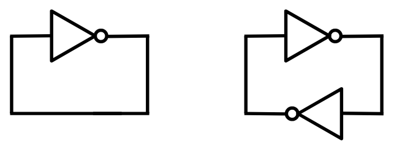

# Compute!

**Music of the chapter:** *Computer Love - By Kraftwerk*

## Which came first? The chicken or the egg?

Imagine, for a moment, that a catastrophic event occurs, causing us to lose all the technology we once had. All that remains is ashes, and our situation is similar to humanity's early days millions of years ago. But there's one key difference: we still have the ability to read, and fortunately, many books are available that explain how our modern technology once worked. Now, here's an interesting question: How long would it take for us to reach the level of advancement we have today?

My prediction is that we would get back on track within a few decades. The only reason it might take longer than expected is that we would need tools to build other tools. For example, we can't just start building a modern CPU, even if we have the specifications and detailed design. First, we would need to rebuild the tools required to create complex electronic circuits. If we are starting from scratch, as we've assumed, we would also need to relearn how to find and extract the materials we need from the Earth, and then use those materials to make simpler tools. These simpler tools would then allow us to create more advanced ones. Here's the key point that makes all of our technological progress possible: ***technology can accelerate the creation of more technology!***

Just like the chicken-and-egg paradox, I’ve often wondered how people built the very first compilers and assemblers. What language did they use to describe the first assembly languages? Did they have to write early assembler programs directly in 0s and 1s? After some research, I discovered that the answer is yes. In fact, as an example, the process of building a C compiler for the first time goes like this:

1. First, you write a C compiler directly in machine code or assembly (or some other lower-level language).
2. Next, you rewrite the same C compiler in C.
3. Then, you compile the new C source code using the compiler written in assembly.
4. At this point, you can completely discard the assembly implementation and treat the C compiler as if it were originally written in C.

See this beautiful loop? Technology sustains and reproduces itself, which essentially means ***technology is a form of life***! The simpler computer language (in this case, machine-assembly) helped the C compiler emerge, but once the compiler was created, it could stand on its own. We no longer need the machine-assembly version, since there’s nothing stopping us from describing a C compiler in C itself! This phenomenon isn’t limited to software—just like a hammer can be used to build new hammers!

Now, let's return to our original question: Which came first, the chicken or the egg? If we look at the history of evolution, we can see that creatures millions of years ago didn’t reproduce by laying eggs. For example, basic living cells didn’t reproduce by laying eggs; they simply split in two. As living organisms evolved and became more complex, processes like egg-laying gradually emerged. The very first chicken-like animal that started laying eggs didn’t necessarily hatch from an egg. It could have been a mutation that introduced egg-laying behavior in a new generation, much like how a C compiler could come to life without depending on an assembly implementation.

## When the dominos fall

If you ask someone deeply knowledgeable about computers how a computer works at the most fundamental level, they’ll probably start by talking about electronic switches, transistors, and logic gates. Well, I’m going to take a similar approach, but with a slight twist! While transistors are the basic building blocks of nearly all modern computers, the real magic behind what makes computers "do their thing" is something I like to call "Cause & Effect" chains.

Let’s begin by looking at some everyday examples of cause-and-effect scenarios. Here’s my list (feel free to add yours as you think of them):

- You press a key on your computer → A character appears on the screen → ***END***
- You push the first domino → The next domino falls → The next domino falls → ...
- You ask someone to open the window → He opens the window → ***END***
- You tell a rumor to your friend → He tells the rumor to his friend → ...
- You toggle the switch → The light bulb turns on → ***END***
- A neuron fires in your brain → Another neuron gets excited and fires → ...

Now, let’s explore why some of these cause-and-effect chains keep going, setting off a series of events that lead to significant changes in their environment, while others stop after just a few steps. Why do some things trigger a cascade of actions, while others don’t?

There's an important pattern here: The long-lasting (i.e., interesting) effects emerge from cause-and-effect chains where ***the effects are of the same type as the causes***. This means that these chains become particularly interesting when they can form cycles. For example, when a "mechanical" cause leads to another "mechanical" effect (like falling dominos), or when an "electrical" cause triggers another electrical effect (like in electronic circuits or the firing of neurons in your brain).

The most complex thing you can create with components that transform a ***single cause into a single effect*** is essentially no different from a chain of falling dominoes (or when rumors circulate within a company). While it’s still impressive and has its own interesting aspects, we don’t want to stop there. The real magic happens when you start transforming ***multiple causes into a single effect***—especially when all the causes are of the same type. That’s when Cause & Effect chains truly come to life!

A simple example of a multi-input/single-output component is a switch. A switch controls the flow of an input to an output through a third, controlling input. Light switches, push buttons, and faucets (which control the flow of water through a pipe) are all examples of switches. However, in these cases, the type of the controlling input is different from the other inputs and outputs. For instance, the controlling input of a push button is mechanical, while the others are electrical. You still need a finger to push the button, and the output of the push button cannot be used as the mechanical input of another button. As a result, you can't build domino-like structures or long-lasting cause-and-effect chains using faucets or push buttons in the same way you would with purely similar types of inputs and outputs!

{ width=350px }

A push-button becomes more interesting when its controlling input is electrical rather than mechanical. In this case, all of its inputs and outputs are of the same type, allowing you to connect the output of one push-button to the controlling input of another.

Similarly, in the faucet example, you could design a special kind of faucet that opens with the force of water, rather than requiring a person to open it manually with their hands. In the picture below, when no water is present in the controlling pipe (the pipe in the middle), the spring will push the block down, preventing water from flowing from the left pipe to the right pipe. However, when water enters the controlling pipe, its pressure will push the block up, creating space for the water to flow from the left pipe to the right pipe.

{ width=350px }

The controlling input doesn't have to sharply switch the flow between no-flow and maximum-flow. Instead, the controller can adjust the flow to any level, depending on how much the controlling input is pushed. Additionally, the controlling input doesn't need to be as large or powerful as the other inputs/outputs. It could be a thinner pipe that requires only a small force of water to fully open the valve. This means you can control a large and powerful water flow using a much smaller input and less force.

There’s also a well-known name for these unique switches: transistors. Now you can understand what "transistor" literally means—it’s something that can "transfer" or adjust "resistance" on demand, much like how we can control the resistance of the water flow in a larger pipe using a third input.

The most obvious use case for a transistor is signal amplification. Let’s explore this with an example: imagine a small pipe through which water flows in a sinusoidal pattern. Initially, there is no water, then the flow gradually increases to a certain level, and finally, it slowly decreases back to zero (a pattern similar to what you might see in a water show!). Now, we connect this pipe to the controlling input of the water transistor we designed earlier. Can you guess what comes out from the output of this transistor? Yes, the output is also a sinusoidal flow of water. The difference is that it’s much more powerful than the small pipe. We’ve just transferred the sinusoidal pattern from a small water flow to a much more powerful one! Can you imagine how important this is? This concept forms the core of how devices like electric guitars and sound amplifiers work!

That’s not the only use case for transistors, though. Because the cause-and-effect types of the inputs and outputs are the same, we can chain them together—and that’s all we need to start building machines that can compute things (we’ll explore the details soon!). These inputs don’t necessarily have to be electrical; they can be mechanical as well. Yes, we can build computers that operate using the force of water!

A typical transistor in the real world is conceptually the same as our imaginary faucet described above. Substitute water with electrons, and you have an accurate analogy for a transistor. Transistors, the building blocks of modern computers, allow you to control the flow of electrons in a wire using a third source of electrons!

Understanding how modern electron-based transistors work involves a fair bit of physics and chemistry. But if you insist, here’s a very simple (and admittedly silly) example of a push-button with an electrical controller: Imagine a person holding a wire in their hand. This person presses the push-button whenever they feel electricity in their hand (as long as the electricity isn’t strong enough to harm them). Together, the person and the push-button form something akin to a transistor, because now the types of all inputs and outputs in the system are the same.

It might sound like the strangest idea in the world, but if you had enough of these "transistors" connected together, you could theoretically build a computer capable of connecting to the internet and rendering webpages!

Why did people choose electrons to flow in the veins of our computers instead of something like water? There are several reasons:

- Electrons are extremely small.
- Electrical effects propagate extremely fast!

Thanks to these properties, we can create complex and dense cause-and-effect chains that produce amazing behaviors while using very little space, like in your smartphone!

## Taming the electrons

In the previous section, we explored what a transistor is. Now it’s time to see what we can do with it! To quickly experiment with transistors, we’ll simulate imaginary transistors on a computer and arrange them in the right order to perform fancy computations for us.

Our ultimate goal is to construct a fully functional computer using a collection of three-way switches. If you have prior experience designing hardware, you're likely familiar with software tools that allow you to describe hardware using a Hardware Description Language (HDL). These tools can generate transistor-level circuits from your designs and even simulate them for you. However, since this book focuses on the underlying concepts rather than real-world, production-ready implementations, we will skip the complexity of learning an HDL. Instead, we'll use the Python programming language to emulate these concepts as we progress. This approach will not only deepen our understanding of the transistor-level implementation of something as intricate as a computer but also shed light on how HDL languages transform high-level circuit descriptions into collections of transistors.

So let's begin and start building our own circuit simulator!

## Everything is relative

The very first term you encounter when exploring electricity is "voltage," so it’s essential to grasp its meaning before studying how transistors behave under different voltages. Formally, voltage is the potential energy difference between two points in a circuit. To understand this concept, let’s set aside electricity for a moment and think about heights.

Imagine lifting a heavy object from the ground. The higher you lift it, the more energy you expend (and the more tired you feel, right? That energy needs to be replenished, like by eating food!). According to the law of conservation of energy, energy cannot be created or destroyed, only transformed or transferred. So where does the energy you used to lift the object go?

Now, release the object and let it fall. It hits the ground with a bang, possibly breaking the ground—or itself. The higher the object was lifted, the greater the damage it causes. Clearly, energy is needed to create those noises and damages. But where did that energy come from?

You’ve guessed it! When you lifted the object, you transferred energy to it. When you let it fall, that stored energy was released. Physicists call this stored energy "potential energy." A raised object has the potential to do work (work is the result of energy being consumed), which is why it’s called potential energy!

If you remember high school physics, you’ll know that the potential energy of an object can be calculated using the formula: \\(U=mgh\\), where \\(m\\) is the mass of the object, \\(h\\) is its height above the ground, and \\(g\\) is the Earth's gravitational constant (approximately \\(9.807 m/s^2\\)).

According to this formula, when the object is on the ground (\\(h=0\\)), the potential energy is also \\(U=0\\). But here’s an important question: does that mean an object lying on the ground has no potential energy?

Actually, it does have potential energy! Imagine taking a shovel and digging a hole under the object. The object would fall into the hole, demonstrating that it still had the capacity to do work due to gravity.

The key point is this: the equation \\(U=mgh\\) represents the potential energy difference relative to a chosen reference point (in this case, the ground), not the absolute potential energy of the object. A more precise way to express this idea would be:
\\(\varDelta{u}=mg\varDelta{h}\\).

This equation shows that the potential energy difference between two points \\(A\\) and \\(B\\) depends on \\(mg\\), the gravitational force, and \\(\varDelta{h}\\), the difference in height between the two points.

In essence, ***potential energy is relative!***

{ width=350px }

The reason it takes energy to lift an object is rooted in the fact that massive bodies attract each other, as described by the universal law of gravitation: \\(F=G\frac{m_1m_2}{r^2}\\).

Similarly, a comparable law exists in the microscopic world, where electrons attract protons, and like charges repel each other. This interaction is governed by Coulomb's law: \\(F=k_e\frac{q_1q_2}{r^2}\\)

As a result, we also have the concept of "potential energy" in the electromagnetic world. It takes energy to separate two electric charges of opposite types (positive and negative), as you're working against the attractive electric force. When you pull them apart and then release them, they will move back toward each other, releasing the stored potential energy.

That's essentially how batteries work. They create potential differences by moving electrons to higher "heights" of potential energy. When you connect a wire from the negative pole of the battery to the positive pole, the electrons "fall" through the wire, releasing energy in the process.

When we talk about "voltage," we are referring to the difference in height or potential energy between two points. While we might not know the absolute potential energy of points A and B, we can definitely measure and understand the difference in potential (voltage) between them!

## Pipes of electrons

We discussed that transistors are essentially three-way switches that control the flow between two input/output paths using a third input. When building a transistor circuit simulator—whether simulating the flow of water or electrons—it makes sense to begin by simulating the "pipes," the elements through which electrons will flow. In electrical circuits, these "pipes" are commonly referred to as ***wires***.

Wires are likely to be the most fundamental and essential components of our circuit simulation software. As their name suggests, wires are conductors of electricity, typically made of metal, that allow different components to connect and communicate via the flow of electricity. We can think of wires as containers that hold electrons at specific voltage levels. If two wires with different voltage levels are connected, electrons will flow from the wire with higher voltage to the one with lower voltage.

In digital circuits, transistors and other electronic components operate using two specific voltage levels: "zero" (commonly referred to as ***ground***) and "one." It’s important to emphasize that the terms "zero" and "one" do not correspond to fixed or absolute values. Instead, "zero" acts as a reference point, while "one" represents a voltage level that is higher relative to "zero."

At first glance, it might seem that we could model a wire using a single boolean value: `false` to represent zero and `true` to represent one. However, this approach fails to account for all the possible scenarios that can arise in a circuit simulator.

For example, consider a wire in your simulator that isn’t connected to either the positive or negative pole of a battery. Would it even have a voltage level? Clearly, it would be neither 0 nor 1. Now imagine a wire that connects a high-voltage (1) wire to a low-voltage (0) wire. What would the voltage of this intermediary wire be? Electrons would start flowing from the higher-voltage wire to the lower-voltage wire, and as a result, the voltage of the intermediary wire would settle somewhere between 0 and 1.

In a digital circuit, connecting a 0 wire to a 1 wire is not always a good idea and could indicate a mistake in your circuit design, potentially causing a short circuit. Therefore, it is useful to consider a value for a wire that is either mistakenly or intentionally left unconnected (Free state) or connected to both 0 and 1 voltage sources simultaneously (Short-circuit/Unknown state).

Based on this explanation, a wire can be in four different states:

* `Z` state - The wire is free and not connected to anything.
* `0` state - The wire is connected to a ground voltage source and has 0 voltage.
* `1` state - The wire is connected to a 5.0V voltage source.
* `X` state - The wire's voltage cannot be determined because it is connected to both a 5.0V and 0.0V voltage source simultaneously.


Initially, a wire that is not connected to anything is in the `Z` state. When you connect it to a gate or wire that has a state of `1`, the wire's state will also become `1`. A wire can connect to multiple gates or wires at the same time. For example, if a wire already in the `1` state is connected to another source of `1`, it will remain 1. However, the wire will enter the `X` state if it is connected to a wire or gate with a conflicting value. For instance, if the wire is connected to both `0` and `1` voltage sources simultaneously, its state will be `X`. Similarly, connecting any wire to an `X` voltage source will also result in the wire taking on the `X` state.

We can summarize all the possible scenarios in a custom table that defines the arithmetic of wire states:

| A | B | A + B |
|---|---|-------|
| Z | Z | Z     |
| 0 | Z | 0     |
| 1 | Z | 1     |
| X | Z | X     |
| Z | 0 | 0     |
| 0 | 0 | 0     |
| 1 | 0 | X     |
| X | 0 | X     |
| Z | 1 | 1     |
| 0 | 1 | X     |
| 1 | 1 | 1     |
| X | 1 | X     |
| Z | X | X     |
| 0 | X | X     |
| 1 | X | X     |
| X | X | X     |

A wildcard version of this table would look like this:

|   A   |   B   | A + B |
|-------|-------|-------|
|   Z   | **x** | **x** |
| **x** |   Z   | **x** |
|   X   | **x** |   X   |
| **x** |   X   |   X   |
|   0   |   0   |   0   |
|   1   |   1   |   1   |
|   0   |   1   |   X   |
|   1   |   0   |   X   |


Based on the explanation, we can model a wire as a Python class:

```python=
FREE = "Z"
UNK = "X"
ZERO = 0
ONE = 1


class Wire:
    def __init__(self):
        self._drivers = {}
        self._assume = FREE

    def assume(self, val):
        self._assume = val

    def get(self):
        curr = FREE
        for b in self._drivers.values():
            if b == UNK:
                return UNK
            elif b != FREE:
                if curr == FREE:
                    curr = b
                elif b != curr:
                    return UNK
        return curr if curr != FREE else self._assume

    def put(self, driver, value):
        is_changed = self._drivers.get(driver) != value
        self._drivers[driver] = value
        return is_changed
```

The code above models a wire as a Python class. By definition, a wire that is not connected to anything remains in the `Z` state. Using the `put` function, a driver (such as a battery or a gate) can apply a voltage to the wire. The final voltage of the wire is determined by iterating over all the voltages applied to it.

We store the voltage values applied to the wire in a dictionary to ensure that a single driver cannot apply two different values to the same wire.

The `put` function also checks whether there has been a change in the values applied to the wire. This will later help our simulator determine if the circuit has reached a stable state, where the values of all wires remain fixed.

In some cases—particularly in circuits containing feedback loops and recursion—it is necessary to assume that a wire already has a value in order to converge on a solution. For this purpose, we have designed the `assume()` function, which allows us to assign an assumed value to a wire if no gates have driven a value into it. If you don’t yet fully understand what the `assume()` function does, don’t worry—we’ll explore its usage in the next sections.

## Magical switches

Now that we've successfully modeled wires, it's time to implement the second most important component of our simulator: the transistor.

Transistors are electrically controlled switches with three pins: ***base***, ***emitter***, and ***collector***. These pins connect to other circuit elements through wires. The ***base*** pin acts as the switch’s controller—when there is a high potential difference between the ***base*** and ***collector*** pins, the ***emitter*** connects to the ***collector***. Otherwise, the ***emitter*** remains unconnected, behaving like a floating wire in the `Z` state.

This key behavior means that turning off the transistor does not set the ***emitter*** to `0` but instead leaves it in the `Z` state.

We can also describe the wire arithmetic of a transistor using the following table:

| B | E | C          |
|---|---|------------|
| 0 | 0 | Z          |
| 0 | 1 | Z          |
| 1 | 0 | 0 (Strong) |
| 1 | 1 | 1 (Weak)   |

The transistor we have been discussing so far is a Type-N transistor. The Type-N transistor turns on when the base wire is driven with a `1`. There is also another type of transistor, known as Type-P, which turns on when the base wire is driven with a `0`. The truth table for a Type-P transistor looks like this:

| B | E | C          |
|---|---|------------|
| 0 | 0 | 0 (Weak)   |
| 0 | 1 | 1 (Strong) |
| 1 | 0 | Z          |
| 1 | 1 | Z          | 

Assuming we define a voltage of ***5.0V*** as `1` and a voltage of ***0.0V*** as `0`, a wire is driven with a ***strong*** `0` when its voltage is very close to 0 (e.g., 0.2V), and a ***strong*** `1` when its voltage is close to 5 (e.g., 4.8V). The truth is, the transistors we build in the real world aren't ideal, so they won't always provide strong signals. A signal is considered ***weak*** when it's far from 0.0V or 5.0V. For example, a voltage of 4.0V could be considered a ***weak*** `1`, and a voltage of 1.0V would be considered a ***weak*** `0`, whereas 4.7V could be considered a ***strong*** `1` and 0.3V a ***strong*** `0`. Type-P transistors, when built in the real world, are very good at producing strong `0` signals, but their `1` signals tend to be weak. On the other hand, Type-N transistors produce strong `1` signals, but their `0` signals are weak. By using both types of transistors together, we can build logic gates that provide strong outputs in all cases.

## The Transistor

In our digital circuit simulator, we’ll have two different types of components: primitive components and components that are made of primitives. We’ll define components as primitives when they can’t be described as a group of smaller primitives.

For example, we can simulate Type-N and Type-P transistors as primitive components, since everything else can be constructed by combining Type-N and Type-P transistors together.

```python=
class NTransistor:
    def __init__(self, in_base, in_collector, out_emitter):
        self.in_base = in_base
        self.in_collector = in_collector
        self.out_emitter = out_emitter

    def update(self):
        b = self.in_base.get()
        if b == ONE:
            return self.out_emitter.put(self, self.in_collector.get())
        elif b == ZERO:
            return self.out_emitter.put(self, FREE)
        elif b == UNK:
            return self.out_emitter.put(self, UNK)
        else:
            return True  # Trigger re-update


class PTransistor:
    def __init__(self, in_base, in_collector, out_emitter):
        self.in_base = in_base
        self.in_collector = in_collector
        self.out_emitter = out_emitter

    def update(self):
        b = self.in_base.get()
        if b == ZERO:
            return self.out_emitter.put(self, self.in_collector.get())
        elif b == ONE:
            return self.out_emitter.put(self, FREE)
        elif b == UNK:
            return self.out_emitter.put(self, UNK)
        else:
            return True  # Trigger re-update
```


Our primitive components are classes with an `update()` function. The `update()` function is called whenever we want to calculate the output of the primitive based on its inputs. As a convention, we will prefix the input and output wires of our components with `in_` and `out_`, respectively.

The `update()` function of our primitive components will also return a boolean value, which indicates whether the element needs to be updated again. Sometimes, the inputs of a component might not be ready when the update() function is called. For example, in the case of transistors, if the `base` wire is in the `Z` state, we assume there is another transistor that needs to be updated before the current transistor can calculate its output. By returning this boolean value, we inform our circuit emulator that the transistor is not "finalized" yet, and the `update()` function needs to be called again before determining that all component outputs have been correctly calculated and the circuit is stabilized.

Additionally, remember that the `put()` function of the `Wire` class also returns a boolean value. This value indicates whether the driver of that wire has placed a new value on the wire. A new value on a wire means there has been a change in the circuit, and the entire circuit needs to be updated again.

## The Circuit

Now, it would be useful to have a data structure for keeping track of the wires and transistors allocated in a circuit. We will call this class `Circuit`. It will provide methods for creating wires and adding transistors. The `Circuit` class is responsible for calling the `update()` function of the primitive components and will allow you to calculate the values of all the wires in the network.

```python=
class Circuit:
    def __init__(self):
        self._wires = []
        self._comps = []

        self._zero = self.new_wire()
        self._zero.put(self, ZERO)
        self._one = self.new_wire()
        self._one.put(self, ONE)

    def one(self):
        return self._one

    def zero(self):
        return self._zero

    def new_wire(self):
        w = Wire()
        self._wires.append(w)
        return w

    def add_component(self, comp):
        self._comps.append(comp)

    def num_components(self):
        return len(self._comps)

    def update(self):
        has_changes = False
        for t in self._comps:
            has_changes = has_changes | t.update()
        return has_changes

    def stabilize(self):
        while self.update():
            pass
```

The `update()` method of the `Circuit` class calculates the values of the wires by iterating through the transistors and calling their update method. In circuits with feedback loops, a single iteration of updates may not be sufficient, and multiple iterations may be needed before the circuit reaches a stable state. To address this, we introduce an additional method specifically designed for this purpose: `stabilize()`. This method repeatedly performs updates until no changes are observed in the wire values, meaning the circuit has stabilized.

Our `Circuit` class also provides global `zero()` and `one()` wires, which can be used by components requiring fixed `0` and `1` signals. These wires function like battery poles in our circuits.

Electronic components can be defined as functions that take a circuit as input and add wires and transistors to it. Let’s explore the implementation details of some of them!

## Life in a non-ideal world

Digital circuits are essentially logical expressions that are automatically evaluated by the flow of electrons through what we refer to as gates. Logical expressions are defined using zeros and ones, but as we have seen, wires in an electronic circuit are not always guaranteed to be either 0 or 1. Therefore, we must redefine our gates and determine their output in cases where the inputs are faulty.

Consider a NOT gate as an example. In an ideal world, its truth table would be as follows:

| A | NOT A |
|---|-------|
| 0 | 1     |
| 1 | 0     |

However, the real world is not ideal, and wires connected to electronic logic gates can have unexpected voltages. Since a wire in our emulation can have four different states, our logic gates must be able to handle all four. The following is the definition of a NOT gate using our wire arithmetic. If the input to the NOT gate is `Z` or `X`, the output will be the faulty state `X`.

| A | NOT A |
|---|-------|
| 0 | 1     |
| 1 | 0     |
| Z | X     |
| X | X     |

There are two ways to simulate gates in our software. We can either implement them using plain Python code as primitive components, similar to transistors, or we can construct them as a circuit of transistors. The following is an example of a NOT gate implemented using the first approach:

```python=
class Not:
    def __init__(self, wire_in, wire_out):
        self.wire_in = wire_in
        self.wire_out = wire_out

    def update(self):
        v = self.wire_in.get()
        if v == FREE:
            self.wire_out.put(self, UNK)
        elif v == UNK:
            self.wire_out.put(self, UNK)
        elif v == ZERO:
            self.wire_out.put(self, ONE)
        elif v == ONE:
            self.wire_out.put(self, ZERO)
```

We can also test out implementation:

```python=
if __name__ == '__main__':
    inp = Wire.zero()
    out = Wire()
    gate = Not(inp, out)
    gate.update()
    print(out.get())
```

The NOT gate modeled as a primitive component is accurate and functions as expected. However, we know that a NOT gate is actually built from transistors, and it might be more interesting to model it using a pair of transistors rather than ***cheating*** by emulating its high-level behavior with Python code.

The following is an example of a NOT gate constructed using a P-type and an N-type transistor:

```python=
def Not(circuit, inp, out):
    circuit.add_component(PTransistor(inp, circuit.one(), out))
    circuit.add_component(NTransistor(inp, circuit.zero(), out))
```


As you know, an N-type transistor connects its source pin to its drain pin when the voltage on its gate is higher than the voltage on its drain. So, when the `inp` wire is driven with `1`, the output gets connected to the `circuit.zero()` wire, causing `out` to hold a `0` signal. Notice that the P-type transistor is off when `inp` is `1`, so the `circuit.one()` wire will ***not*** get connected to the output pin. If that were the case, we would get a short circuit, causing the out signal to become a faulty (`X`)`.

Likewise, when `inp` is `0`, the P-type transistor turns on and connects the output to `circuit.one()`, while the N-type transistor turns off, leaving the output unconnected to the ground.

NOT gates are probably the simplest components you can build using the current primitive elements provided by our simulator. Now that we’re familiar with transistors, it’s time to expand our component set and build some of the most fundamental logic gates. In addition to NOT gates, you’ve likely heard of AND and OR gates, which are a bit more complex—mainly because they take more than one input. Here’s their definition:

***AND gate:*** outputs `0` when at least one of the inputs is `0`, and gets `1` when all of the inputs are `1`. Otherwise the output is faulty (`X`).

| A | B | A AND B |
|---|---|---------|
| 0 | * | 0       |
| * | 0 | 0       |
| 1 | 1 | 1       |
|   |   | X       |

***OR gate:*** outputs `1` when at least one of the inputs is `1`, and gets `0` only when all of the inputs are `0`. Otherwise the output is unknown (`X`).

| A | B | A OR B |
|---|---|--------|
| 1 | * | 1      |
| * | 1 | 1      |
| 0 | 0 | 0      |
|   |   | X      |


## Mother of the gates

A NAND gate is a logic gate that outputs 0 if and only if both of its inputs are 1. It is essentially an AND gate with its output inverted. It can be proven that all the basic logic gates (AND, OR, NOT) can be built using different combinations of this single gate:

- \\(NOT(x) = NAND(x, x)\\)
- \\(AND(x, y) = NOT(NAND(x, y)) = NAND(NAND(x, y), NAND(x, y))\\)
- \\(OR(x, y) = NAND(NOT(x), NOT(y)) = NAND(NAND(x, x), NAND(y, y))\\)

It is the "mother gate" of all logic circuits. Although building everything with NAND gates would be very inefficient in practice, for the sake of simplicity, we'll stick to NAND gates and try to construct other gates by connecting them together.


It turns out that we can build NAND gates with strong and accurate output signals using 4 transistors (2 Type-N and 2 Type-P). Let's prototype a NAND gate using our simulated N/P transistors!

```python=
def Nand(circuit, in_a, in_b, out):
    inter = circuit.new_wire()
    circuit.add_component(PTransistor(in_a, circuit.one(), out))
    circuit.add_component(PTransistor(in_b, circuit.one(), out))
    circuit.add_component(NTransistor(in_a, circuit.zero(), inter))
    circuit.add_component(NTransistor(in_b, inter, out))
```

Now, other primitive gates can be defined as combinations of NAND gates. Take the NOT gate as an example. Here is a third way we can implement a NOT gate (So far, we have implemented a NOT gate in two ways: 1. Describing its behavior through plain Python code, and 2. By connecting a pair of Type-N and Type-P transistors):

```python=
def Not(circuit, inp, out):
    Nand(circuit, inp, inp, out)
```

Go ahead and implement the other primitive gates using the NAND gate we just defined. After that, we can start creating useful circuits from these gates!

```python=
def And(circuit, in_a, in_b, out):
    not_out = circuit.new_wire()
    Nand(circuit, in_a, in_b, not_out)
    Not(circuit, not_out, out)


def Or(circuit, in_a, in_b, out):
    not_out = circuit.new_wire()
    Nor(circuit, in_a, in_b, not_out)
    Not(circuit, not_out, out)


def Nor(circuit, in_a, in_b, out):
    inter = circuit.new_wire()
    circuit.add_component(PTransistor(in_a, circuit.one(), inter))
    circuit.add_component(PTransistor(in_b, inter, out))
    circuit.add_component(NTransistor(in_a, circuit.zero(), out))
    circuit.add_component(NTransistor(in_b, circuit.zero(), out))
```

An XOR gate is another incredibly useful gate that comes in handy when building circuits that can perform numerical additions. The XOR gate outputs 1 only when the inputs are unequal, and outputs 0 when they are equal. XOR gates can be built from AND, OR, and NOT gates: \\(Xor(x,y) = Or(And(x, Not(y)), And(Not(x), y))\\). However, since XOR gates will be used frequently in our future circuits, it makes more sense to provide a transistor-level implementation for them, as this will require fewer transistors!

```python=
def Xor(circuit, in_a, in_b, out):
    a_not = circuit.new_wire()
    b_not = circuit.new_wire()
    Not(circuit, in_a, a_not)
    Not(circuit, in_b, b_not)

    inter1 = circuit.new_wire()
    circuit.add_component(PTransistor(b_not, circuit.one(), inter1))
    circuit.add_component(PTransistor(in_a, inter1, out))
    inter2 = circuit.new_wire()
    circuit.add_component(PTransistor(in_b, circuit.one(), inter2))
    circuit.add_component(PTransistor(a_not, inter2, out))

    inter3 = circuit.new_wire()
    circuit.add_component(NTransistor(in_b, circuit.zero(), inter3))
    circuit.add_component(NTransistor(in_a, inter3, out))
    inter4 = circuit.new_wire()
    circuit.add_component(NTransistor(b_not, circuit.zero(), inter4))
    circuit.add_component(NTransistor(a_not, inter4, out))
```

Sometimes, we simply need to connect two different wires. Instead of creating a new primitive component for that purpose, we can use two consecutive NOT gates. This will act like a simple jumper! We'll call this gate a `Forward` gate:

```python=
def Forward(circuit, inp, out):
    tmp = circuit.new_wire()
    Not(circuit, inp, tmp)
    Not(circuit, tmp, out)
```

## Hello World circuit!

The simplest digital circuit we might consider a "computer" is one that can perform basic arithmetic, like adding two numbers together. In digital circuits, information is represented using binary signals—0s and 1s. So, when we talk about adding numbers in a digital circuit, we're working with binary numbers.

To start with, let's focus on a very basic example: a circuit that can add two one-bit binary numbers. A one-bit number can only be either a 0 or a 1, so adding them together can yield one of three possible results: 0 + 0 = 0, 0 + 1 = 1, and 1 + 1 = 10 (which is 2 in decimal). Notice that the result of adding two one-bit numbers is always a two-bit number, because 1 + 1 produces a carry, which means we need two bits to store the result.

To design such a circuit, one of the most effective approaches is to start by figuring out what the output should be for each possible combination of inputs. Since there are two inputs (each one-bit numbers), there are four possible input combinations: 00, 01, 10, and 11. For each of these combinations, we can determine what the output should be. Since the result is always a two-bit number, we can break the circuit into two smaller subcircuits: one that calculates the sum bit (the least significant bit) and one that calculates the carry bit (the more significant bit). Each subcircuit works independently to compute its corresponding part of the result.

In this way, we approach building the circuit step by step, using logic gates to implement the required operations for each input combination.

| A | B | First digit | Second digit |
|---|---|-------------|--------------|
| 0 | 0 | 0           | 0            |
| 0 | 1 | 1           | 0            |
| 1 | 0 | 1           | 0            |
| 1 | 1 | 0           | 1            |

The relation of the second digit with A and B is very familiar; it's essentially an AND gate! Try to figure out how the first digit can be calculated by combining primitive gates. (Hint: It outputs 1 only when A is 0 AND B is 1, or A is 1 AND B is 0.)

***Answer:*** It's an XOR gate! (\\(Xor(x, y) = Or(And(x, Not(y)), And(Not(x), y))\\)), and here is the Python code for the entire thing:

```python=
def HalfAdder(circuit, in_a, in_b, out_sum, out_carry):
    Xor(circuit, in_a, in_b, out_sum)
    And(circuit, in_a, in_b, out_carry)
```

What we have just built is known as a half-adder. With a half-adder, you can add 1-bit numbers together. You might think that we can build multi-bit adders by stacking multiple half-adders in a row, but that's not entirely correct. Recall that the addition algorithm we learned in primary school also applies to binary numbers. Imagine we want to add the binary numbers `1011001` (89) and `111101` (61) together. Here’s how it works:

```
 1111  1
   
  1011001
+  111101
-----------
 10010110
```

By examining the algorithm, we can see that for each digit, the addition involves ***three bits*** (not just two). In addition to the original bits, there is also a third carry bit from the previous addition that must be considered. Therefore, to design a multi-bit adder, we need a circuit that can add three one-bit numbers together. Such a circuit is known as a ***full-adder***, and the third number is often referred to as the carry bit. Here’s the truth table for a three-bit adder:

| A | B | C | D0 | D1 |
|---|---|---|----|----|
| 0 | 0 | 0 | 0  | 0  |
| 1 | 0 | 0 | 1  | 0  |
| 0 | 1 | 0 | 1  | 0  |
| 1 | 1 | 0 | 0  | 1  |
| 0 | 0 | 1 | 1  | 0  |
| 1 | 0 | 1 | 0  | 1  |
| 0 | 1 | 1 | 0  | 1  |
| 1 | 1 | 1 | 1  | 1  |

Building a full-adder is not that challenging. You can use two half-adders to compute the sum bit and then take the OR of the carry outputs to obtain the final carry bit.

```python=
def FullAdder(circuit, in_a, in_b, in_carry, out_sum, out_carry):
    sum_ab = circuit.new_wire()
    carry1 = circuit.new_wire()
    carry2 = circuit.new_wire()
    HalfAdder(circuit, in_a, in_b, sum_ab, carry1)
    HalfAdder(circuit, sum_ab, in_carry, out_sum, carry2)
    Or(circuit, carry1, carry2, out_carry)
```

Once we have a full-adder ready, we can proceed with building multi-bit adders. For example, to create an 8-bit adder, we need to connect eight full-adders in a row. The carry output of each adder serves as the carry input for the next, mimicking the addition algorithm we discussed earlier.

```python=
def Adder8(circuit, in_a, in_b, in_carry, out_sum, out_carry):
    carries = [in_carry] + [circuit.new_wire() for _ in range(7)] + [out_carry]
    for i in range(8):
        FullAdder(
            circuit,
            in_a[i],
            in_b[i],
            carries[i],
            out_sum[i],
            carries[i + 1],
        )
```

Congratulations! We just added two 8-bit numbers using nothing but bare transistors. Before continuing our journey toward more complex circuits, let's ensure that our simulated model of the 8-bit adder is functioning correctly. If the 8-bit adder works properly, there is a high chance that the other gates are also functioning as expected.

```python=
def num_to_wires(circuit, num):
    wires = []
    for i in range(8):
        bit = (num >> i) & 1
        wires.append(circuit.one() if bit else circuit.zero())
    return wires


def wires_to_num(wires):
    out = 0
    for i, w in enumerate(wires):
        if w.get() == ONE:
            out += 2**i
    return out


if __name__ == "__main__":
    for x in range(256):
        for y in range(256):
            circuit = Circuit()
            wires_x = num_to_wires(circuit, x)
            wires_y = num_to_wires(circuit, y)
            wires_out = [Wire() for _ in range(8)]
            Adder8(circuit, wires_x, wires_y, circuit.zero(), wires_out, circuit.zero())
            circuit.update()
            out = wires_to_num(wires_out)
            if out != (x + y) % 256:
                print("Adder is not working!")

```

Here, we are checking if the outputs are correct for all possible inputs. We have defined two auxiliary functions, `num_to_wires` and `wires_to_num`, to convert numbers into a set of wires that can connect to an electronic circuit, and vice versa.

## When addition is subtraction

So far, we have been able to implement the addition operation by combining N and P transistors. Our adder is limited to 8 bits, meaning that the input and output values are all in the range \\([0,255]\\). If you try to add two numbers whose sum exceeds 255, you will still get a result in the range \\([0,255]\\). This happens because a number larger than 255 cannot be represented by 8 bits, and an ***overflow*** occurs. Upon closer inspection, you’ll notice that what we have designed isn’t the typical addition operation we are used to in elementary school mathematics; instead, it’s addition in a finite field. This means the addition results are taken modulo 256.

\\(a \oplus b = (a + b) \mod 256\\)

It is good to know that finite-fields have interesting properties:

1. \\((a \oplus b) \oplus c = a \oplus (b \oplus c)\\)
2. For every non-zero number \\(x \in \mathbb{F}\\), there is a number \\(y\\), where \\(x \oplus y = 0\\). \\(y\\) is known as the negative of \\(x\\).

In a finite field, the negative of a number can be calculated by subtracting that number from the field size (in this case, the size of our field is \\(2^8=256\\)).  For example, the negative of \\(10\\) is \\(256-10=246\\), so \\(10 \oplus 246 = 0\\).

Surprisingly, the number \\(246\\), behaves exactly like \\(-10\\). Try adding \\(246\\) to \\(15\\). You will get \\(246 \oplus 15 = 5\\) which is the same as \\(15 + (-10)\\)! This has an important implication: we can perform subtraction without designing a new circuit! All we need to do is negate the number. Calculating the negative of a number is like taking the XOR of that number (Which gives \\(255 - a\\)), and then adding \\(1\\) to it (Which results in \\(256 - a\\), our definition of negation). This is known as the two's complement form of a number.

It’s incredible to see that we can build electronic machines capable of adding and subtracting numbers by simply connecting a bunch of transistors together! The good news is that we can go even further and design circuits that can perform multiplication and division, using the same approach we used for designing addition circuits. The details of multiplication and division circuits are beyond the scope of this book, but you are strongly encouraged to study them on your own!

## Not gates can be fun too!

If you remember, we discussed that you can't build interesting structures using only a single type of single-input/single-output component (such as NOT gates). In fact, we argued that using just them, we can only create domino-like structures, where a single cause traverses through the components until reaching the last one. However, that's not entirely true: what if we connect the last component of the chain to the first one? This creates a loop, which is definitely something new. Assuming two consecutive NOT gates cancel each other out, we can build two different kinds of NOT loops:



After analyzing both possible loops, you will soon understand that the one with a single NOT gate is unstable. The voltage of the wire can be neither 0 nor 1. It creates a logical paradox, similar to the statement: *This sentence is not true*. The statement can be neither true nor false!

Practically, if you build such a circuit, it may oscillate rapidly between possible states, or the wire's voltage may settle at a value between the logical voltages of 0 and 1.

On the other hand, the loop with two NOT gates can achieve stability. The resulting circuit has two possible states: either the first wire is 1 and the second wire is 0, or the first wire is 0 and the second wire is 1. It will not switch between these states automatically. If you build such a circuit using real components, the initial state will be somewhat random. A slight difference in the transistor conditions may cause the circuit to settle into one of the states and remain there.

## Try to remember

So far, we have been experimenting with stateless circuits—circuits that do not need to store or remember anything to function. However, circuits without memory are severely limited in their capabilities. To unlock their full potential, we need to explore how to store data within a digital circuit and maintain it over time. This is one of the most critical steps before we can build a computer, as computers are essentially machines that manipulate values stored in some kind of ***memory***. Without memory, a computer cannot perform complex tasks or execute meaningful programs.

As a child, you may have tried to leave a light switch in a "middle" position. If the switch was well-made, you probably found it frustratingly difficult to do! The concept of memory arises when a system with multiple possible states can only stabilize in a single state at a time. Once it becomes stable, it can only change through an external force. In this sense, a light switch can function as a single-bit memory cell.

Another silly example: imagine a piece of paper—it remains stable in its current state. If you set it on fire, it gradually changes until it is completely burned, after which it stabilizes again. Keeping the paper in a "half-burned" state is not easy! You could consider the paper as a crude single-bit memory cell, but it has a major flaw: once burned, it cannot return to its original state.

Fortunately, there are ways to build circuits with multiple possible states, where only one state remains stable at a time. The simplest example is a circuit that forms a loop by connecting two NOT gates to each other. This setup involves two wires: if the first wire is 1, the second wire will be 0, and the circuit will stabilize in that configuration (and vice versa).

The problem with a simple NOT gate loop is that it cannot be controlled externally—it lacks an input mechanism to change its state. To fix this, we can replace the NOT gates with logic gates that accept two inputs instead of one. For example, using NAND gates instead allows us to introduce external control. By providing voltages to the extra input pins, a user can modify the internal state of the loop. This type of circuit is known as an SR latch:


Now, the user can set the latch to the first or second state by setting S=1 and R=0, or S=0 and R=1, respectively. The magic lies in the fact that ***the circuit will stably remain in the latest state***, even after both S and R inputs are set to zero!

Here you can find an example of a SR latch implemented in Python:

```python=
def SRLatch(circuit, in_r, in_s, out_data, initial=0):
    neg_out = circuit.new_wire()
    Nor(circuit, in_r, neg_out, out_data)
    Nor(circuit, in_s, out_data, neg_out)
    neg_out.assume(1 - initial)
    out_data.assume(initial)
```

Notice how we ingeniously feed two set/reset inputs into something that is essentially a NOT loop! Now, there’s something tricky about simulating a NOR/NOT loop: How can the first NOR gate function when `neg_out` is still not calculated? Or similarly, how can the second NOR gate calculate `neg_out` when `out_data` is still not calculated? There are two approaches we can use to resolve the chicken-and-egg problem in our simulation:

1. Give up and attempt to simulate a memory-cell component without performing low-level transistor simulations. This would require us to define a new ***Primitive Component*** (similar to N/P transistors), which includes an `update()` function that mimics the expected behavior of a latch.
2. Hint the simulator with the initial values of wires, and let the simulator to settle in an stable state by running the update function of the transistors for a few iterations and stopping the iterations after the wire values stop changing (Meaning that the system has entered a stable state).

That’s where the `assume` function we defined for our `Wire` class comes in handy. The `assume` function essentially hints to the simulator the initial value(s) of the wires in our memory cell, making it stable. In fact, if you don’t call these `assume` functions when defining the gates, the simulator won’t be able to simulate it, and the output of both NOR gates would become `X`. Assumption is only necessary when we want to initialize the circuit in a stable state for the first time. After that, the circuit will ignore the initial assumed values and will start working as expected. *Note: In the real world, the memory cell randomly settles into one of the set/reset states due to environmental noise and slight differences between the transistors.*

## A more user-friendly latch

SR latches are perfect examples of memory cells since they can store a single bit of data. However, the unusual aspect of SR latches is that they require two inputs to determine whether to set them to a set (1) or reset (0) state. To set the latch to a 1 (set) state, you would feed it `S=1 & R=0`, and to reset it to 0 (reset) state, you would feed it `S=0 & R=1`. But what if we only had a single wire, `D=0/1`, and wanted the latch to remember the value stored in that wire? This is where the D-latch, a second type of latch, comes in handy.

Building a D-latch is quite straightforward: you simply need to create a circuit that decodes a single `D` bit into two `S` and `R` bits. The circuit should output `SR=01` when `D=0` and `SR=10` when `D=1`. This circuit is essentially a 1x2 decoder, which can then be connected to your existing SR-latch.

There’s a problem when we simply connect a 2x1 decoder to an SR latch: how can we tell the latch to stop copying whatever value is present on the `D` wire into its internal state? In an SR latch, the answer is straightforward: when both `S` and `R` are set to 0, the latch’s internal state won’t change and will simply remain in its most recent state. We would like to have the same kind of control in a D-latch, or else the D-latch would be no different than a simple wire! To achieve this, we introduce a new ***control*** wire called `clock` (or `clk`), which stops the latch from acquiring the value of `D`. The truth table for such a circuit would look something like this:

| Previous state | CLK | D | Next state |
|----------------|-----|---|------------|
|       0        |  0  | 0 |     0      |
|       0        |  0  | 1 |     0      |
|       0        |  1  | 0 |     0      |
|       0        |  1  | 1 |     1      |
|       1        |  0  | 0 |     1      |
|       1        |  0  | 1 |     1      |
|       1        |  1  | 0 |     0      |
|       1        |  1  | 1 |     1      |


Here is how the schematic representation of a D-latch would look:


And how it can be represented with our Python simulator:

```python=
def DLatch(circuit, in_clk, in_data, out_data, initial=0):
    not_data = circuit.new_wire()
    Not(circuit, in_data, not_data)
    and_d_clk = circuit.new_wire()
    And(circuit, in_data, in_clk, and_d_clk)
    and_notd_clk = circuit.new_wire()
    And(circuit, not_data, in_clk, and_notd_clk)
    neg_out = circuit.new_wire()
    Nor(circuit, and_notd_clk, neg_out, out_data)
    Nor(circuit, and_d_clk, out_data, neg_out)

    neg_out.assume(1 - initial)
    out_data.assume(initial)
```

Later in this book, we will be building a computer with memory cells of size 8 bits (a.k.a. a byte). It might make sense to group 8 of these DLatches together as a separate component in order to build our memory cells, registers, and RAM. We'll need to arrange the latches in a row and connect their enable pins together. The resulting component will have 9 input wires (1-bit `in_clk` and 8-bit `in_data`) and 8 output wires (8-bit `out_data`):

```python=
class Reg8:
    def snapshot(self):
        return wires_to_num(self.out_data)

    def __init__(self, circuit, in_clk, in_data, out_data, initial=0):
        self.out_data = out_data
        for i in range(8):
            DLatch(  # WARN: A DLatch may not be appropriate here...
                circuit,
                in_clk,
                in_data[i],
                out_data[i],
                ZERO if initial % 2 == 0 else ONE,
            )
            initial //= 2
```

There is something wrong with this register component. Let's discover the problem in action!

## Make it count!

Since we now know how to build memory cells, we can create circuits that maintain state/memory and behave accordingly! Let's build something useful with it!

A very simple yet useful ***stateful*** circuit you can build, using adders and memory cells, is a counter. An 8-bit counter can be made by taking the output of an 8-bit memory cell, incrementing it, and then feeding it back to the input of the memory cell. In this case, we expect the value of the counter to be incremented every time the clock signal rises and falls. Here’s what the Python simulator for an 8-bit counter would look like. Try running it, and you’ll see that the simulator gets stuck and is unable to stabilize!

```python=
class Counter:
    def snapshot(self):
        print("Value:", self.counter.snapshot())

    def __init__(self, circuit: Circuit, in_clk: Wire):
        one = [circuit.one()] + [circuit.zero()] * 7

        counter_val = [circuit.new_wire() for _ in range(8)]
        next_counter_val = [circuit.new_wire() for _ in range(8)]

        Adder8(
            circuit,
            counter_val,
            one,
            circuit.zero(),
            next_counter_val,
            circuit.new_wire(),
        )

        self.counter = Reg8(circuit, in_clk, next_counter_val, counter_val, 0)


if __name__ == "__main__":
    circ = Circuit()
    clk = circ.new_wire()

    OSCILLATOR = "OSCILLATOR"

    clk.put(OSCILLATOR, ZERO)

    counter = Counter(circ, clk)
    print("Num components:", circ.num_components())

    while True:
        circ.stabilize()  # WARN: Gets stuck here!
        counter.snapshot()
        clk.put(OSCILLATOR, 1 - clk.get())
```

When you think about it, the reason the circuit doesn’t stabilize becomes clear: as soon as the clock signal rises to 1, the feedback loop activates and continues to operate as long as the clock remains at 1. However, the clock signal stays at 1 for a certain period before dropping back down to 0. During that time, the circuit keeps trying to increment the value of the memory cell, which prevents it from stabilizing. We introduced the clock signal to allow us to control our stateful circuit as it iterates through different states, but it seems that a DLatch isn't giving us the control we need.

In fact, the enable input of the D-Latch (the clock signal) should be set to 1 for only a very short time—we just need a brief tick. Otherwise, the circuit will enter an unstable state. As soon as the input of the memory cell is captured, the output will change shortly after. If the enable signal is still 1, the circuit will continue incrementing and updating its internal state. The duration for which the enable signal is 1 should be short enough that the incrementor component doesn't have enough time to update its output, Otherwise, our circuit will be no different from connecting the output of a NOT gate to its input, in terms of instability!

A straightforward idea for solving the problem is to make the time the clock stays high short enough to resemble a pulse—just long enough to let the circuit transition to its next state, but not so long that it starts looping and becomes unstable. One way to create such pulses is by passing a typical clock signal through an edge detector. An edge detector is an electronic circuit that can recognize sharp changes in a signal.

So, how can we build an edge detector? There's an interesting twist in the real world that we can exploit: because logic gates have propagation delays, unusual behaviors—known as hazards—can occur. These are brief, unintended outputs caused by timing mismatches in signal changes.

Consider this example circuit:


When the input is 0, the NOT gate outputs 1. Now, when the input switches to 1, the wire that goes directly to the AND gate receives 1 immediately. However, the wire that goes through the NOT gate takes a brief moment to reflect the change, still holding 1 for a short time before it becomes 0. During that brief moment, both inputs of the AND gate are 1, causing it to produce a short, unintended high output—a glitch or pulse.

By closely observing the behavior of this circuit, we can see that it effectively converts a clock signal into a train of ultra-short pulses. If we connect this component to the enable pin of a latch, the latch will update only on the rising edge of the clock signal. This configuration is known as a ***flip-flop***.

The only difference between a flip-flop and a latch is in how they respond to the clock: flip-flops are edge-triggered, while latches are level-triggered. Flip-flops are preferred when designing synchronous circuits, as they provide better timing control and predictability.

Unfortunately, our digital circuit simulator is not a perfect representation of the real world. Since it doesn't account for gate delays, we can't build edge detectors as we discussed earlier. Even if we could, it wouldn't be a very clean solution for someone like me, who tends to be a bit paranoid. Just imagine if one of those pulses happens to be shorter or longer than expected—it could break the entire computation!

Fortunately, there's a cleaner and more reliable way to solve the looping problem, one that doesn’t rely on exploiting subtle physical behaviors. It starts by breaking the loop through serially connecting two D-latches: one that activates when the clock signal goes low, and the other when the clock signal goes high. This way, there is no point in time when both latches are active, so a loop can't form, even though data is still being reliably stored. Curious why it's called a flip-flop? When the clock signal rises, the first D-latch gets activated and it "flips." Then, when the clock signal falls, the first latch becomes inactive, the second latch activates, and it "flops!" And just like that, we form a flip-flop!


Here's the Python implementation of the structure we just described:

```python=
def DFlipFlop(circuit, in_clk, in_data, out_data, initial=0):
    neg_clk = circuit.new_wire()
    Not(circuit, in_clk, neg_clk)
    inter = circuit.new_wire()
    DLatch(circuit, in_clk, in_data, inter, initial)
    DLatch(circuit, neg_clk, inter, out_data, initial)
```

In our `Counter` circuit example, substitute the registers we built with `DLatch`es with ones built using `DFlipFlop`s, and the stabilization problem is solved!

## Counters on steroids!

A counter circuit is a perfect example of how digital circuits can remember their state and transition to a new state in a controlled fashion. It’s also a fundamental concept that inspires us to build much more complex systems, including computers.

A computer, in its simplest form, consists of memory, which stores all instructions and data, and a CPU, which fetches and interprets them. Looking closely at the whole system, you can see that the CPU/memory pair is not very different from the register/incrementer pair in a counter circuit. There is a state (in the counter circuit, a single byte within a register; in the computer, several billion memory cells), and there is a state manipulator (in the counter circuit, an incrementer; in the computer, a component that decodes the current instruction and executes it). On every clock pulse, the old state is processed by the manipulator, and the result is saved back into the state holder.

However, there is an important difference: in the case of a computer, we can't feed the entire state (all several billion 8-bit cells) into the manipulator to compute the next state—that would be enormous. It would require a giant manipulator circuit and billions of wires, which is excessive for a state change that typically affects only a small portion of the entire state.

We don't want to give up on having a large memory. But as previously mentioned, a single state transition typically affects only a small portion of the overall state. So, we don’t need to feed the entire memory into the manipulator—***we only need to feed in the parts that are relevant***.

But how do we specify which part of the memory we want to use?

### A smarter state storage

The solution is simple but powerful: let's assign a unique identity to each memory cell and call it its address. That way, we can reference and access only the specific parts of memory we need during each operation.

Yes, what we need is an ***Addressable Memory***.

In this section, we're going to implement a very simple—and admittedly foolish—way to build an addressable memory. I say "foolish" because the memory in a typical computer is far more complex and efficient than what we're about to construct. But that's fine—the goal here isn't efficiency. It's to understand the core concept and to get creative with the tools we already have.

So, let’s begin by defining what we want to build. We'll assume we're designing an 8-bit computer. This computer will have a CPU capable of handling 8-bit instructions and an addressable memory (RAM) with an 8-bit address space. That means it will contain \\(2^8 = 256\\) memory cells, and each cell will store 8 bits of data. A 256-byte random-access memory, which is embarrassingly small by today's standards!

In this section, we’ll focus specifically on building the RAM component.

Given these specifications, our RAM will need:

- **8 address input wires** — to specify the memory cell we want to read from or write to.
- **1 read/write control wire** — to determine whether the operation is a read or a write.
- **8 data input wires** — used only in write mode, to supply the value to store at the specified address.
- **8 data output wires** — used only in read mode, to output the value stored at the specified address.

That gives us a total of **17 input wires** (8 for address, 8 for data-in, 1 for read/write control) and **8 output wires** (for data-out).

Now the challenging question is how to allow only a single 8-bit memory-cell to be read/written, given an address? Not too hard, let's solve the problem for read and write operations independently.

### Selective writing

Let's assume that the 8-bit input pins of all the memory cells within our memory are connected to the 8 input pins of the memory component. This would cause the internal value of every memory cell to be updated to the given input value on the next clock cycle. We definitely don't want that! So how can we prevent it?

Remember how a register only stores its input value when a full clock cycle occurs? We can use a similar idea here. Specifically, we need to prevent the clock signal from reaching all memory cells except the one whose address matches the input address. Additionally, when the memory is in read mode, the clock signal should be completely disabled for all memory cells.

Technically, the clock signal should only reach a memory cell if: `(addr == cell_index) && write_mode`. To achieve this, simply set the input clock signal of each memory cell to: `(addr == cell_index) && write_mode && clk`

If you're still unsure why this works, try analyzing the value of the equation for different input scenarios.

If `write_mode` is false, the entire expression evaluates to false for all memory cells, which is exactly what we want—no writes occur. If the address provided to the memory component doesn't match a given cell's index, the expression again evaluates to false, regardless of whether `write_mode` is true or whether the clock signal is high. This, too, is the intended behavior.

However, when the memory is in write mode and the address matches a specific memory cell’s index, the condition becomes: `true && true && clk = clk`

This means the global clock signal is effectively passed through to only that memory cell, allowing it to store the input value on the next rising edge—just as intended.

Implementation-wise, we already have AND gates, and the only missing piece is the ability to check the equality of two 8-bit values. As always, it's best to start simple: we'll first design a circuit that can check the equality of two single bits, and then extend that solution to handle multi-bit inputs.

To achieve this, we'll create two modules:

- `Equals`: This module checks the equality of two single bits. Functionally, it's just `Not(Xor(a, b))`.
- `MultiEquals`: This module checks the equality of two multi-bit values. It will be especially useful for comparing memory addresses and decoding instructions in the sections to come.

```python=
def Equals(circuit, in_a, in_b, out_eq):
    xor_out = circuit.new_wire()
    Xor(circuit, in_a, in_b, xor_out)
    Not(circuit, xor_out, out_eq)


def MultiEquals(circuit, in_a, in_b, out_eq):
    if len(in_a) != len(in_b):
        raise Exception("Expected equal num of wires!")

    count = len(in_a)
    xor_outs = []
    for i in range(count):
        xor_out = circuit.new_wire()
        Xor(circuit, in_a[i], in_b[i], xor_out)
        xor_outs.append(xor_out)

    inter = circuit.new_wire()
    Or(circuit, xor_outs[0], xor_outs[1], inter)
    for i in range(2, count):
        next_inter = circuit.new_wire()
        Or(circuit, inter, xor_outs[i], next_inter)
        inter = next_inter
    Not(circuit, inter, out_eq)
```

To keep our implementation of `MultiEquals` efficient—especially since we'll use many of them in our RAM module—we'll avoid the naive approach of using an array of `Equals` components followed by a big AND gate.

Instead, we'll take a more optimized route:

- XOR each pair of corresponding bits from the two inputs. This will produce a 1 for any position where the bits differ.
- OR all the XOR results together. If any pair of bits is unequal, the result will be 1.
- NOT the final result. This gives us 1 only if all bits are equal—exactly what we want.

This approach reduces the depth of the logic and avoids constructing redundant gates, making it both faster and more resource-efficient.

### Selective reading

The read-mode scenario is even simpler. Memory cells continuously output their internal values to their output pins, regardless of the clock signal—so the clock doesn't matter at all in this case. What we do need is a way to ***select*** which register's outputs should be routed to the memory component’s output pins, based on the given address.

To handle this, we introduce a new and very useful component: the multiplexer. Before moving on to our final RAM implementation, let’s take a closer look at how a multiplexer works and how it can be implemented.

A **vanilla multiplexer** is a digital circuit that takes in \\(2^n\\) input bits—representing the options to choose from—and another \\(n\\) bits as a `selection` input, which tells the circuit which option to access. The output is a single bit: the value of the selected input at the specified index.

You can think of a multiplexer as being conceptually similar to accessing a boolean array: ```output = data[selection]```, where `data` is a bit array with \\(2^n\\) elements and `selection` is an \\(n\\)-bit value indicating which array entry to output.

You can start by building a 2-input multiplexer and then use it to construct larger multiplexers. A 2-input multiplexer takes two data bits as available options and a single selection bit. If the selection bit is 0, the first data bit is output. If the selection bit is 1, the second data bit is output.

Here is a truth-table for the multiplexer described:

| data | sel | out |
|------|-----|-----|
|  00  |  0  |  0  |
|  00  |  1  |  0  |
|  01  |  0  |  0  |
|  01  |  1  |  1  |
|  10  |  0  |  1  |
|  10  |  1  |  0  |
|  11  |  0  |  1  |
|  11  |  1  |  1  |

Which can be easily constructed using basic logic gates:

`out = (!data[0] & sel) | (data[1] & sel)`

And here is the equivalent Python component:

```python=
def Mux1x2(circuit, in_sel, in_options, out):
    wire_select_not = circuit.new_wire()
    and1_out = circuit.new_wire()
    and2_out = circuit.new_wire()
    Not(circuit, in_sel[0], wire_select_not)
    And(circuit, wire_select_not, in_options[0], and1_out)
    And(circuit, in_sel[0], in_options[1], and2_out)
    Or(circuit, and1_out, and2_out, out)
```

Now given two \\(2^n\\) input multiplexers you can build a \\(2^{n+1}\\) multiplexer!

1. A \\(2^{n+1}\\) input multiplexer has \\(2^{n+1}=2 \times 2^n\\) inputs.
2. Feed the first \\(2^n\\) input bits to the first multiplexer and the second \\(2^n\\) input bits to the second multiplexer.
3. Connect the first \\(n\\) bits of the \\(n+1\\) selection pins to both multiplexers.
4. Now you have two outputs—one from each multiplexer. The final output depends on the last (most significant) selection bit. Use a 2-input multiplexer to select between these two outputs and compute the final result.

We can define a meta-function that generates multiplexer component creators, given the number of input pins and a multiplexer component with one fewer selection bit.
For example, you can build a \\(2^5\\)-input multiplexer using two \\(2^4\\)-input multiplexers like this: `Mux5x32 = Mux(5, Mux4x16)`

Then, we’ll iteratively build a \\(2^8=256\\) input multiplexer, which is exactly what we need for constructing our 8-bit RAM:

```python=
def Mux(bits, sub_mux):
    def f(circuit, in_sel, in_options, out):
        out_mux1 = circuit.new_wire()
        out_mux2 = circuit.new_wire()

        sub_mux(
            circuit,
            in_options[0 : bits - 1],
            in_options[0 : 2 ** (bits - 1)],
            out_mux1,
        )
        sub_mux(
            circuit,
            in_sel[0 : bits - 1],
            in_options[2 ** (bits - 1) : 2**bits],
            out_mux2,
        )
        Mux1x2(circuit, [in_sel[bits - 1]], [out_mux1, out_mux2], out)

    return f


Mux2x4 = Mux(2, Mux1x2)
Mux3x8 = Mux(3, Mux2x4)
Mux4x16 = Mux(4, Mux3x8)
Mux5x32 = Mux(5, Mux4x16)
Mux6x64 = Mux(6, Mux5x32)
Mux7x128 = Mux(7, Mux6x64)
Mux8x256 = Mux(8, Mux7x128)
```

Now we're fully ready to move forward and implement our RAM design!

### Chaotic access

First things first—what do we mean by ***random-access*** memory?

Because in RAM, it's very efficient to read or write a value at any address, regardless of its position. The key idea is that accessing a memory cell takes the same amount of time no matter which address is used.

Now, compare this to how optical disks or hard drives work. These devices have to keep track of the current read/write head position, and to reach a new location, they must seek—move to the requested position relative to where they are. This makes access efficient only when reading or writing data sequentially, like going forward or backward one byte at a time.

However, real-world programs don't access memory so predictably. Instead, they often jump around, requesting data from widely different memory addresses. Since these access patterns are hard to predict, we call it "random access." And RAM is designed specifically to handle such patterns efficiently.

As discussed in the previous section, the read and write modes of our RAM work independently. For the write-mode functionality, we simply need to initialize 256 8-bit registers using a loop and condition their clock signals.

While tracking their outputs in the wire array `reg_outs`, we’ll use eight `Mux8x256` components to select which register's output pins should be routed to the RAM’s output. Eight multiplexers are required because each of our registers has 8 bits.

```python=
class RAM:
    def snapshot(self):
        return [self.regs[i].snapshot() for i in range(256)]

    def __init__(self, circuit, in_clk, in_wr, in_addr, in_data, out_data, initial):
        self.regs = []
        reg_outs = [[circuit.new_wire() for _ in range(8)] for _ in range(256)]

        for i in range(256):
            is_sel = circuit.new_wire()
            MultiEquals(circuit, in_addr, num_to_wires(circuit, i), is_sel)
            is_wr = circuit.new_wire()
            And(circuit, is_sel, in_wr, is_wr)
            is_wr_and_clk = circuit.new_wire()
            And(circuit, is_wr, in_clk, is_wr_and_clk)
            self.regs.append(
                Reg8(circuit, is_wr_and_clk, in_data, reg_outs[i], initial[i])
            )

        for i in range(8):
            Mux8x256(
                circuit, in_addr, [reg_outs[j][i] for j in range(256)], out_data[i]
            )
```

Soon, you’ll realize that our simulator isn't efficient enough to handle transistor-level simulations of RAM, especially as memory size grows. To keep things practical, it makes sense to cheat a little and provide a secondary, faster implementation of RAM—a primitive component described directly in plain Python code, much like how we handled transistors.

```python=
class FastRAM:
    def snapshot(self):
        return self.data

    def __init__(self, circuit, in_clk, in_wr, in_addr, in_data, out_data, initial):
        self.in_clk = in_clk
        self.in_wr = in_wr
        self.in_addr = in_addr
        self.in_data = in_data
        self.out_data = out_data
        self.data = initial
        self.clk_is_up = False
        circuit.add_component(self)

    def update(self):
        clk = self.in_clk.get()
        addr = wires_to_num(self.in_addr)
        data = wires_to_num(self.in_data)
        if clk == ZERO and self.clk_is_up:
            wr = self.in_wr.get()
            if wr == ONE:
                self.data[addr] = data
            self.clk_is_up = False
        elif clk == ONE:
            self.clk_is_up = True

        value = self.data[addr]
        for i in range(8):
            self.out_data[i].put(self, ONE if (value >> i) & 1 else ZERO)

        return False
```

Alright folks—the "state" storage part of our magical CPU/memory duo is now up and running! Now it’s time to build the state manipulator—the CPU itself—and bring everything together to finalize our design of a computer!

## The manipulator

Our definition of a computer in this chapter is a machine that can be programmed—something on which you can deploy arbitrary algorithms. We want this program to be replaceable, meaning we may deploy one program now and later substitute it with another. Therefore, it makes perfect sense that the programs on this computer need to be stored in some form of alterable memory.

Our construction of memory is simply an addressable group of memory cells that can store a certain number of bits. So, the "programs" we're referring to must be representable in a binary format—otherwise, how could they persist in memory that only stores data as bits?

In this section, we will discuss how we can assign meaning to numbers and bit patterns. Essentially, we want to design a very simplistic mapping from 8-bit values to "meanings." These mappings will make up the ***instruction set*** of our computer. We'll also design circuits that can fetch those values from memory, interpret them, and execute their intended operations.

Before diving into this book's design and implementation of a processor, there’s an important question we need to address. Computer programs need a place to store and manipulate temporary values—much like using a sheet of paper as a draft when solving a math problem. That’s actually one of the primary reasons computers have memory. But we just said that a "program" itself is also data stored in memory. So, ***is the memory used by the program for drafting its data the same as the memory where the program itself is stored? Or are these two separate memory spaces?***

For modern computers, the answer is yes—both the program and its data reside in the same memory. This concept is often summed up by the phrase: ***code is data, and data is code***. It's one of the most brilliant and fundamental ideas that form the basis of modern computing.

The implications of this design—known as the Von Neumann architecture—are profound. When a computer stores both the program and the data it operates on in the same memory, several important things become possible:

- Since programs are stored as data, they can modify themselves during execution, enabling dynamic behavior!
- A program may generate another program: it just needs to dump some instructions on memory and jump to it!
- Errors like buffer overflows can overwrite program instructions, leading to vulnerabilities and exploits.

An interesting perspective is that the reason you can download a compressed executable file from the internet, decompress it, and run it right away is that the data and the program are in the same place!

To keep our computer implementation simple, we will not follow the Von Neumann architecture. Instead, we will assume that code and data are stored in separate memory components. This has made our lives much easier, mainly because we can now read an instruction, decode it, and execute it all in a single clock cycle. If the program and data were both stored in a single memory component, the CPU would need to perform at least two memory reads to execute an instruction: one to read the instruction itself, and another in case the fetched instruction involves accessing memory. (Our current RAM doesn't allow reading from two different memory locations at the same time.) Moreover, the CPU would also require additional circuitry to determine which "stage" it is in during a cycle: Is it supposed to "read" an instruction, or execute one that it has already read and stored in a temporary buffer? We avoided all of this simply by separating the memories.

### Fetching the instruction

The computer we are going to implement will be very minimal. In fact, it will have only six different instructions. However, these six instructions are enough to build programs that are more than interesting. Our goal is to design a CPU with enough features to create a Brainfuck compiler that can target its instruction set. We have a whole section dedicated to describing the Brainfuck programming language and the ways you can build complex programs using it. For now, let's focus on the processor's instructions and the way they are fetched.

Before our processor can decode an instruction, it must first fetch it from memory. The first question is: ***which memory address should be fetched***—that is, where is the instruction to be executed located? The next important question is: ***what is the location of the next instruction*** that should be fetched and executed?

You might think the next instruction to be executed resides in the program memory cell immediately after the current one. However, that is not always the case. In fact, programs often jump to other parts of the code that are not simply the next instruction. This is how loops and conditional branches are implemented.

To answer the first question, we need a register to hold the current location in program memory from which the instruction should be fetched. Let’s call this register the Program Counter (or simply PC). The PC is initialized to 0, meaning the first instruction to be executed is located at the 0th cell of program memory.

If the current instruction is not a jump, then the next value of the PC should simply be `PC + 1`. However, if the current instruction is a jump, then the next value of the PC is determined by that instruction. We'll dedicate a module to holding the PC and determining its next value. We’ll call this module the `InstructionPointer`.

Practically speaking, the `InstructionPointer` module could first check if a jump is needed (based on the current instruction) and set the instruction pointer to the new value; otherwise, it would simply increment it.

```
ShouldJump = IsJNZ && (Data[DataPointer] == 0)
InstPtr = ShouldJump ? JNZ_Addr : InstPtr + 1
```

Unfortunately, since our instructions are 8 bits wide and the first bit is already being used by the decoder to detect if the instruction is a JNZ, our jumps will be limited to memory locations in the range 0-127 (instead of 0-255), as we have only 7 bits left. While we’re okay with this limitation, there are different ways to overcome it. For example, we could make our instructions wider (e.g., 16 bits), or allow some instructions to take extra arguments by performing additional memory reads. For instance, when the current instruction is JNZ, we could wait for another clock cycle and perform an extra memory read to get the memory location to jump to.

That would again make the JNZ instruction multi-staged, as it would require adding extra circuitry to read the memory cell following the PC to get the target PC in the next clock cycle. Handling all of that would significantly increase the complexity of our processor, so let's keep it simple. Here is the implementation of our simplified `InstructionPointer` module:

```python=
def Mux1x2Byte(circuit, in_sel, in_a, in_b, out):
    for i in range(8):
        Mux1x2(
            circuit,
            [in_sel],
            [in_a[i], in_b[i]],
            out[i],
        )


def InstructionPointer(circuit, in_clk, in_is_jnz, in_data, in_addr, out_inst_pointer):
    zero = [circuit.zero()] * 8
    one = [circuit.one()] + [circuit.zero()] * 7

    # should_jump = Data[DataPointer] != 0 && in_is_jnz
    is_data_zero = circuit.new_wire()
    is_data_not_zero = circuit.new_wire()
    should_jump = circuit.new_wire()
    MultiEquals(circuit, in_data, zero, is_data_zero)
    Not(circuit, is_data_zero, is_data_not_zero)
    And(circuit, in_is_jnz, is_data_not_zero, should_jump)

    # InstPointer = should_jump ? in_addr : InstPointer + 1
    inst_pointer_inc = [circuit.new_wire() for _ in range(8)]
    inst_pointer_next = [circuit.new_wire() for _ in range(8)]
    Adder8(
        circuit,
        out_inst_pointer,
        one,
        circuit.zero(),
        inst_pointer_inc,
        circuit.new_wire(),
    )
    Mux1x2Byte(
        circuit,
        should_jump,
        inst_pointer_inc,
        in_addr + [circuit.zero()],
        inst_pointer_next,
    )

    return Reg8(circuit, in_clk, inst_pointer_next, out_inst_pointer, 0)
```

Next, we will have an `InstructionMemory`, which is a 256-byte RAM that holds our program. We'll connect the `InstructionPointer` to the `InstructionMemory`, which will output the fetched instruction. This instruction is then passed to a separate module responsible for decoding it and determining what action to take.

```python=
def InstructionMemory(circuit, in_clk, in_inst_pointer, out_inst, code):
    return FastRAM(
        circuit,
        in_clk,
        circuit.zero(),
        in_inst_pointer,
        [circuit.zero()] * 8,
        out_inst,
        code,
    )
```

Remember how we decided to separate the program and its data into different memory modules? In a similar way to how we introduced the Program Counter to track the location of the current instruction, our processor will also have a register called the Data Pointer. As the name suggests, this register points to a specific cell in the ***data*** memory. By default, it is initialized to zero, pointing to the first cell of memory.

[MARKER]

```python=
def DataPointer(circuit, in_clk, in_is_fwd, in_is_bwd, data_pointer):
    one = [circuit.one()] + [circuit.zero()] * 7
    minus_one = [circuit.one()] * 8

    # data_pointer_inc = data_pointer + 1
    data_pointer_inc = [circuit.new_wire() for _ in range(8)]
    Adder8(
        circuit, data_pointer, one, circuit.zero(), data_pointer_inc, circuit.new_wire()
    )

    # data_pointer_inc = data_pointer - 1
    data_pointer_dec = [circuit.new_wire() for _ in range(8)]
    Adder8(
        circuit,
        data_pointer,
        minus_one,
        circuit.zero(),
        data_pointer_dec,
        circuit.new_wire(),
    )

    data_pointer_next = [circuit.new_wire() for _ in range(8)]
    in_is_fwd_bwd = circuit.new_wire()
    Or(circuit, in_is_fwd, in_is_bwd, in_is_fwd_bwd)
    tmp = [circuit.new_wire() for _ in range(8)]
    Mux1x2Byte(circuit, in_is_bwd, data_pointer_inc, data_pointer_dec, tmp)
    Mux1x2Byte(circuit, in_is_fwd_bwd, data_pointer, tmp, data_pointer_next)

    return Reg8(circuit, in_clk, data_pointer_next, data_pointer, 0)
```

```python=
def DataMemory(circuit, in_clk, in_addr, in_is_inc, in_is_dec, out_data):
    one = [circuit.one()] + [circuit.zero()] * 7
    min_one = [circuit.one()] * 8

    is_wr = circuit.new_wire()
    Or(circuit, in_is_inc, in_is_dec, is_wr)

    data_inc = [circuit.new_wire() for _ in range(8)]
    data_dec = [circuit.new_wire() for _ in range(8)]
    Adder8(circuit, out_data, one, circuit.zero(), data_inc, circuit.new_wire())
    Adder8(circuit, out_data, min_one, circuit.zero(), data_dec, circuit.new_wire())
    data_next = [circuit.new_wire() for _ in range(8)]
    Mux1x2Byte(circuit, in_is_dec, data_inc, data_dec, data_next)

    return FastRAM(
        circuit, in_clk, is_wr, in_addr, data_next, out_data, [0 for _ in range(256)]
    )
```

So, what can our computer actually do? Here's a list of instructions we want our processor to support:

- ***FWD***: Increases the data-pointer by 1, i.e., moves the data-pointer to the next cell.
- ***BWD***: Decreases the data-pointer by 1, i.e., moves the data-pointer to the previous cell.
- ***INC***: Increases the value of the current data cell by 1.
- ***DEC***: Decreases the value of the current data cell by 1.
- ***JNZ***: Jumps to a given address if the value in the current cell is not zero.
- ***PRNT***: Outputs the value of the 

(Note: Since our memory cells are 8 bits wide, they can hold values between 0 and 255. Increasing 255 will cause an overflow, resetting the value to 0, and decreasing 0 will cause an underflow, wrapping the value around to 255.)

To get an idea of how this instruction set actually works, let's look at some examples.

This is a program that stores the number 2 in the 2nd memory cell and the number 4 in the 3rd one:

```
0: FWD // Now we are on the second memory-cell
1: INC
2: INC
3: FWD // Moving forward to the third memory-cell
4: INC
5: INC
6: INC
7: INC
```

Or, this is a program that moves the number from the first memory cell to the second one:

```
0: INC
1: INC
2: INC

3: DEC
4: FWD
5: INC
6: BWD
7: JNZ(3)
```

In this program, we'll assume that the number 3 is stored in the first memory cell by initially incrementing it three times. Then, the move logic follows. In each step, we decrement the value in the first cell and add to the second cell. This process continues while the value in the first cell is not zero (using the `JNZ` instruction).

(Note: `JNZ(3)` means set the program-counter register to 3.)

The interesting thing is that you can perform unbelievably complex tasks using a simple instruction set like this. If you're up for a challenge, try implementing a program that calculates the factorial of a number using these instructions.

### Decoder

Up until now, we know what our instructions are, how they're fetched from memory, and what can be done using them. But as you know, the output of the `InstructionMemory` is simply an 8-bit number. How do we know if a number represents `FWD`, `BWD`, or other instructions? Well, we need to design a mapping from 8-bit numbers to these instructions. Here's my proposed method for how this mapping can be done:

{ width=300px }

If you're wondering why I designed the opcodes of the instruction set for our CPU this way: we have only six instructions, and the first thing a CPU needs to do after fetching an instruction is determine its type. A naive approach would be to prefix our instructions with at least 3 bits to specify the instruction type.

However, the only instruction in our set that requires an argument is JNZ, and if we reserve 3 bits just for the instruction type, we’d only have 5 bits left for the argument (the memory address to jump to). Since our memory has 256 cells, 5 bits would only allow us to specify 32 locations for the jump, leaving 224 locations unused, which isn’t ideal.

Instead, a more efficient design is to dedicate the first bit of the 8-bit instruction to indicate whether the instruction is JNZ or something else. If it’s not JNZ, the CPU can use the remaining bits to determine the exact instruction type. This gives us 7 bits for the jump location, allowing us to access 128 memory locations instead of just 32. This is a much more efficient use of the available space!

Perfect! Now it's time to get our hands dirty and begin by building hardware that can recognize the type of instruction after fetching it from memory. We'll call this component the `Decoder`, since it decodes the instruction. The way it works is simple: it performs several equality checks using the `MultiEquals` component we used earlier when designing the memory.

The `Decoder` is composed of 5 `MultiEquals` components to distinguish between `FWD`, `BWD`, `INC`, `DEC`, and `PRNT`, as well as a single Equals module responsible for detecting whether the instruction is a `JMP`s by examining the first bit. The module outputs 6 boolean bits, indicating the type of instruction:

```python=
def Decoder(
    circuit,
    in_inst,
    out_is_fwd,
    out_is_bwd,
    out_is_inc,
    out_is_dec,
    out_is_jnz,
    out_is_prnt,
):
    MultiEquals(
        circuit,
        in_inst[0:4],
        [circuit.zero(), circuit.zero(), circuit.zero(), circuit.zero()],
        out_is_fwd,
    )
    MultiEquals(
        circuit,
        in_inst[0:4],
        [circuit.zero(), circuit.one(), circuit.zero(), circuit.zero()],
        out_is_bwd,
    )
    MultiEquals(
        circuit,
        in_inst[0:4],
        [circuit.zero(), circuit.zero(), circuit.one(), circuit.zero()],
        out_is_inc,
    )
    MultiEquals(
        circuit,
        in_inst[0:4],
        [circuit.zero(), circuit.one(), circuit.one(), circuit.zero()],
        out_is_dec,
    )
    MultiEquals(
        circuit,
        in_inst[0:4],
        [circuit.zero(), circuit.zero(), circuit.zero(), circuit.one()],
        out_is_prnt,
    )
    Equals(circuit, in_inst[0], circuit.one(), out_is_jnz)
```

Lastly, our computing machine start working when all of these modules get together in a single place:

```python=
class CPU:
    def snapshot(self):
        print("Data Pointer:", self.data_pointer.snapshot())
        print("Instruction Pointer:", self.inst_pointer.snapshot())
        print("RAM:", self.ram.snapshot())

    def __init__(
        self,
        circuit: Circuit,
        in_clk: Wire,
        code: str,
        out_ready: Wire,
        out_data,
    ):
        inst_pointer = [circuit.new_wire() for _ in range(8)]
        inst = [circuit.new_wire() for _ in range(8)]

        data_pointer = [circuit.new_wire() for _ in range(8)]
        data = [circuit.new_wire() for _ in range(8)]

        is_fwd = circuit.new_wire()
        is_bwd = circuit.new_wire()
        is_inc = circuit.new_wire()
        is_dec = circuit.new_wire()
        is_jmp = circuit.new_wire()
        is_prnt = circuit.new_wire()

        Forward(circuit, is_prnt, out_ready)
        for i in range(8):
            Forward(circuit, data[i], out_data[i])

        # inst = Inst[inst_pointer]
        self.rom = InstructionMemory(circuit, in_clk, inst_pointer, inst, code)

        # is_fwd = inst[0:4] == 0000
        # is_bwd = inst[0:4] == 0100
        # is_inc = inst[0:4] == 0010
        # is_dec = inst[0:4] == 0110
        # is_prnt = inst[0:4] == 0001
        # is_jmp = inst[0] == 1
        Decoder(circuit, inst, is_fwd, is_bwd, is_inc, is_dec, is_jmp, is_prnt)

        # inst_pointer =
        #   if is_jmp: inst[1:8]
        #   else: inst_pointer + 1
        self.inst_pointer = InstructionPointer(
            circuit, in_clk, is_jmp, data, inst[1:8], inst_pointer
        )

        # data_pointer =
        #   if is_fwd: data_pointer + 1
        #   if is_bwd: data_pointer - 1
        #   else: P
        self.data_pointer = DataPointer(circuit, in_clk, is_fwd, is_bwd, data_pointer)

        # data = Data[data_pointer]
        #   if is_inc: Data[data_pointer] + 1
        #   if is_dec: Data[data_pointer] - 1
        #   else: Data[data_pointer]
        self.ram = DataMemory(circuit, in_clk, data_pointer, is_inc, is_dec, data)
```

Now, let's write a compiler/assembler that is able to convert Brainfuck codes into opcodes runnable by our Brainfuck Processor!

```python=
def compile(bf):
    opcodes = []
    locs = []

    for c in bf:
        if c == ">":
            opcodes.append(0)
        elif c == "<":
            opcodes.append(2)
        elif c == "+":
            opcodes.append(4)
        elif c == "-":
            opcodes.append(6)
        elif c == ".":
            opcodes.append(8)
        elif c == "[":
            locs.append(len(opcodes))
        elif c == "]":
            opcodes.append(1 + (locs.pop() << 1))

    return opcodes + [0 for _ in range(256 - len(opcodes))]
```

Let's write a program that prints out the fibonnaci sequence and run it:

```python=
if __name__ == "__main__":
    circ = Circuit()
    clk = circ.new_wire()

    out_ready = circ.new_wire()
    out = [circ.new_wire() for _ in range(8)]

    OSCILLATOR = "OSCILLATOR"

    clk.put(OSCILLATOR, ZERO)

    code = "+>+[.[->+>+<<]>[-<+>]<<[->>+>+<<<]>>[-<<+>>]>[-<+>]<]"

    cpu = CPU(circ, clk, code, out_ready, out)
    print("Num components:", circ.num_components())

    while True:
        circ.stabilize()

        if out_ready.get() and clk.get():
            print(wires_to_num(out))

        clk.put(OSCILLATOR, 1 - clk.get())
```

Unfortunately, the CPU we just implemented is not a 100% accurate implementation of Brainfuck, the slight difference is that in standard Brainfuck, the operation `[` acts like a `JZ` (Jump if zero!) instruction, it jumps to the corresponding `]` when the data in the data-pointer is zero. In our implementation, the `[` operator is compiled to nothing, and is ignored, although this doesn't stop us for having loops!

## What about keyboards, monitors and etc?

So far, our CPU has been able to perform computation with values that were internally generated by repeatedly incrementing the value of a memory-cell, but we'd like to be able to pass data from the outside of the CPU (E.g a keyboard) too, It'd be also cool if the CPU was able to report the final output when it's done. We can't expect the user of the CPU to inspect the result of a program by looking at the RAM.

Typically, there are 2 ways CPUs can communicate with the external world:

1. By allocating dedicated in/out wires.
2. Sharing the RAM with other devices

## Brainfuck

Most people say it’s crucial to learn C if you want to be a good programmer. I say you only become truly skilled in programming when you learn how to program in a strange programming language named Brainfuck. Brainfuck is a language where you can only build working programs if you have a solid engineering mindset. Created in 1993 by Urban Müller, Brainfuck is an esoteric programming language — designed mainly for fun and as a challenge. Learning to program in Brainfuck is a great way to see and understand how amazing things can be built by combining really simple components.

Brainfuck is extremely minimalistic, consisting of only eight simple commands. It’s easy to learn but hard to build anything meaningful with! Despite its simplicity, it can be mathematically proven that Brainfuck is Turing-complete, which means you can theoretically build web browsers, 3D games, and all kinds of complex software with it.

The processor we are going to design and implement in this chapter will be heavily inspired by this language. In fact, the CPU will have instructions almost identical to those in Brainfuck (with some slight differences). Therefore, it’s crucial to first take a quick look at the language and see how different programs can be built with it. After that, we will explore how to build hardware capable of understanding and executing Brainfuck programs.

Brainfuck is a minimalistic language that works with a simple array of memory cells, each initially set to zero, and a pointer that moves along these cells. You can increase or decrease the value in the current cell, move the pointer to adjacent cells, and perform input and output operations based on the value at the pointer’s position. The language also lets you jump to other parts of your code depending on whether the value of the current cell is zero or not. This basic setup enables surprisingly powerful computation through careful manipulation of memory and control structures.

Here is the specification of the instructions:

| Instruction | Description |
|-|-|
| > | Increment the data pointer |
| < | Decrement the data pointer |
| + | Increment the byte at the data pointer |
| - | Decrement the byte at the data pointer |
| . | Output the byte at the data pointer |
| , | Store an input at the data pointer |
| [ | If the byte at the data pointer is zero, jump forward to the command after the corresponding ] |
| ] | If the byte at the data pointer is not zero, jump back to the command after the corresponding [ |

Nothing explains the language better than a few examples:

Setting the value of different slots is quite easy. You just have to navigate to the target cell using the `<>` instructions, and then repeat `+` as many times as needed. For example, the following code sets the first memory cell to 5 and the second memory cell to 7:

```
+++++       (set cell #0 to 5)
> +++++++   (move to cell #1 and set it to 7)
```

The values you'll be working with in your program are not always static. Sometimes, you'll want to move an existing value from one memory cell to another. That's where the loop instructions `[]` come in handy. The code below simply decrements the source cell and increments the target cell as long as the source cell is above zero—effectively zeroing out the source cell and incrementing the target cell by the same amount:

```
+++         (set cell #0 to 3)
[->+<]      (move the value from cell #0 to cell #1)
```

Yes, the fact that the source cell becomes zero is sometimes inconvenient. What if you want to copy a value while preserving the original value of the source cell? This is typically done by decrementing the source cell while incrementing both the target cell and a ***temporary*** memory cell. You then move the value from the temporary cell back into the source cell, restoring its original value. The code would look like this (we are copying cell #0 to cell #1, using cell #2 as temporary storage):

```
+++         (set cell #0 to 3)
[->+>+<<]   (move the value in cell #0 to both cell #1 and #2)
>> [-<+>]   (restore the value of cell #0 by moving the value in cell #2 to back cell #0)
```

Now, an important point when moving or copying values is that the target cell is not necessarily zero. In this case, you are effectively adding two numbers together. (Voila! The first useful case of Brainfuck!):

```
+++         (set cell #0 to 3)
> ++++ <    (set cell #1 to 4 and go back to cell #0)
[->+<]      (move the value from cell #0 to cell #1)
```

So, what if you want to ignore the current value of the target cell and ensure it holds exactly the value from the source cell? Easy! Just clear out the target cell before performing the move. Clearing a cell is as simple as using a loop with a decrement instruction: `[-]`

```
+++         (set cell #0 to 3)
> ++++ <    (assume the target cell is not zero)
> [-] <     (clear out the target cell)
[->+<]      (perform the move operation)
```

These are some very simple and primitive operations you can perform in a Brainfuck program. Things get more interesting when you start nesting loops—for example, you can implement multiplication by placing one loop inside another. We'll take a much deeper approach to implementing Brainfuck programs in the later sections.

Now that you're convinced real programs can be implemented using Brainfuck, we're ready to design a minimalistic set of instructions that our processor can execute. This instruction set will be just powerful enough to allow us to write a compiler that translates Brainfuck programs into these instructions.

To test whether everything works correctly, we'll use a sample Brainfuck program that calculates and outputs numbers from the Fibonacci sequence.

## Brainfuck

Before trying to build anything with Brainfuck, let's write an interpreter for this language first! The original Brainfuck machine specification has 30000 memory-cells, each storing a 8-bit byte (Unsigned integer between 0 to 255). 

The following code is an Brainfuck interpreter written in Python, which executes a "Hello World!" program written in Brainfuck.

```python3=
code = '''
++++++++[>++++[>++>+++>+++>+<<<<-]>+>+>->>+[<]<-]>>.>
---.+++++++..+++.>>.<-.<.+++.------.--------.>>+.>++.
'''

memory = [0] * 30000
ptr = 0
pc = 0

stack = []
while pc < len(code):
    if code[pc] == ">":
        ptr = (ptr + 1) % 30000
    elif code[pc] == "<":
        ptr = (ptr - 1) % 30000
    elif code[pc] == "+":
        memory[ptr] = (memory[ptr] + 1) % 256
    elif code[pc] == "-":
        memory[ptr] = (memory[ptr] - 1) % 256
    elif code[pc] == "[":
        stack.append(pc)
    elif code[pc] == "]":
        top = stack.pop()
        if memory[ptr] != 0:
            pc = top
            continue
    elif code[pc] == ".":
        print(chr(memory[ptr]), end="")

    pc += 1
```

If you want to reach maximum speeds while running a Brainfuck program, it is also worth noting that Brainfuck can be directly transpiled to C, you'll just need to initialize some variables and then do these substitutions:

```clike
unsigned char mem[30000] = {0};
unsigned int pc = 0;
```


| Instruction | Equivalent C code |
|-|-|
| > | `ptr++;` |
| < | `ptr--;` |
| + | `mem[ptr]++;` |
| - | `mem[ptr]--;` |
| . | `putchar(mem[ptr));` |
| , | `mem[ptr] = getchar();` |
| [ | `while(mem[ptr] != 0) {` |
| ] | `}` |

Here is a Brainfuck-to-C transpiler written in Python (`bf2c.py`):

```python3=
print('#include <stdio.h>')
print('void main() {')
print('unsigned char mem[30000] = {0};')
print('unsigned int ptr = 0;')

mapping = {
    '>': 'ptr++;',
    '<': 'ptr--;',
    '+': 'mem[ptr]++;',
    '-': 'mem[ptr]--;',
    '[': 'while(mem[ptr]) {',
    ']': '}',
    '.': 'putchar(mem[ptr]);',
    ',': 'mem[ptr] = getchar();'
}

bf = input()

for ch in bf:
    if ch in mapping:
        print(mapping[ch])
    
print('}')
```

In order to use this tool for running your Brainfuck programs:

1. Write your Brainfuck program in a file: `main.bf`
2. Transpile it to C: `python3 bf2c.py < main.bf > main.c`
3. Compile the C program: `gcc main.c`
4. Run the program: `./a.out`

Let's try to build things with this language now!

**Hello World!**

Printing a string is the first thing people actually do when learning a new programming language. Surprisingly, printing stuff isn't that straightforward in an esoteric programming language like Brainfuck. Since a Brainfuck program's inputs and outputs are bytes, we'll need to work with an 8-bit character encoding (Like ASCII) in order to work with strings. 

The instruction `.` is responsible for outputting bytes, and it outputs the byte the program is currently pointing at. So we somehow have to put our desired ASCII code in that memory location in order to print it. Naively, this would mean we have to put a lot of `+` instructions to make the current memory cell equal with our desired ASCII character. For example, we'll need to put 72 `+` instructions in order to print a `H` character! There are ways we can optimize the process of printing a string. Since the number 72 is already in the memory, we won't need to put 69 other `+` signs in another memory location in order to print the next letter `E`, we'll just need to subtract the old character by 3 (72-3=69), and print it again! This way we can write a Brainfuck program that can print "HELLO WORLD" in around 160 instructions:

```
+++++++++++++++++++++++++++++++++++
+++++++++++++++++++++++++++++++++++
++.---.+++++++..+++.                ; Print 'HELLO'

>++++++++++++++++++++++++++++++++.< ; Print ' '

++++++++.--------.+++.------.------
--.                                 ; Print 'WORLD'
```

Since printing the space character (ASCII code 32) required a huge jump, we preferred generating it in a separate memory cell (By moving the cursor to the next cell, incrementing it 32 times, printing it and the moving the cursor back to its original place).

From now, instead of jumping to different locations of the memory through `<>` instruction, for the sake of readability, we will express our will to jump to different locations of memory, by giving names to the locations in memory and using those names in our code when we want to jump.

As an example, imagine this is how we have named the memory cells of our machine:

```
0 1 2 3 4 5 6 7 8 9 ...
    A     B   C
```

Imagine we would like to add the values in memory location B and C to A. Assuming we are currently on 0th memory cell, we can write the code like this:

```
>>>>>[-<<<+>>>]>>[-<<<<<+>>>>>]
````

As a human, it would be very hard to analyze what's happening in this code. We can make it significantly more readable by expressing it like this:

```
B[-A+B]C[-A+C]
```

We can actually write a compiler that can handle all these namings and memory managements for us, and make our life easier!

Zeroing out a cell: `[-]`
Moving from A to B: `A[-B+A]`
Copying from A to B: `A[-B+T+A]T[-A+T]A`

**Moving a number**

Sometimes you'll need to move a number from one memory cell to another

**Addition**

```=
,>,<         ; Store two numbers in memory cells 0 and 1
[->>+<<]     ; Add the number in slot 0 to slot 2
>            ; Move to slot 1
[->+<]       ; Add the number in slot 1 to slot 2
>.           ; Move to slot 2 and print its content
```

Keep in mind that the program above gets ASCII characters as its input and outputs another ASCII character which its code is the sum of the input codes.

## Befriending complexity

As you write more complicated programs in Brainfuck, you will soon notice that the immense amount of complexity is going to become unmaintainable over time. and soon you won't be able to add more logic and features to your Brainfuck programs. That is the time when you start missing functions, classes, and all other fancy tools your favorite high-level programming language provided you for free.

Brainfuck is very similar to the assembly language of a very simple CPU. So it might make sense to start explaining our programs in a higher-level language that can be translated to Brainfuck, making it easier for us to build complicated programs that can run on our CPU without losing our minds. I have decided not to guide you through the process of building a compiler, because it's a world on its own. Compilers are programs that convert strings of one language to strings of another language. It's safe to say that compilers are effectively just string manipulation programs, and even if you don't know the inner workings of a modern compiler, you probably have some clues on how a compiler works. That's why we don't discuss building a compiler in this book, because the core idea behind a compiler is simple, and what we care about in this book is merely the ideas, and not production-level implemention and optimizations.

So, instead of designing a whole new language that can be translated to Brainfuck, a simpler approach would be to write a Python library for generating Brainfuck codes. The Python library will help us to split our Brainfuck applications into modules.

In this framework, we expect the modules of our Brainfuck application to reside in Python functions. These functions will all accept a `BrainfuckGenerator` class as their first argument, and all other inputs/outputs of the modules will be memory locations (`Pointer`s). There will be a `append` function within the generator class, allowing the modules to spit raw Brainfuck code into the generator. Besides that, it would be good to add some memory-management functionality to the generator class, allowing the user to allocate and free memory-cells on demand, so that the user doesn't have to worry about finding memory cells that are in-use by other modules, and focus on the logic of the application instead.

Here is an example of how it would look like:

```python=
class Pointer:
    def __init__(self, pos: int):
        self.pos = pos


class BrainfuckGenerator:
    def __init__(self):
        self.code = ""
        self.pos = 0
        self.allocated = set()

    def append(self, code):
        self.code += code

    def alloc(self) -> Pointer:
        pos = self.pos + 1
        while pos in self.allocated:
            pos += 1
        self.allocated.add(pos)
        return Pointer(pos)

    def free(self, ptr: Pointer):
        self.allocated.remove(ptr.pos)

    def move(self, target: Pointer):
        if target.pos > self.pos:
            self.code += ">" * (target.pos - self.pos)
        else:
            self.code += "<" * (self.pos - target.pos)
        self.pos = target.pos
```

Our Brainfuck code generator helps us to keep track of memory locations which are being used by different modules of our Brainfuck programs and to prevent conflicts. The code generator will not let you to move to different memory locations by yourself, and you have to use to `move` function instead. The `move` function will also keep track of the current location of the data pointer and generates as many `<`/`>` characters as needed, when the pointer needs to be moved.

The `alloc` function finds the first unused memory location and flags it as allocated. The `free` function let's the user to free the memory cell again, by removing the flag from the `self.allocated` set.

Great! Now let's implement some modules. We'll start with simple ones, a module that zeroes out a memory-cell by moving into it and decrementing it until in gets 0 (`zoroize`), and a module for putting a fixed number into a memory-cell (`fill`). The `fill` module will use the `zeroize` module.

```python=
def zeroize(bf: BrainfuckGenerator, target: Pointer):
    bf.move(target)
    bf.append('[-]')


def fill(bf: BrainfuckGenerator, target: Pointer, val: int):
    zeroize(bf, target)
    bf.move(target)
    bf.append('+' * val)
```

A more complicated example is the copy operation. As you know, we need a third memory cell in order to copy a value from a source to a destination cell. We'll use the `alloc` function in order to find an unused cell, and after we are done with it, we'll `free` it, allowing other modules to use it:

```python=
def copy(bf: BrainfuckGenerator, src: Pointer, dst: Pointer):
    tmp = bf.alloc()

    # Move src to tmp and dst
    bf.move(src)
    bf.append("[-")
    bf.move(tmp)
    bf.append("+")
    bf.move(dst)
    bf.append("+")
    bf.move(src)
    bf.append("]")

    # Move tmp to src
    bf.move(tmp)
    bf.append("[-")
    bf.move(src)
    bf.append("+")
    bf.move(tmp)
    bf.append("]")

    bf.free(tmp)


bf = BrainfuckGenerator()
copy(bf, Pointer(5), Pointer(8))
print(bf.code)
```

We can even exploit the Python `with` expressions in order to implement for loops:

```python=
class For:
    def __init__(self, bf: BrainfuckGenerator, i: Pointer, count: Pointer):
        self.bf = bf
        self.i = i
        self.count = count
    
    def __enter__(self):
        copy(self.bf, self.count, self.i)
        self.bf.move(self.i)
        self.bf.append('[')

    def __exit__(self, exc_type, exc_val, exc_tb):
        self.bf.move(self.i)
        self.bf.append('-]')
```

Here is a program that prints out the letter `A` for 5 times:

```python=
bf = BrainfuckGenerator()

i = bf.alloc()
cnt = bf.alloc()
ascii_a = bf.alloc()

fill(bf, ascii_a, 65)
fill(bf, cnt, 5)
with For(bf, i, cnt):
    bf.move(ascii_a)
    bf.append('.')
```

## What really happens

The Brainfuck CPU we created is similar to real CPUs in many ways, but it lacks many features making it impractical for any serious application. As an example, we didn’t cover how a cpu is able to interact with different hardware (our brainfuck cpu can’t), or how an operating system written for such a simple cpu would look like, or questions like that. In this section, we are going to explore some of those unclear questions you might have about your computer.

## How can your computer interact with other hardware?

Our brainfuck cpu doesn’t really have means for communicating with a 3rd party hardware, so you might still have confusions on how the cpu in a modern computer is connected to other hardware.

The answer is simple (You might figure it out and design a solution yourself too, by putting a bit of thought)
You will just need a few more wires coming out of your cpu, making it able to send/receive data with custom hardware. Besides that, you will need to add a few more instructions for writing/reading data to/from those wires (just like how you interact with your RAM)
As an example, in a x86-64 computer, the instructions x and x are used for communicating with other hardware, we can 

Having I/O related instructions isnt the only way a CPU can connect to peripherals. There is one other way too, you can give your hardware access to some parts of your RAM, allowing your CPU to communicate with that hardware by putting data on that part of your RAM. This way, you won’t need dedicated wire for communicating data to the device, as your ram itself is being a medium for communication.

This method has been a popular solution for communicating with a monitor, the monitor could listen to some sections of the RAM (Also known as Video memory) and put the pixel data residing there on your monitor. This way, your cpu could render things on your monitor by simply writing stuff on your RAM. Not a single extra instruction needed!

Curious how you can manipulate your video memory on a Linux machine? Try this command to put random bytes on your monitor’s pixel buffer and see what happens!

## What is the first program your computer executes?

We saw that cpus are simple devices that can fetch instructions from memory, run them and write the side effects back to the memory. So, what are the first instructions that are being run in a computer? When you turn your computer on, your RAM is empty, and there are no instructions, so how does it start to load anything when a RAM is absolutely empty on a startup?

The answer is: although your computer has an empty ram, we can still trick your computer, making it believe that some constant pieces of data do exist in the very first bytes of your RAM, and put some initial programs there.

## How can programs not conflict with each other in memory locations?

This is a question that you might not have asked yourself but is an important one: when you compile a program, you will get a raw binary that contains the cpu opcodes that need to be executed. Those opcodes that have something to do with your RAM, may use static locations in your memory. Now, imagine you want your computer to load and maintain multiple programs on your ram at the same time. Since the programs are using static locations, there is a very high probability that they will use the same locations of memory for storing data. How does a cpu prevent that? Sometimes this could be malicious too, a program may try to read/write locations on memory that are not for itself (E.g a malicious program may try to read the password you entered for logging in to your shell program)

## How are the keyboard events are handled by a computer?

## How can multiple programs run at the same time?

## If you are nerd enough to write an OS yourself

You can’t really understand the way a modern computer’s cpu work without writing an operating system for it. Unfortunately, writing an operating system for a popular CPU like x86-64 involves a lot of details that are not necessarily helpful for a book like this. I’ll try my best to explain most of the important questions you might have here, but I highly encourage you to write a simple OS yourself! Here is a good roadmap for an OS project:

- Read about cross-compiler and try to build a C compiler targeting raw binaries on your CPU
- Write a bootloader that is able to print something on the screen

## Let's talk in Gerber

Using the discussed simulation techniques, we have been able to build a very simple computer that is surprisingly useful, only by connecting a bunch of transistors together! We showed how simple it is to build a CPU that is able to run Brainfuck programs, and we also showed that you can (With some practice and hard-work) write amazingly complex programs that can perform useful stuff using a programming language as simple as Brainfuck.

The fact that our CPU is only a simulation and not a real one, is a bit of a downer, but hey, since our simulation is actually a mixture of components that do exist in the real world, we can surely build a physical version of our computer with real electronic components!

The scary side is, our Brainfuck computer, although very simple, is still composed of thausands of transistors, which certainly means, good luck building it with a bunch of breadboards and tons of wires (Unless you are a real creep)!

So, what's the solution? Let's design the whole thing again using a electronic circuit-design software and ship the design file to an electronic board manufacturer? Well that's not how we do things in this book!

I hope you are convinced that you really can't handle the immense amount of complexity your super-simple CPU has with bread-boards. A cleaner solution is to replicate your circuit on an electronic board, where components are connected together through lanes of copper. If you are into electronics, you might already know that you can print your circuit on a fiber board which is fully covered by copper, and then put your board in a bucket of acid that is able to dissolve copper. That way, only the parts that are covered by the protected material will remain, and you will end up with a board replicating your circuit with copper lines.

After printing the circuit, you may drill the points where the electronic component pins should place in, and then solder them manually with a soldering iron.

Although the process is exciting, it involves a lot of dirt, and if you are not a professional, you may end up with a dirty board that does not work as you expect. The good news is, there are machines that do the whole process automatically for us, and their resulting board is much cleaner compared to a board made by hand.

So now the question is, how do these machines work, and what do we need to give them in order to get our desired output? In other words, how should we describe our board to these circuit-printing machines? Decades ago, engineers asked these questions from themselves too, so they decided that they need to design a description-language for it. The description-language would tell the board-printing-machine exactly how the copper lanes should be printed on the board. That way, the electronic-circuit-design software  could output a file containing the circuit description that could be shipped to manufacturers that are able to do all the complexities of printing circuits for us, using their machines.

One of the most famous languages designed for exactly this purpose is named Gerber, and in the next sections we are going to try to generate a Gerber file describing the physical version of our Brainfuck computer, again using a pure Python script. Let's dive in!

As you might have guessed, Gerber is somehow a graphical file format, since it describes an image that should be printed on a board. The difference is that Gerber files describe an image is printed via copper-metal, as oppsed to regular printing, where colorful inks and materials are involved.

Here is a Hello World Gerber program which outputs a solid circle filled with copper:

```
%FSLAX26Y26*%
%MOMM*%
%ADD100C,1.5*%
D100*
X0Y0D03*
M02*
```

## FPGAs

Although CPUs are general purpose and can perform whatever computation you can ever imagine, sometimes it makes more sense to build specialized hardware for some applications. Not all algorithms need the fancy set of instructions your CPU provides. In fact, many of the computationally intensive application only require simple math operations. Algorithms performing image generation/manipulation are of the examples. That's why computer nowadays have an specialized processors called GPUs, which used to take of what you see on your monitos (GPUs today are not limiting themselves on graphical computations and are being used for many kinds of heavy computation)
GPUs are basically a bulk of processors which have simple instruction sets and they are really good in accelerating algorithms that are known to be **embarrassingly parallel**. An algorithm is embarrassingly parallel if you can divide it into chunks that can be processed by independent processors without any memory-sharing and interactions between the processors. These algorithms are so easily parallelizable, that it would be embarrasing for a programmer to be proud of parallelizing them!

Now there are times where you need something even simpler that a GPU (Well, GPUs are not that simple to be fair). E.g. imagine you need a device that is only able to perform multiplications, and it needs to do billions of them per second. Any CPU or GPU would be an overkill for such an application.

Unfortunately, it would be very costly to design and manufacture a completely new electronic board whenever you need specialized hardware. Instead of doing that, let's get smart and thing of an electronic circuit that can transform into arbitrary circuit without physical changes in its circuitry. Well, such infrastructures do exist and they are called Field-Programmable-Gate-Arrays!

Before getting to the details of the FPGAs, I would like you to think about the way something like a FPGA can work for a bit. The title itself is guiding you to the answer. It has something to do with "gates" that are "programmable", maybe, unlike a regular logic gate such as AND/OR/NOT, a programmable gate is a gate that can be configured to become whatever gate you like. Try to build a programmable gate yourself, which accepts two inputs and gives out one output, and can transform to different gates when we tune it.

(Hint: You can use memory-cells for storing the chosen functionality of your programmable gate, and put your configuration in it through some extra input pins)

This way, "programming" a gate, would mean to put the right values inside the gate's memory-cells.

Here is a popular design of a programmable gate among FPGAs. They are also known as Configurable Logic Gates (Or CLBs).

## CHIP-8

## Operating Systems


## Other ways to compute?

I just got reminded of an interesting article I read 5 years ago on an IEEE Specturm magazine (You can find a lot of interesting stuff there!). The article was discussing some strange form of computing, known as ***Stochastic Computing***. It has also been a popular research topic in 1960s, according to the article. I'm bringing it here to remind you that there isn't a single way to build machines that can compute.

The idea is emerged from the fact that computation costs a lot of energy. You'll need hundred (Or even thousands) of transistors in order to do single addition/multiplications, and each of these transistors are going to cost energy. Stochastic Computing, as its name suggests, tries to exploit the laws of probability for performing calculations. The concept can be perfectly understood with an example:

What is the odds of throwing a dice and getting a value less-than-or-equal to 3? Easy! There are a total of 3 outcomes that are less-than-equal 3 (1,2 and 3), thus, dividing \\(\frac{3}{6}\\) gives us 0.5. In the general case, the odds of getting an outcome less-than-equal \\(n\\) would be \\(\frac{n}{6}\\).

Now imagine we have two dices. If we throw them both, what is the odds of getting a value less-than-equal \\(n_1\\) for the first dice and a value less-than-equal \\(n_2\\) for the second dice? Based on the rules of probability, we know that the probability would be \\(\frac{n_1}{6}\times\frac{n_2}{6}=\frac{n_1n_2}{36}\\). For example, in case \\(n_1=3\\) and \\(n_2=2\\), the probability would be \\(\frac{3}{6}\frac{2}{6}=\frac{1}{6}\\). As you can see, a multiplication is happening here.

Now, the point is you don't have to do the calculation yourself. You can let the universe do it for you: just throw the pair of dices as many times as you can, and count the cases where the first dice got less-than-equal 3 and the second dice got less-than-equal 2, and then divide it by the total number of experiments. If you perform the experiment many times, the value calculated value will get closer and closer to \\(\frac{1}{6}\\).

In order to make use of this concept in an actual hardware, we first need some kind of encoding: a method by which we can translate actual numbers into probabilities (Because our method was only able to multiply probability values with each other and not any actual numbers). A smart-conversion for translating numbers in the range \\(0 \le p \le 1\\) is to create bit-streams in which you'll get 1s with probabiliy \\(p\\). E.g, you can translate the number 0.3 to a bit-stream like this: `00101000011001100000`.

Now, the goal would be to create a third bit-stream, in which the probability of getting a 1 is \\(p_1 \times p_2\\). This can be achieved with a regular AND gate! AND gates really behave like multipliers, if the numbers we are working with are binary. So just substitute deterministic 0 and 1 with probabilistic bit-streams, and you'll be able to multiply floating-point numbers between 0 and 1!

[IMG AND two bit-streams]

Unlike multiplying, adding is not as straightforward. The reason is, by adding two probabilities, which are numbers between 0 and 1, you'll get a value that can get above 1 (Maximum 2). This is not a valid probability, thus you can't represent it with a bit-stream. But there is a hack! Assume our goal is not to calculate \\(p_1+p_2\\) but to calculate \\(\frac{p_1+p_2}{2}\\), which is indeed a number below 1. If that's what we want to calculate, we can do it using a Multiplexer gate which its control pin is connected to a third bit-stream which gives out 1s 50% of the times. This way, we are effectively calculating the average of the inputs of the multiplexer, which is equal to \\(\frac{p_1+p_2}{2}\\). Smart, right?

In case you found the topic interesting, try designing a more challeging circuit yourself. E.g. try designing a circuit that can add two probabilities like this: \\(min(p_1 + p_2,1)\\) instead of \\(\frac{p_1+p_2}{2}\\). I'm not sure if such thing is possible at all, it's just something that popped in my mind, but it might be work thinking, and may also show you the limitations of this kind of computing.

That's it, yet another way to compute! The point is to admire how little pieces that do simple stuff can get together and do amazing stuff!

## Exploiting the subatomic world

So far, we have been working on cause-and-effect chains that were totally deterministic and predictable. We saw how we can exploit the flow of electricity and route it in a way so that it can do logical operations like AND, OR, NOT and etc.

There are some particles in our universe that do not have determinsitic behaviors but are probabilistic. You might first think that randomness is a poison for computers, but we humans are greedy, we want to take advantage of everything, and luckily, we have found ways to exploit non-determinism and solve problems with it that a normal computer just can't (Without spending more time than the age of the universe).

Before getting into the details of quantum computing and algorithms, it's good to know the history behind it.

As you may already know, Albert Einstein, the famous German physicist, in his special theory of relativity, argued that you can't transfer data between two points in the space faster than the speed of light. This means that, there are some unfortunate limitations in our universe. For example:

* We can't have real-time communication with people living in Mars, there will always be an annoting lag.
* We can't  see the current state of the stars far away from us. We can only see their past. The star could be long gone and what we percieve could be really old photons that are reaching to our eyes from millions of years ago.
* As humans residing on Earth, we will never see other humans reach planets that are more than hundreds of light-years far from us, even if we assume that we are capable of building spaceships that can travel near the speed of light. It will take hundreds of years to reach there, and we'll be dead by then!

There is no way to escape this limitation. In fact, not only physical stuff, but also ***data*** cannot travel that fast. It takes around 7 minutes for light to travel from sun to earth. This means, it takes at least 7 minutes to send any kind of data from sun to earth. Sun, as you know, pulls the earth because of its gravity. What happens when you remove the sun from the solar system? Will the earth stop rotating around the non-existing sun and start moving in a straight line, immediately? No, it takes at least 7 minutes for earth to feel that nothing is pulling it anymore. The non-existing sun would just shine normally, and earth will rotate around it just as before, for 7 minutes, and then comes the darkness! If the loss of gravity of the sun was felt immediatly, we could build a communication system with no delay, i.e faster than the speed of light! You can just map existing of gravity to 1, and loss of gravity as 0, and send your data through such a protocol!

Everything was alright and made sense, until some physicists claimed that there are some particles in the universe that are somehow coupled/connected with each other. These particles have immediate effects on each other, even if they are millions of years away from each other. This meant that we can transfer data faster than light: given two particles that are "paired" with each other, you can do something with the first particle, and someone holding the other particle in the other side of the universe, can "sense" there is something going on with the first particle. Thus you guys can communicate with each other faster than the speed of light!

## We live in The Matrix!

We are not going to explore all the physics and math behind these phenomena, we are engineers, not physicists. In order to make sense of it, let's assume that the world we live in is a computer simulation, just like the movie: The Matrix

In this simulation, our world is made of ***particles***. Smallest possible building blocks of this universe. For optimization purposes, some properties of these particles are undetermined and random. These properties will only get their determined values when someone tries to measure them!

Now, here is the strange thing: assume there are some particles in our simulated world that have a boolean property named "spin", which can ***randomly*** become false (Down!), or true (Up!), upon measurement. But, some of these particles have a pair that are guaranteed to have opposite spin.

How is this possible? How can the spin of a particle be both:

1. Random
2. Opposite of its pair

at the same time? Quantum physicists argued that, when we measure the spin of the particle A, the second particle will collapse into the opposite state of B, instantly. That holds true even if the particles are light-years apart!

Let's investigate the behavior in an experiment. Assume we have a machine that is able to generate entangled particles and shoot them to the left and right sides, and there are some spin-detectors in both sides that will show the spin of the particles once they reach there:


When you actually do this experiment in a lab, you'll always see that the spin of the right and left particles are opposite of each other. Quantum physicist's theory is that, the particles do not have definite spins when they are generated. They only acquire a definite spin when they reach the detector. If that's the case, and their spin is truly random, then how do these particles get opposite spins? If their spin is truly random, they'll have to to talk with each other, telling their spin so that the other particle can get the other spin. If the particles are far from each other, their data-transmission should happen faster than the speed of light.

Einstein, seeing that particles are not obeying his no-faster-than-light law, claimed that the spin of the entangled particles are not random, but their spins are deterministically chosen upon creation, so they don't have to "communicate" with each other. Nobody could prove that Einstein is wrong. Nobody could prove he is right either. In fact, some scientists claimed that this will always remain a mystery, since there is no way to experiment whether the particles know their spin before the measurement or not, until, an Irish physicist named John Stewart Bell designed an experiment that could show which theorem is true!

Fortunately, one doesn't need to know a lot of math and physics in order to understand his experiment. The experiment is as follows:

Imagine, instead of measuring only a single property, we measure three different properties (E.g spin of the particle around three different axis). The results will be similar to the case where we only measure a single axis: the spins of the right-hand-side will be opposite of the respective spins of the left hand side (E.g If the left-hand-side particle's spins are Up-Up-Down, the right-hand-side spins will be Down-Down-Up). Now, instead of measuring the spins in all three axis at the same time, we'll put three buttons on the detectors, allowing us to choose the axis we want to measure the spin in.


Unlike the previous experiment in which the spin of the left detector and right detector were opposite of each other, now it is possible to observe same spins by the detectors. Now, let's assume that Einstein's statement is true, and the spins of the particles are determined when the particles are generated. Assuming we randomly choose the button on the detectors, what is the probability of observing opposite directions on them? It's simple probability, let's try all different combinations:

[TODO]

It is obvious that in at least \\(\frac{5}{9} \approx 55%\\) of the experiments, the detectors should show opposite directions. Physicists experimented this and only in 50% of the samples the detectors appeared to show opposite directions. ***This was a strong proof that we live in The Matrix!***

## Exploiting the indeterminism

If you are now convinced that we are living in a computer simulation, we can now exploit the fact that some particles in our world do not have definite states, and try to build new types of computers with it, computers than can compute stuff that a simple classical computer just can't, welcome to the world of quantum computers!

Before teleporting to the quantum world, let's first agree on what ***state*** means on a classical computer. In a classical computer (E.g the Brainfuck processor we built in the previous sections), a n-bit register may only be in one of the \\(2^n\\) possible states. In the quantum world however, particles may have indefinite states. A particle may be 50% spin up and 50% spin down. By interpreting those indefinite properties as bits, we may have bits that are both 1 and 0 at the same time! So a n-bit quantum register maybe in all \\(2^n\\) states as a same time. In other words, an n-bit qunatum register is a probability distribution showing how possible each of the \\(2^n\\) states are. Let's simulate the a quantum-state as a Python class:

```python=
import math
import random


class QuantumState:
    def __init__(self, bits):
        self.bits = bits
        self.values = [0 + 0j] * (2**bits)
        self.values[0] = 1 + 0j

    def is_unitary(self):
        return math.isclose(abs(sum(map(lambda v: v * v, self.values))), 1)

    def apply(self, gate):
        res = []
        for row in gate:
            res.append(sum([row[i] * self.values[i] for i in range(len(self.values))]))
        self.values = res

    def observe(self):
        dice = random.random()
        accum = 0
        for i, p in enumerate(self.values):
            accum += abs(p * p)
            if dice < accum:
                s = bin(i)[2:]
                while len(s) < self.bits:
                    s = "0" + s
                return s
        raise Exception()

    def sample(self, times=1000):
        states = {}
        for _ in range(times):
            v = self.observe()
            if v not in states:
                states[v] = 0
            states[v] += 1
        return states
```

As you can see in the code, a n-bit Quantum register is a list of \\(2^n\\) complex numbers. We can also assume that quantum-state is a unitary vector (A vector that its length is 1). In order to check if a qunatum-state is valid or not, we have implemented a `is_unitary` method which calculates the length of the vector, and checks if it is equal to 1.

Quantum-gates are transformations that can convert a unitary vector to another unitary vector. Such transformations can be represented with square matrices! The `apply` method applies a quantum-gate \\(T\\) (Which is basically a \\(2^n \times 2^n\\) matrix) on the gate, resulting to a new state: \\(S_{next}=S \times T\\)

Lastly, in order to simulate a quantum-state's non-deterministic behavior, we have added a `observe` which throws a dice (Using Python's `random.random()` function) and decides what the observed state of the quantum-state is, given the probability distribution.

We can sample the results of the `observe` function for many times, in order to get more sense of what is happening. We have defined a method `sample` for this purpose.

Initially, we set the probability of the n-bit quantum-state to be \\(000 \dots 000\\) for 100% of the time. Thus, if we start sampling a state with no transformations, we will always be in the first state:

```python=
s = QuantumState(3)
print(s.sample(1000))  # {'000': 1000}
```

Here are some gates that can be applied on single qubits:

```python=
def not_gate():
    return [[0, 1], [1, 0]]
```

And there are some 

```python=
def cnot_gate():
    return [[1, 0, 0, 0], [0, 1, 0, 0], [0, 0, 0, 1], [0, 0, 1, 0]]


def swap_gate():
    return [[1, 0, 0, 0], [0, 0, 1, 0], [0, 1, 0, 0], [0, 0, 0, 1]]
```

## Why matrices?

The term quantum computer is a bit misleading. In fact, a quantum-computer is a regular classical-computer equipped with a device that can perform operations on a quantum-state (Maybe someday, you’ll be able to connect a quantum-state to your laptop too). For example, the quantum operation could be radiating the “state” with a electromagnetic wave of some frequency. A real quantum computer doesn’t perform matrix multiplications, like what we did in our simulator! Matrices just happened to be good mathematical structures for modeling different quantum operations!

As previously noted, a quantum-state is somehow a probability distribution over its different possible states.

The state is a vector of length one. It’s length will always be one.

In a quantum operation, the final result of one bit is somehow a linear combination of all other bits. That's why quantum operations are defined by matrices, because matrices are just a group of coefficient-rows that are stacked on top of each other.