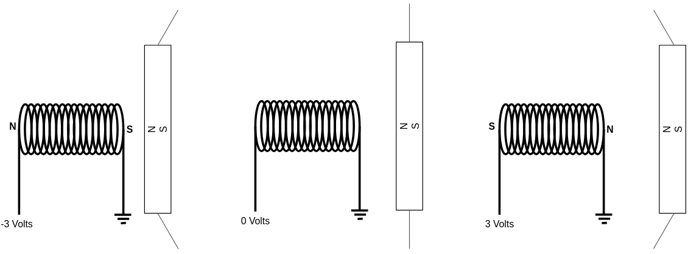
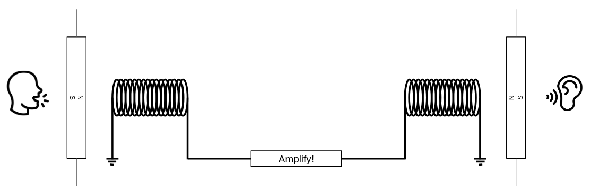
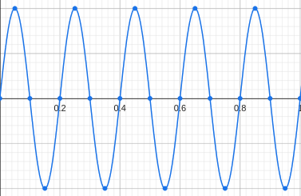
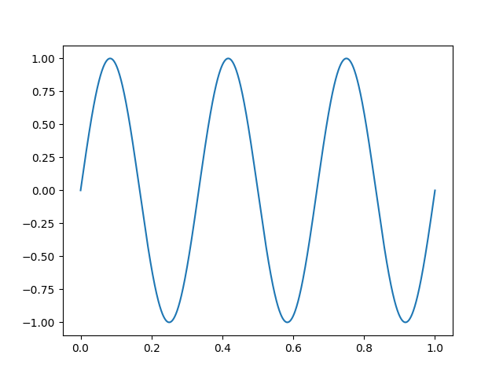
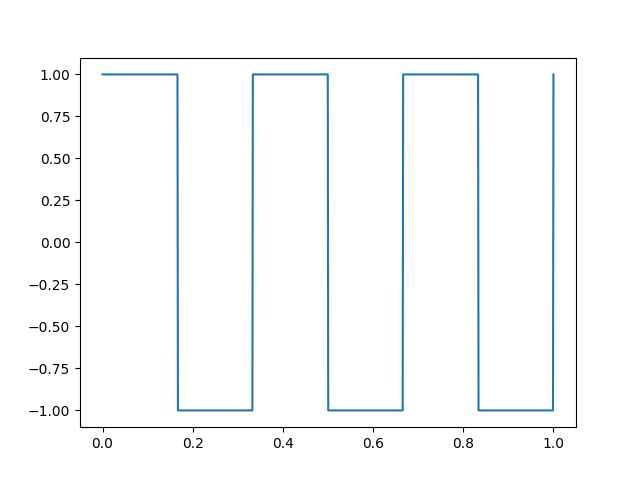
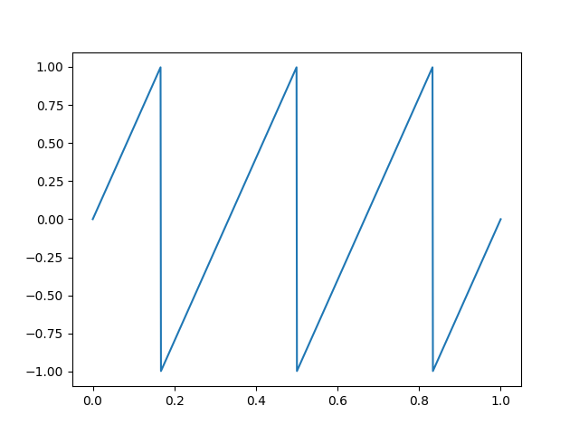
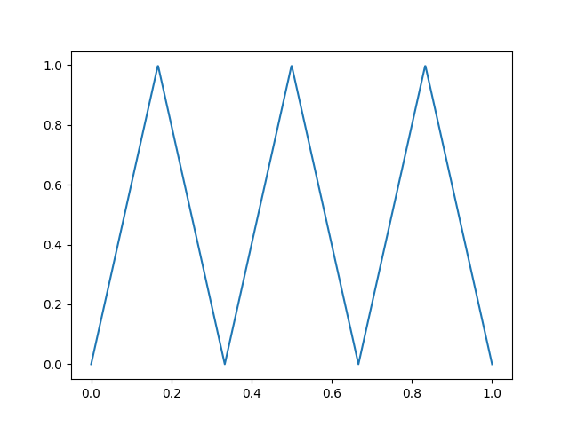
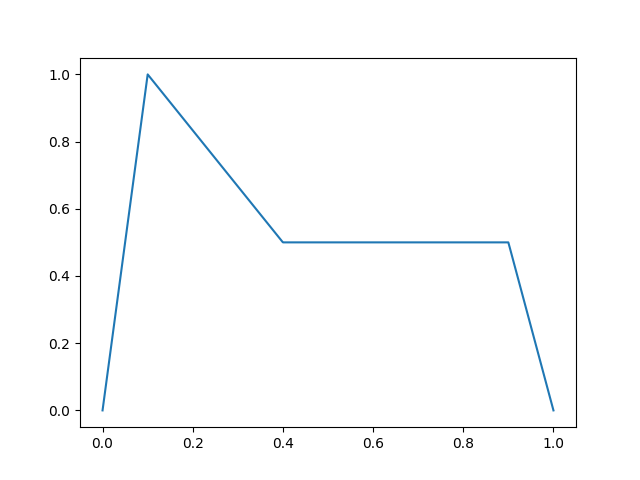

# Hear!

**Music of the chapter:** *Giorgio by Moroder - By Daft Punk*

## Human senses

Before starting this chapter, I'm expecting you to understand that human brains are biologically evolved computers. They are massive networks of interconnected cause/effect gates, which can dynamically change their behavior (Unlike a silicon computer gate, which has a fixed behavior over time) to learn stuff. These interconnected gates excite each other through electrical impulses. Electrical impulses are the language with which our neurons talk with each other. So, in order to sense something from the external world, some kind of translation is needed, and that's why we have **Senses**.

Regular computers have sensors too. For example, we can think of a keyboard as a computer’s way of sensing the world. It allows humans to communicate with it, much like ears and eyes allow a human to receive input from the world around them, including other people. It's interesting to know that there are 6 different kinds of ways a human brain can make sense of the external world. Here is a brief list:


| Name    | Organ      | Stimulus                    | Stimulator    |
|---------|------------|-----------------------------|---------------|
| Sight   | Eyes       | Light                       | Physical self |
| Hearing | Ears       | Sound                       | Larynx        |
| Balance | Inner-ears | Acceleration                | ?!            |
| Smell   | Nose       | Chemical substances         | Sweat         |
| Taste   | Tongue     | Chemical substances         | ?!            |
| Touch   | Skin       | Position/Motion/Temperature | Touch/Hit     |

We used to refer to the human senses as the five main senses, but there are also less obvious types of sensory inputs. For example, there’s something like a gyroscope in your inner ear that allows you to sense rotation and movement through space. This is what lets you feel the acceleration of a car even when your eyes are closed. Similarly, different kinds of pain or bodily sensations can also be considered sensory inputs. The key point is that your brain’s neurons are not only connected to each other, but also to various peripheral systems. These peripherals enable you to function as a complete, integrated human system.

Human brains need to communicate with each other to maximize their evolutionary goals, but they aren't directly wired together. (Imagine if they were actually connected by wires—an interesting question would be: would they then become a single brain? A single "person"?) So, what's the solution? How can a conscious piece of meat, trapped inside a hard skull, communicate with other brains?

Much like the regular computers in your home, human brains also have external auxiliary hardware connected to them, primarily designed to perceive input from other computers—or, in this case, other humans. The eyes, ears, nose, tongue, and skin are examples of input devices connected to the brain, allowing it to sense the effects of the external world.

In addition, there are organs connected to the brain that enable it to produce various outputs or effects in the world. Some examples include generating sound, giving a smile, or even producing attractive scents for mating!

The brain's internal language is the flow of electricity through dendrites and axons. Different parts of the brain communicate with each other via electrical signals. However, for a brain to connect with the external world and transmit data to another brain, a series of cause-and-effect conversions is required. Messages must be transformed into some other form of signal that can travel through the environment, and then be converted back into electrical signals upon reaching the receiving brain.

Imagine you're designing a communication system for human-like creatures that allows them to exchange information through their environment. How would you do it? That's right—the most obvious method is sound: one creature produces vibrations (speech), and another perceives them (hearing). This process is what we know as speaking and listening.

This chapter explores one of the most effective mediums of human communication: sound. Voices, music, and auditory signals have not only shaped human interaction, but also inspired the foundations of modern communication systems.

Today, humans are no longer the only entities that can produce and perceive sound—computers can do it too! You hear digital sounds and voices every day, whether it's a song playing on your laptop, or the sound your phone makes when you press a key. Computers can generate sounds, and more impressively, they can also "hear" them. These sounds don't even have to be mechanical. Your computer, for instance, communicates with your Wi-Fi router using "electromagnetic sounds."

In fact, programming a computer to generate and interpret sound is one of the most exciting and creative things you can do as an engineer.

We’ll begin by exploring the history of sound, starting with the earliest inventions that enabled us to record audio. The good news is that sound waves—the basic building blocks of any sound—can be generated quite easily by a computer. That’s because sound is, at its core, a mechanical disturbance that propagates through the air. There are many ways to convert alternating electrical signals in a wire into mechanical vibrations. And guess what kind of output computers are great at producing? Electrical signals! (Not all human senses are this easy to simulate—smell and taste, for example, are still challenging to reproduce with current technology.)

Along the way, we’ll also take a brief detour into music theory. In fact, understanding music is a fun and intuitive way to start learning about sound. As you progress through this chapter, you’ll discover how you can compose a Beethoven symphony by writing a program that outputs nothing but numbers. Musical notes are like the LEGO pieces of our minds. Putting the right ones in the right order can influence human emotion—evoking sadness, joy, excitement, fear, wonder, and more. Learning how to create music will not only deepen your appreciation for sound, but also make you a better programmer. After all, programming is also about assembling the right pieces in the right sequence to create something meaningful.

Once you’re comfortable generating sound, we’ll shift our focus to how a computer can "hear." You’ll learn that a single sound can actually be a combination of many simpler, "primitive" sounds—and that we can break down complex audio into these basic components. Just like humans, computers can be trained to detect specific primitive sounds within a more complicated mix. We use this principle to build systems that allow computers to communicate with each other through sound.

## History of vibration

Thomas Alva Edison—some people think of him as a villain who stole Tesla’s ideas. We're not here to judge. Regardless of the controversy, he was an inventor whose creations had a significant impact on history and inspired many. In this piece, I want to talk about one of his inventions that I personally find both primitive and impressive: the Phonograph (nowadays often referred to as the Gramophone), the first human invention capable of recording and replaying sound.

Sound itself is the result of mechanical waves traveling through the air. In a vacuum, where air (the medium) is absent, sound cannot travel. Humans can produce sound because they have an organ—the larynx—that vibrates the air. These vibrations eventually reach the eardrums of another person, causing them to move in a specific pattern. To record and replay sound, we must capture these air movements and then recreate them in the same way. Phonographs offer a mechanical approach to this problem.

Phonographs, as defined by Wikipedia, are devices that can record and reproduce sound. The idea behind them is both clever and elegant. Imagine a needle on a rotating disk. The needle is connected to something similar to a loudspeaker, which vibrates when someone speaks nearby. As the needle vibrates, it engraves grooves or varying depths into the disk. Over time, as the disk rotates, these grooves represent the air's movement—the sound—captured over that period.

Here’s what makes the phonograph fascinating: after recording, you can place the needle back at the starting position and play it again. This time, instead of engraving, the needle follows the previously cut grooves, causing it to vibrate. This vibration transfers to the loudspeaker, which in turn vibrates the surrounding air. The air vibrations reach our eardrums, which convert the movement into electrical signals understood by our brain—and voilà, we hear the sound again. This reveals something profound: any arbitrary sound can be encoded as a stream of numbers. In the case of the phonograph, the "numbers" are the depths of the grooves engraved into the disk during the original recording.

Phonographs were an early mechanical solution to the challenge of recording and replaying audio. Eventually, people learned to encode sound as electrical signals and invented electrical speakers, which could convert those signals back into air movement. The way an electric speaker works is surprisingly straightforward. It’s essentially an electromagnet—a magnet whose field is generated by electrical current flowing through a coil—placed near a permanent magnet attached to a flexible diaphragm. When electric current flows through the coil, the resulting magnetic field either attracts or repels the nearby magnet (depending on the voltage’s polarity), causing the diaphragm to move. When the current stops, the magnetic field disappears, and the diaphragm returns to its resting position. This is a direct conversion of electrical signals into mechanical vibrations—in other words, sound.



The system surprisingly works in reverse too! (Remember how a phonograph could both record and play music?) Vibrations in the air can cause the magnet—connected to the diaphragm—to move, which in turn induces an electrical current in the coil. Eureka! You can convert sound into a stream of voltages on one side, transmit it through a wire, and play it back on the other side. This is a very basic explanation of how a simple telephone works.

One important detail is that the electrical current generated during recording is very weak and not strong enough to move the magnet and diaphragm on the receiving end. The solution is to amplify the signal along the way.

A similar principle applies to phonographs. The vibration applied to the phonograph needle alone isn't strong enough to vibrate the surrounding air and produce audible sound. Instead, the vibration is routed to a mechanical loudspeaker, where it is somehow intensified before reaching our ears.

(If you're curious about how the amplification process works, stay tuned for Chapter 6!)



When people speak, a neural process triggers a mechanical response—specifically, the vibration of the larynx. This vibration causes the surrounding air to vibrate as well, creating a wave that travels through the air and reaches the ears of others. In this way, neural activity in one brain leads to neural activity in another, effectively linking minds.

This process forms the basis of a meta-computer we call "society." Human communication acts like neural transistors, enabling the construction of complex systems—essentially large-scale cognitive networks—that are capable of doing remarkably sophisticated and sometimes unexpected things.

## Selective hearing

We are now convinced that what we perceive as audio is nothing but a stream of intensities. This intensity can take different forms: mechanical (like the depth of the groove in a gramophone disk), electrical (alternating voltage in a wire), electromagnetic (a disturbance that can travel even through the vacuum of space), or simply a number in a computer. From now on, let's refer to these streams of intensities as signals.

The main question is: why is something as simple as a signal—a single stream of alternating air pressure—such a perfect medium for humans (or even computers) to communicate with each other? The answer lies in our incredible ability to selectively focus on what’s important to us.

Imagine you're at a party, and everyone is dancing to loud music. There's a lot of noise, yet you can still hear what your friend is saying. That’s remarkable because sound is a single signal—a single stream of intensities. The loud music and your friend's voice are combined into that same signal.

The reason you can still make sense of your friend’s voice in a noisy environment is similar to how you can recognize the taste of an energy drink inside a cocktail—even when it contains many ingredients and is “loud” in flavor. This is because we have specialized receptors that detect different primitive elements of a sensory experience, whether it's hearing or tasting. In the case of taste, the primitive elements might be sweetness, sourness, bitterness, etc. Each specific taste is a unique combination of these basic flavors. But what are the primitive elements of an audio signal?

The answer to this is one of the most incredible and important discoveries in engineering. In 1822, French mathematician Joseph Fourier, in his work on the flow of heat, claimed that any function or signal can be expressed as the sum of a series of sine and cosine terms. This means we can treat pure sine waves as the primitive elements of signals. Fourier also introduced a method to decompose any signal into its sine components—what we now call the Fourier Transform.

If you record someone speaking and decompose the recording into its sine components, you'll find that most of the energy lies within a specific frequency range. Different people speak in different frequency ranges. So, theoretically, if one person speaks in one range and someone else in another, our brain can distinguish between them—even if they speak at the same time!

However, if their frequency ranges are too similar, it becomes difficult for the brain to separate the voices. This is why the human larynx has evolved in such a way that most people have distinct vocal frequency ranges.

## Let your computer speak!

Enough talking. As I always say, the best way to understand something is to explain it to a computer. In this section, we will learn how you can shake the magnetic plate of the speaker on your computer and use that to create different sounds. As we mentioned earlier, sound can be represented as a stream of intensities. This stream can be stored or generated by a computer as well. Computers generally come with hardware that can take a stream of data as input and smoothly apply it to the magnetic coil of a speaker, causing it to move back and forth. This movement vibrates the nearby air, allowing the computer to produce sound on its own. So, our first step is to find a way to send this data stream to your hardware.

If you have a Linux machine, your life will be easier! There is a program called `pacat` (PulseAudio Cat) that allows you to directly send sound samples to your computer’s audio device. It operates at a default rate of 44,100 samples per second (which means if you provide 44,100 samples, it applies all of them to the magnetic coil in exactly one second). By default, it reads signed 16-bit integers from its standard input and plays them through your speaker by varying the voltage applied to the speaker’s magnetic plate. When the sample has the lowest possible value (-32,768), the maximum negative voltage is applied and the plate is pulled inward; when the sample has the highest possible value (32,767), the plate is pushed outward. A sample value of 0 means zero voltage, which results in zero magnetic field and the plate remains in its original position.

The obvious implication is: if you give a constant voltage to the speaker, you won’t hear anything. You’ll only start to hear sound when the input stream of numbers fluctuates rapidly, causing the magnetic plate to move back and forth quickly. The faster the changes, the higher the frequency (pitch) of the sound you’ll hear!

Since `pacat` can accept any data as input, we can try passing non-audio data to it too, just to see what happens! For example, try giving the random data generated by `/dev/urandom` to `pacat`:

```
cat /dev/urandom | pacat
```

You'll hear random noise! It might be fun to hear the voice of the Linux kernel:

```
sudo cat /boot/vmlinuz | pacat
```

Random noise is boring. Now it's the time to generate sounds that actually make sense to our brain. For the beginning, we are going to write a program that can generate sounds of different frequencies. This will become a playground for our experiments and will help us to understand the concepts much better. Throughout this chapter, we'll be generating waves of different frequencies, combining them, manipulating them in weird waves and then hear how it sounds! Let out journey begin!

The formal definition of a wave with frequency \\(f\\), is something like this:

\\(sin(2\pi ft)\\)

\\(t\\) is the variable of time in seconds, and \\(f\\) is the frequency. Plot this function and you'll see that the function oscillates between -1 and 1, for exactly \\(f\\) times during 1 second.

{ width=250px }

Since \\(t\\) is a real number, there are infinite possible values for it (Even in a limited range like \\([0,1]\\)). We can't apply infinite different voltages to our magnetic plate in a finite time. A solution is to increase \\(t\\) with an fixed number, and take a **sample** out of the function. How fast we take samples from our function determines our ***sampling rate***. A sampling rate of 100 means that we are taking 100 samples per second. In order to reach sampling rate of 100, we have to increase \\(t\\) by 0.001 everytime we take a new sample. The sampling rate should be high enough so that we are able to generate a wide range of frequencies, otherwise it'll become useless. A sampling-rate of around ~40000 is enough to be able to generate sounds that are hearable by a human.

A very standard sampling-rate for sounds is 44100. `pacat` uses it by default too. The next step is to substitute the \\(t\\) variable with \\(\frac{n}{44100}\\) where \\(n\\) is the sample number: \\(sin(2\pi f\frac{n}{44100})\\), then we should just create a loop in which the value of \\(n\\) by 1 (Effectively causing the value of \\(t\\) increases by \\(\frac{1}{44100}\\))

```python=
import sys
import struct
import math


# Send sound sample to stdout as a 16-bit signed integer
def put(x):
    sys.stdout.buffer.write(struct.pack("h", int(x * 32767)))


sample_rate = 44100  # Rate per second
step = 1 / sample_rate
length = 5  # Seconds
freq = 440


def f(t):
    return math.sin(t * 2 * math.pi * freq)


t = 0
for _ in range(sample_rate * length):
    put(f(t))
    t += step
```

`put(x)` function is getting a floating point value \\(-1 \leq x \leq 1\\) as its input and putting a signed short integer between \\(-32768 \leq s \leq 32767\\) into the stdout. It is the main gate which allows us to convert an electrical cause to a mechanical effect, by vibrating a magnetic plate in your computer!

Redirect your script's output to the `pacat` program and hear the voice of your program:

```bash
pacat <(python3 music.py)
```

## Frequency combos!

Remember that each arbitrary signal can be assumed as nothing but composition of sine waves? A fascinating fact is, our ears are actually able to recognize the existence of two different frequencies in a single signal, and we can actually experiment that! Instead of defining our `f(t)` function as a single sine, we can embed two sine components in a single signal by adding them together:


```python
def f(t):
    a = math.sin(t * 2 * math.pi * 440) * 0.5
    b = math.sin(t * 2 * math.pi * 660) * 0.5
    return a + b
```

We are multiplying `a` and `b` by `0.5` so that the output value remains between -1 and 1, otherwise the value of `a + b` may go below -1 or above 1, which doesn't make sense to our audio device. When you apply a coefficient to a signal, the sound will remain the same, only the energy/intensity of it (Its volume), will decrease/increase! Here we are halving the volume of our original sine function so that some space remains for the other sine component.

If you hear this function, you will actually notice that it consists of two sounds. Your brain can successfully decompose the output wave into two sounds, and this is amazing! The reason that you can recognize the 440Hz and 660Hz sound in the output of this script is the same reason you can hear your friend in a loud room full of noise, your brain is able to decouple sounds with different frequencies.

## Invent your sound pallete!

Now that we are able to generate sounds of different frequencies, I want you to do an experiment. Try generating frequencies that are of the form \\(2^nf\\). E.g. try hearing these frequencies: \\(440, 880, 1760, 3520, \dots\\)

```python=
def f(t):
    if t < 1:
        return math.sin(t * 2 * math.pi * 440)
    elif t < 2:
        return math.sin(t * 2 * math.pi * 440 * 2) # 880Hz
    elif t < 3:
        return math.sin(t * 2 * math.pi * 440 * 2 * 2) # 1760Hz
    elif t < 4:
        return math.sin(t * 2 * math.pi * 440 * 2 * 2 * 2) # 3520Hz
```

In the code above, we are generating different frequencies through time. We start with 440Hz, and we double the frequency every 1 second.

Hear them carefully, and then compare how they sound when their frequency is doubled. Try a different coefficient. Generate sounds that are of the form: \\(1.5^nf\\): \\(440, 660, 990, 1485, \dots\\)

We can discover something very strange and important here. Sounds that are generated when the frequency is doubled each time, are very similar to each other (At least, to our brain). While in the second experiment, sounds seem to be different with each other. If the sounds that are generated in the first experiment are similar, then what makes them different?

Let's try another experiment (This time without coding!). Play one of your favorite musics and try to sing on it. Try to sing on it with lower and higher pitches. Even though you have changed your voice, your singing still "fits" the song. By singing on a song with higher pitch, you are not actually shifting your frequency by some number, but you will actually multiplying it by a power of two. A man and woman with totally different frequency ranges can both sing on the same song, but both of the singings will "fit" on the song, as long as the frequencies are multiplies of powers of 2. I think it's now safe two say, frequencies that are doubled (Or halved) every time, have same feelings.

Let's start with 300Hz. We calculate powers of two multiplied by the base frequency. Here is what we get:


`..., 37.5Hz, 75Hz, 150Hz, 300Hz, 600Hz, 1200Hz, 2400Hz, ...`

Although there areLet's agree that they are all basically the same "sound", and let's put a name on them. Let's call them **sound number 1** or S1.

Whatever frequency we take from the range 300Hz-600Hz, there will also exist the corresponding "same-feeling" sound in ranges 75-150, 150-300, 600-1200, 1200-2400 and etc.

Conversely, we can also conclude that any random frequncy have an corresponding "same-feeling" frequency in 300Hz-600Hz range. In order to find its same-feeling frequency, we just need to halve/double it, until it gets between 300Hz-600Hz. (E.g. let's start with 1500Hz, we halve it 2 times and we get 375Hz which exists in the range, so 375Hz is the equivalent same-feeling sound of 1500Hz). We know there are infinite number of frequencies between 300Hz-600Hz. A single S1 is not enough for creating beautiful pieces of music. We could only build Morse codes out of the single sounds! So let's discover and define other sounds in the same range.

Imagine we define S2 as a sound that is in the middle of two S1s. Given that the self-feeling sounds are repeated in a loop, here is what we should expect:

```
S1 - 75Hz
S2 - ?Hz
S1 - 150Hz
S2 - ?Hz
S1 - 300Hz
S2 - ?Hz
S1 - 600Hz
S2 - ?Hz
S1 - 1200Hz
```

What is the definition of middle? Let's say, \\(C\\) is in the middle of \\(A\\) and \\(B\\), when the distance between \\(C\\) and \\(A\\) is equal with the distance between \\(C\\) and \\(B\\). How is *distance* defined in case of frequencies? As a first guess, we can take the average of two S1 frequencies in order to find the S2 frequency.

```
S1 - 75Hz
S2 - (75 + 150)/2 = 112.5Hz
S1 - 150Hz
S2 - (150 + 300)/2 = 225Hz
S1 - 300Hz
S2 - (300 + 600)/2 = 450Hz
S1 - 600Hz
S2 - (600 + 1200)/2 = 900Hz
S1 - 1200Hz
```

As you can see in the calculations, you can get other S2 sounds by multiplying/dividing any S2 sound by powers of 2, just like what happened with S1. So the derived S2 frequencies are all valid and all same in terms of their feelings.

This is not the only way one can define the "middle" frequency here. Imagine instead of taking the average, we multiply the numbers, and take their square-root instead. This is called an "multiplicative" average, or a geometric mean (As opposed to an arithmetic-mean that we used in the first example):

\\(m=\sqrt{ab}\\)

We know that the frequencies are doubled in each iteration, so \\(b=2a\\). Substituting this in the equation we get: \\(m=\sqrt{2a^2}=a\sqrt{2}\\)

```
S1 - 75Hz
S2 - 75 x sqrt(2) = 106.06Hz
S1 - 150Hz
S2 - 150 x sqrt(2) = 212.13Hz
S1 - 300Hz
S2 - 300 x sqrt(2) = 424.26Hz
S1 - 600Hz
S2 - 600 x sqrt(2) = 848.52Hz
S1 - 1200Hz
```

As you can see, both of these definitions of "middle" give us valid sounds (By valid, I mean they are frequencies that are same-feeling), that indeed are in the middle of the S1 frequncies. The first definition of "middle" gives us numbers that have same arithmetic distance with the S1 frequencies (\\(m-a=b-m\\)), while in the second definition, the results are numbers that have same multiplicative distance with the S1 frequencies (\\(\frac{m}{a}=\frac{b}{m}\\)). Unfortunately, each of these defintions of middle is giving us different middle frequencies.

So, the million dollar question is, which one is the more appropriate defintion of "middle" here?

Let's look to those numbers again, this time without considering the middle frequencies. Take 3 consecutive S1s in a row. (E.g `300Hz 600Hz 1200Hz`). By definition, if we take 3 consecutive sounds, the second one is in the middle of the first and third sound. If we forget about our artificial middle frequencies and take a stream of S1s as our reference sounds, are the middle frequencies the artithmetic or the geometric mean of the other frequencies? 

Let's say our 3 consecutive sounds are \\(2^ka\\), \\(2^{k+1}a\\) and \\(2^{k+2}a\\). How can we calculate the middle frequency if we only had the values for the first and the third frequency? Let's try both artithmetic and geometric means.

\\(m_a=\frac{2^ka+2^{k+2}a}{2}=\frac{2^k(a+4a)}{2}=5\times 2^{k-1}a\\)

\\(m_g=\sqrt{2^ka \times 2^{k+2}a}=2^{k+1}a\\)

Obviously, geometric mean is the natural definition of "middle" in a raw stream of S1 frequencies, so it makes a lot of sense to define middle as the geometric mean.

Good to mention that another bug also happens when we try to define middle frequencies with arithmetic means. Although S2 resides in the middle of two S1s, S1s do not reside in the middle of S2s! \\(\frac{112.5 + 225}{2} \neq 150\\). This does not happen when we use geometric means: \\(\sqrt{106.06 \times 212.13}=150\\).

Fortunately, we have been able to find a way to halve frequency ranges and create new same-feeling sounds out of them! But are 2 sounds enough for making a song? Well, we don't have to stop here. We can still find the middle of a S1 and a S2 and define a new S3 sound. The middle of the gap between an S2 and the next S1 can also define a new S4 sound. We can build infinitely many sounds just by halving the frequency gaps!

{width=250px}

Enough explanation. Given that you now know how same-feeling sounds are derived, let's talk about the standard frequencies that are used in the music we hear everyday. Just like how we defined a base frequency S1 for deriving new sounds, music composers also defined a base frequency (That is 440Hz) and derived the other sounds out of it. They called their base frequency **A**, splitted the gap between two consecutive **A**s into 12 different sounds (Probably because 12 was big enough to make big variations of music and small enough so that the sounds remain distinguishable for human ears) and named the 11 other derived sounds as `A# B C C# D D# E F F# G G#`. How can you take 12 sounds out of a base frequency? New sounds can be derived by multiplying the previous sound by \\(\sqrt[12]2 \simeq 1.05946\\). Starting from \\(A\\) sound, if you do this 12 times, you get back to the next same-feeling A sound again, because \\(\sqrt[12]2^{12}=2\\).

```
A = 440Hz
A# = 440 * 1.05946 = 466.16
B = 440 * 1.05946^2 = 493.88
C = 440 * 1.05946^3 = 523.25
C# = 440 * 1.05946^4 = 554.37
D = 440 * 1.05946^5 = 587.33
D# = 440 * 1.05946^6 = 622.25
E = 440 * 1.05946^7 = 659.25
F = 440 * 1.05946^8 = 698.46
F# = 440 * 1.05946^9 = 739.99
G = 440 * 1.05946^10 = 783.99
G# = 440 * 1.05946^11 = 830.61
A = 440 * 1.05946^12 = 440 * 2 = 880
```

Just like painters, we now have a sound pallete!

## Let your computer sing!

Now that we have our pallete of sounds ready, we may start playing simple pieces of melodies! A simple melody consists of musical notes that come, stay for some time and then fade away. There can also be times when no musical not is being played, silence itself is an ingredient of music.

Defining the frequencies of musical notes as a list of constants may come handy in the next sections:

```python=
SILENCE = 0
A = 440           # La
A_SHARP = 466.16
B = 493.88        # Si
C = 523.25        # Do
C_SHARP = 554.37
D = 587.33        # Re
D_SHARP = 622.25
E = 659.25        # Mi
F = 698.46        # Fa
F_SHARP = 739.99
G = 783.99        # Sol
G_SHARP = 830.61
```

We can have a chain of `if`s in order to play different notes at different times. Here is an example that goes through the musical notes in a C major scale (We'll have a quick look into the theory of music and scales soon):

```python=
# Play Do, Re, Mi, Fa, Sol, La, Si!
def f(t):
    if t < 0.2:
        f = C
    elif t < 0.4:
        f = D
    elif t < 0.6:
        f = E
    elif t < 0.8:
        f = F
    elif t < 1.:
        f = G
    elif t < 1.2:
        f = A
    elif t < 1.4:
        f = B
    else:
        f = SILENCE
    return math.sin(t * 2 * math.pi * f)
```

Notice that we define `SILENCE` as a wave with frequency 0.

Instead of defining a melody as a long list of `if`s, we may have a list of notes and calculate the index of the note that should be played in any given time by doing a division:

```python=
SONG = [C, D, E, F, G, A, B]

def f(t):
    note_index = int(t / 0.5) % len(SONG)
    f = SONG[note_index]
    return math.sin(t * 2 * math.pi * f) if f else 0
```

We are now ready to synthesize our first melody: let's go ahead and play Twinkle Twinkle Little Star:

```python=
SONG = [C, C, G, G, A * 2, A * 2, G, SILENCE, F, F, E, E, D, D, C]
```

(Note: the reason we are multiplying `A` by two is that we want the version of `A` with higher pitch (Or the `A` note on the next ***octave***), remember the same feeling sounds? We discussed that if you multiply a note by a power of two, you will get the same sound, but in a higher pitch, so effectively, `A * 2` is still `A`!)

Ok, there is a small problem here, the subsequent notes which have same frequency are connecting together. `[C, C]` doesn't sound like two independent `C`s, but it sounds like a long-lasting `C`. Here is a quick solution:

```python=
DURATION = 0.5  # Seconds
WIDTH = 0.8  # 80% of the note is filled with sound, the rest is silence

def f(t):
    note_index = int(t / DURATION) % len(SONG)

    if t - note_index * DURATION > DURATION * WIDTH:
        return SILENCE

    f = SONG[note_index]
    return math.sin(t * 2 * math.pi * f)
```

Here we are silencing the last 20% of the note duration with silence. This makes it possible for us to distinguish between the notes! Try different `WIDTH`s to see the difference.

## Yins and Yangs

Years ago when I was a high-school student, once our Chemistry teacher wanted take an oral quiz from us. He randomly chose a student, brought him to the blackboard and asked him an unusual question. Why does a proton has positive electrical charge, while an electron has negative electrical charge? Why isn't it the other way round?

The question has a fairly simple answer, negativity and positivity are merely names assigned to these primitive particles, so that we can analyze their behaviors. The question is like asking why humans with male reproductive systems are called men, while humans with female reproductive systems are called women?

Genders and electrical charges are not the only dualities in our universe. In fact, we have infinite concepts in our unverse that has duals. Good and bad, happiness and sadness, light and dark, love and hate, forward and backward, angel and devil, heaven and hell, or even zeros and ones in our computers, they are all examples of dualities.

In many of these duals, one thing refers to the presence of something while the other things refers to the absence of that thing. In context of zeros and  ones, we can say one refers to existence of some quantity while zero defines absence of it.

Duals are interestingly two sides of a single coin. A single side cannot exist alone: it can only have a meaning when the other side also exists. That holds true for all other duals. Happiness wouldn't exist if there wasn't any sadness. Positive numbers wouldn't exist if there weren't any negative numbers (If we didn't have negative numbers, our algebra would become bugos).

You can see that many of these interesting phenomena emerge when we try to pull "numbness" from two sides and break it into into two ***meaninful pieces***.

Some of these halvenings are conceptual, meaning that they are not something emerged in our universe like protons and electrons, or women and men. And example is negative and positive numbers, or real and imaginary numbers. We can somehow argue that negative and positive numbers are things that exist even if our universe does not exist.

And some of them are reflections of these conceptual Yin and Yangs. The fact that some living creatures have genders only emerged after millions of years of evolution. In fact many living creatures did not have genders and they split into two only after evolution decided to mimick duality, maybe because duality is good.

You might wonder why I'm saying all this. Well, I thought thinking about duals could be a good starting point for understanding why melodies have feelings in themselves. Why do some of them bring joy, while the other bring sadness?

## Recipes of feelings!

Play these two frequency combos with your synthesizer, and think about how you feel about them. If you were supposed two attribute the happy/sad feelings to these sounds, how would you do it?

The first one is a sound composed of three frequencies `A`, `C_SHARP`, and `E`, known as a A-major triad:

```python=
def f(t):
    a = math.sin(t * 2 * math.pi * A) * 0.33
    c_sharp = math.sin(t * 2 * math.pi * C_SHARP) * 0.33
    e = math.sin(t * 2 * math.pi * E) * 0.33
    return a + c_sharp + e
```

The second one is a sound composed of three frequencies `A`, `C`, and `E`, known as a A-minor triad:

```python=
def f(t):
    a = math.sin(t * 2 * math.pi * A) * 0.33
    c = math.sin(t * 2 * math.pi * C) * 0.33
    e = math.sin(t * 2 * math.pi * E) * 0.33
    return (a + c + e) * 0.33
```

Most probably, you will percieve joy when listening to the A-major sound, while feeling confusion and sadness when listening to the A-minor sound. The reason we attribute feelings to musical patterns like these are merely cultural! Music has somehow become an international language among humans, since there are very few nations/tribes in the world who will percieve minor patterns as happy and major patterns as sad. This simple duality (That is somehow made-up by humans!) is one of the most important foundations of what we today know as music!

Sequences may have minor/major feelings too. Play these two sequences of notes and think about how you feel about them:

```python=
A_MAJOR = [A, B, C_SHARP, D, E, F_SHARP, G_SHARP]
A_MINOR = [A, B, C, D, E, F, G]
```

Just like the frequency combos, it's very probable that you'll find the `A_MAJOR` sequence happy and confident, while the `A_MINOR` one has a bit of confusion and probably sadness.

If you are already excited about the way a simple note sequence might feel, you might want to try these two:

```
A_MINOR_HARMONIC = [A, B, C, D, E, F, G_SHARP]
A_MINOR_MELODIC = [A, B, C, D, E, F_SHARP, G_SHARP]
```

The feelings of both of them are very similar to the `A_MINOR` sequence, but they have even more confusion, one might even say that these sequences have some kind of "magical" feelings.

You can keep going and expanding the sequences by appending the same notes that are in the next octaves. It's easier to catch the feelings of the sequences this way:

```python=
def next_octave(m):
    return [n * 2 for n in m]


SONG = A_MINOR_MELODIC
SONG += next_octave(A_MINOR_MELODIC)
SONG += next_octave(next_octave(A_MINOR_MELODIC))
```

Now, think of these note not as sequences, but as ingredients which you can use for making melodies. Choose a sequence and cook a melody by picking notes only from that sequence. You will have a melody which can have a happy, sad, confusing or even a more complicated feeling! These sequences, or note-ingredients are what is called by musicians as ***musical scales***. We just explored A-major and A-minor scales.

Now tell me, what is the musical scale of the Twinkle Twinkle Little Star melody we synthesized earlier? Wrong! Although the musical notes that are used in this song are the notes of the A-minor scale, it has a happy feeling, it has a "major" feeling! So what has happened?

To understand what is happening, let's first play the expanded version of A-minor scale again, but this time, we'll cut the first two notes in the resulting sequence:

```python=
A_MINOR = [A, B, C, D, E, F, G]
SONG = A_MINOR
SONG += next_octave(A_MINOR)
SONG += next_octave(next_octave(A_MINOR))
SONG = SONG[2:]
```

Weird, it seems like that the location of the sequence from which we start our sequence has strong effects in the way the melody feels!

The truth is, the resulting sound is not in the A-minor scale anymore. Although it has a major feeling, it's not an A-major (You can compare them). It is a C-major!

```python=
C_MAJOR = [C, D, E, F, G, A * 2, B * 2]
```

What is pattern that makes `A_MAJOR` and `C_MAJOR` have same feelings, although using different notes? The truth lies in that ratio the frequecy is increasing!

```python=
def ratios(song):
    res = []
    curr = song[0]
    for i in range(1, len(song)):
        res.append(song[i] / curr)
        curr = song[i]
    return res

A_MAJOR = [A, B, C_SHARP, D, E, F_SHARP, G_SHARP]
C_MAJOR = [C, D, E, F, G, A * 2, B * 2]

print(ratios(A_MAJOR))
print(ratios(C_MAJOR))
```

The resulting lists are both equal, this means that the notes themselves are not important, but the way the frequencies are increasing is what makes these sequences to have special feelings.

We can have functions that can make minor/major scales for us:

```python=
HALF_STEP = math.pow(2, 1 / 12)
WHOLE_STEP = HALF_STEP * HALF_STEP

def apply_scale(starting_note, scale):
    result = [starting_note]
    for step in scale:
        result.append(result[-1] * step)
    return result


def minor(starting_note):
    return apply_scale(
        starting_note,
        [WHOLE_STEP, HALF_STEP, WHOLE_STEP, WHOLE_STEP, HALF_STEP, WHOLE_STEP]
    )


def major(starting_note):
    return apply_scale(
        starting_note,
        [WHOLE_STEP, WHOLE_STEP, HALF_STEP, WHOLE_STEP, WHOLE_STEP, WHOLE_STEP]
    )
```

Now you can make musical scales on the fly!

## Chords

Our ears are wonderful. They can distinguish between different frequencies and notes, even when they are mixed up with each other. It might be worth noting that this isn't true for our eyes. Our eyes can't distinguish between the yellow color, and the mixture of red and green colors! (Yes, they are different, and this unfortunate fact isn't that bad: it has made it much easier for us to build color display! More on this in the next chapter)

So if the ears are able to make sense of "frequency mixtures", why not trying to bake new sounds by mixing different frequencies with each other? It'll be like mixing different colors with each other and making new colors!

In the world of music, these mixtures are often referred as "chords". Chords are simply just mixtures of different notes that exist in a certain musical scale. Musicians have found ways to make up chords that feel nice and good. Let's explore a few of them. I would like to start with *triads* (We already explored the A-major and A-minor triads if you remember): these are chords that are made of 3 different notes. Just like how we categorize musical scales as majors and minors, some triad chords are also categorized in this way too.

Given a starting note, here are some of the triads you can make:

```python=
def major_triad(root):
    return [root, root * (HALF_STEP ** 4), root * (HALF_STEP ** 7)]

def minor_triad(root):
    return [root, root * (HALF_STEP ** 3), root * (HALF_STEP ** 7)]

def diminished_triad(root):
    return [root, root * (HALF_STEP ** 3), root * (HALF_STEP ** 6)]

def augmented_triad(root):
    return [root, root * (HALF_STEP ** 4), root * (HALF_STEP ** 8)]
```

As you expect, minor and major triads have sad and happy feelings, but we have two new patterns here too: diminished and augmented triads somehow sound mysterious, disturbing and some people say melancholic!

Now, you may want to use chords in your music to go above building pure melodies. Not all chords are going to "fit" to the musical-scale your are using in your music! Here is how you can make triads that will sound nice and fit your music: start with a root note in the scale, and also pick the third and fifth notes. E.g in scale of A-major, here are the triads you can use:

- **A** B **C#** D **E** F# G#
- A **B** C# **D** E **F#** G#
- A B **C#** D **E** F# **G#**
- A B C# **D** E **F#** G# **A**
- A B C# D **E** F# **G#** A **B**
- A B C# D E **F#** G# **A** B **C#**
- A B C# D E F# **G#** A **B** C# **D**

Let's automate this and write a function that can generate the triad chords of a given scale for us on the fly:

```python=
def triads(scale):
    # The scale is repeated twice to avoid overflows!
    notes = scale + next_octave(scale)
    res = []
    for i in range(7):
        res.append([notes[i], notes[i+2], notes[i+4]])
    return res
```

[POINTER]

Sometimes we already have a note in a given scale, and we just want to extract the corresponding triad of it:

```python=
def triad_of(note, scale):
    scale = scale + next_octave(scale)
    i = scale.index(note)
    return [scale[i], scale[i+2], scale[i+4]]
```

Now let's substitute the notes in the Twinkle Twinkle Little Star with their corresponding triads, and play the triad notes simultanously on every note. We'll define a new function `combo` to make it easier for us to play a note-combination given a list of frequencies:

```python=
def combo(t, freqs):
    return sum([
        math.sin(t * 2 * math.pi * f) for f in freqs
    ]) / len(freqs)

def f(t):
    note_index = int(t / DURATION) % len(SONG)
    triad = triad_of(SONG[note_index], C_MAJOR)
    return combo(t, triad)
```

See how richer our output has got!

Our toolset is almost enough for generating random pieces that feel somewhat good to our ears. Given we now have some knowledge on musical scales and feelings, we may even inject our desired feelings to these pieces.

Our brief journey in theory of music has now ended. In the next sections, we are mostly going to study more on the waves themselves.


## Storing melodies

It's a shame to limit your synthesizer to the Twinkle Twinkle Little Star melody. You perhaps are more interesed in synthesizing the sound of your favorite music, so perhaps you want your synth to be able to play and synthesize some sort of a standardized format for storing melodies. This way, you'll be able to compose a lot of other melodies which people have made and published over the internet for you! There actually is a very commonly used format for exactly that purpose named MIDI. MIDI (Or Musical Instrument Digital Interface), as defined in Wikipedia: ***is a file format that provides a standardized way for music sequences to be saved, transported, and opened in other systems***. You might challenge yourself to write a MIDI parser and interpreter for your synth, but MIDI is a pretty complicated format, and one might need to read a enormous document before he can implemenet it, so I decided to start with something simpler:

There is a simple file format developed by mobile phone manufacturer Nokie for storing ringtones, named RTTTL. We are going to implement a RTTTL parser since it's a relatively simple format. The RTTTL version of the StarWars theme is something like this:

```
StarWars:d=4,o=5,b=45:32p,32f#,32f#,32f#,8b.,8f#.6,32e6,32d#6,32c#6,8b.6,16f#.6,32e6,32d#6,32c#6,8b.6,16f#.6,32e6,32d#6,32e6,8c#.6,32f#,32f#,32f#,8b.,8f#.6,32e6,32d#6,32c#6,8b.6,16f#.6,32e6,32d#6,32c#6,8b.6,16f#.6,32e6,32d#6,32e6,8c#6
```

A RTTTL file is composed of 3 sections, separated by `:`. Here is the description of each section:

1. First comes the name of the song, e.g: `StarWars`
2. Then comes a comma (`,`) separated list of parameters: `d=4,o=5,b=45`
    - `d` is the default duration of each note (As number of *beats*)
    - `o` is the octave which we are in
    - `b` is the beats per minute.
3. And at last we have another comma separated list of notes: e.g: `32p,32f#,32f#,32f#,8b.,8f#.6,32e6,32d#6,32c#6,8b.6,16f#.6,32e6,32d#6,32c#6,8b.6,16f#.6,32e6,32d#6,32e6,8c#.6,32f#,32f#,32f#,8b.,8f#.6,32e6,32d#6,32c#6,8b.6,16f#.6,32e6,32d#6,32c#6,8b.6,16f#.6,32e6,32d#6,32e6,8c#6`
    - For each note, we first have its duration (As number of beats). If there isn't any, then the default one is used.
    - Then comes the note
    - If there is a `.` after the note, it means you should multiply the duration with `1.5`
    - And then comes the octave (Otherwide, the default octave is used)

Here is a function that accepts a RTTTL script and returns a list of notes:

```python=
def parse_rtttl(rtttl: str):
    NOTES = {
        "p": 0,
        "a": A,
        "a#": A_SHARP,
        "b": B,
        "c": C,
        "c#": C_SHARP,
        "d": D,
        "d#": D_SHARP,
        "e": E,
        "f": F,
        "f#": F_SHARP,
        "g": G,
        "g#": G_SHARP,
    }
    name, params, body = tuple(rtttl.split(":"))
    params = {p.split("=")[0]: int(p.split("=")[1]) for p in params.split(",")}
    notes = body.split(",")
    res = []
    for note in notes:
        dur, name, dotted, oct = re.match(
            r"(\d*)([a-gA-GpP#]{1,2})(\.?)(\d*)", note
        ).groups()
        freq = NOTES[name]
        dur = int(dur) if dur else params["d"]
        oct = int(oct) if oct else params["o"]
        if dotted:
            dur += dur // 2
        res.append((freq, dur))
    return res
```

Here are some other RTTTL melodies you might want to try!

```
GoodBad:d=4,o=5,b=56:32p,32a#,32d#6,32a#,32d#6,8a#.,16f#.,16g#.,d#,32a#,32d#6,32a#,32d#6,8a#.,16f#.,16g#.,c#6,32a#,32d#6,32a#,32d#6,8a#.,16f#.,32f.,32d#.,c#,32a#,32d#6,32a#,32d#6,8a#.,16g#.,d#
Gadget:d=16,o=5,b=50:32d#,32f,32f#,32g#,a#,f#,a,f,g#,f#,32d#,32f,32f#,32g#,a#,d#6,4d6,32d#,32f,32f#,32g#,a#,f#,a,f,g#,f#,8d#
```

## More than Sines!

After playing some melodies by generating different frequencies in a sequence, you might nag that the notes are very pure, emotionless, and not at all close to what we hear when we press a key on a piano, and you are right. We are generating pure sine-waves, meaning that what we hear contains only a single frequency. If you analyze the sound coming out of a musical instrument, you will notice that not only it contains frequencies other than the main frequency, but also the strength of those frequencies change over time.

It's not easy to generate a piano sound using pure sine frequencies, but there are other ways we can oscillate a loud-speaker, letting us to get more creative and generate sounds that are more interesting and weird.

As an example, imagine sharp jumpings to -1 and +1 instead of smoothly going up and down like a sine wave. This will make a square wave that feels very differently. Square-waves have vintage feeling, since the game consoles back then didn't have speakers with enough precision for generating sound with needing smoother movement of the speaker's magnetic plate. All they could do was to sharply pull and push the magnetic plate!

## Sounds as gates

Engineering is all about making new things, by gluing already existing things together. When synthesizing a sound, the "things" that are being glued together are math functions that produce intensity samples given time. Let's call these functions ***samplers***. 

So far, we have been putting all of the sound sampling logic inside a single `f` function. In case `f` was simply generating a sine wave, any change on the frequency of the wave would need direct changes in the definition of the `f` function. A nicer, more engineer-friendly (!) approach would be to define some ***primitive samplers*** and provide toolings for combining them together and making new samplers (Like chapter 1, where we defined transistors as primitive elements and started building logic gates and more complex circuits on top of them). In case of producing sound samples, periodic functions like sine-wave generators are basic enough to be considered ***primitive***. Since these functions are kind of oscillating your speaker, we call them ***oscillators***!

Unfortunately there isn't a single sine-wave oscillator since sine-wave oscillators with different frequencies are different and thus sound different. Creating a new function for each of the frequencies is neither practical nor smart, so, thanks to Python we are able to define a function that is able to get a frequency as an input and return a sampler function as its output!

As an example, here is a sampler-creator function that accepts a frequency as its input and returns a sine-wave sampler as its output:

```python
import math

def Sine(freq):
    def out(t):
        return math.sin(2 * math.pi * freq * t)
    return out
```

{ width=250px }

Now, `f` can be defined by the output of an oscillator like `Sine`:

```python=
f = Sine(440.0)
```

See how better it looks? Here are some other forms you can oscillate a speaker. Try hearing them all!

***Square***

```python
import math

def Square(freq):
    def out(t):
        if math.floor(2 * freq * t) % 2 == 0:
            return 1
        else:
            return -1
    return out
```

{ width=250px }

***Sawtooth***

```python
def Sawtooth(freq):
    def out(t):
        return 2*(t*freq - math.floor(1/2 + t*freq))
    return out
```

{ width=250px }

***Triangle***

```python
def Triangle(freq):
    def out(t):
        return 2*abs(t*freq - math.floor(1/2 + t*freq))
    return out
```

{ width=250px }

### The gates

In our model of a synthesizer, we assumed that there are some set of ***primitive*** samplers, which we can pick as a starting point for building more complicated samplers, thus now we kind of need sampler generators which will accept other samplers as their input. Let's start with a simple example: imagine we want to synthesize a sine wave which has a lower volume compared to the original `Sine` sampler. We can either create a completely new sampler like `LowVolumeSine`, or create a general-purpose volume-decaying sampler named `Gain`, which will accept a sampler as input and returns a new one in which the samples are scaled by some constant:

```python=
def Gain(inp, s):
    def out(t):
        return inp(t) * s
    return out
```

Now, if we want to hear `Sine(440.0)` with 50% of volume, we would only need to pass it to the `Gain` sampler like this:

```python=
f = Gain(Sine(440.0), 0.5)
```

Another interesting example would be to get a sampler and apply a coefficient to its input:

```python=
def Speed(inp, s):
    def out(t):
        return inp(t * s)
    return out
```

The following sampler will sound like a 880Hz sound wave, becase we are sampling x2 faster!

```python=
f = Speed(Sine(440.0), 2)
```

When composing a melody, we had to make the notes to stay only for a limited time. Such behavior can be described with a sampler! The mask sampler will get a input sampler, and only allows the first `dur` seconds to pass!

```python=
def Mask(inp, dur):
    def out(t):
        if t >= 0 and t <= dur:
            return inp(t)
        else:
            return 0
    return out
```

You can also shift a sampler in time:

```python=
def Delay(inp, delay):
    def out(t):
        return inp(t - delay)
    return out
```

The `Delay` and `Mask` samplers together can allow you to play a specific sampler, for a limited time, starting at a specific time. The given sampler will start playing a 440Hz sine wave at 5.0s and end in 6.0s.

```python=
f = Delay(Mask(Sine(440.0), 1), 5)
```

Just like the multi-input logical gates we explored in the first chapter, you may also compose a new sampler by combining more than a single sampler. This is where the magic slowly starts to show itself!

```python
def Compose(samplers):
    def f(t):
        v = sum([sampler(t) for sampler in samplers])
        return v
    return f
```

These three alone are enough for composing melodies:

```python
f = Compose([
    Delay(Mask(Sine(440), 1), 0),
    Delay(Mask(Sine(440), 1), 1.5),
    Delay(Mask(Sine(440), 1), 3),
    Delay(Mask(Sine(440), 1), 4.5),
])
```

This way of describing a sound is definitely less-efficient (Performance wise) than directly implementing the wave-generator as a plain Python function, but look how manageable and beautiful the code has got. (Perhaps we can achieve the same speed if we write some kind of compiler that is able to translate the modular definition into plain code).

**ADSR**

Hearing all these compositions of different oscillators, you may still notice that the sounds are far from being pleasant to your ears, and one of the main reasons is that the intensity of those sounds is constant in time, while in real-world, a note gets loud with a delay, and will smoothly lose its intensity as time passes. One way we can bring such effect in our simulation is to actually manipulate the volume of our oscillator through time.

One of those methods, known as ADSR (Attack, Delay, Sustain, Release), assumes that a musical note starts with a volume of 0, quickly reaches its peak volume and then quickly gets down to relatively quieter volume, stays there for a longer time and then starts decreasing its intensity until it reaches zero.

These timings might be different for different instruments, and they do not neccessarrily change linearly. For the sake of simplicity, we will assume the changes all happen in a linear fashion. Here is a graph:

{ width=250px }

Fortunately, applying an ADSR effect is as simple as multiplying the ADSR function with the oscillator function!

```python
def Adsr(sampler, a_dur, d_dur, s_dur, r_dur, a_level, s_level):
    def f(t):
        if t < 0:
            coeff = 0
        elif t < a_dur:
            coeff = (t / a_dur) * a_level
        elif t < a_dur + d_dur:
            coeff = a_level - ((t - a_dur) / d_dur) * (a_level - s_level)
        elif t < a_dur + d_dur + s_dur:
            coeff = s_level
        elif t < a_dur + d_dur + s_dur + r_dur:
            coeff = s_level - ((t - a_dur - d_dur - s_dur) / r_dur) * s_level
        else:
            coeff = 0
        return sampler(t) * coeff
    return f
```

## Macro Music Language

Macro Music Language (MML) is a very old and deprecated music description language for storing melodies on computers. MML was originally designed to be used in video games back in 70s, so you probably can't find a lot of software that can play MML files, though I chose to introduce and implement this format since it's fairly simple to implement and there are plenty of music available in this format which you can test your synthesizer with, and unlike RTTTL, it may contain multiple lines of melodies which are played in parallel. Here is a brief spec of this language:

A MML music consists of commands.

- `cdefgab` the notes. You may get the sharp/flat versions of them by appending `#`/`-` respectively. You may also specify the duration as a fraction of the whole note. E.g `a2` is a half-note and `b#8` is an eighth note. If a duration is not specified, a default duration is used. If a `.` appears after the note duration, the duration should be multiplied by 1.5.
- `r`/`p` rest/pause! Just like the regular notes it may have a duration as a fraction. E.g `p4` pauses as long as a quarter note.
- `o` followed by a number, selects the octave.
- `>`, `<` used for going to the next/previous octave.
- `l` sets the default duration for note, as a fraction of the whole note. E.g `l8` sets the default duration to 1/8 of a whole note.
- `v` follewed by a number, sets the volume of the instrument. 
- `t` followed by a number, sets the tempo in beats per minute.

A MML music may be composed of several lines of melodies which should be played all at the same time. These lines of melodies are separated using `&`.

Now we would like to write our MML synthesizer as a sampler, just like all samplers we defined in the previous sections. The `ComposeMML` sampler accepts a MML text, and a instrument as its input, and produces a sampler as its output. The instrument is simply a function that returns a sampler given a pitch.

```python
def simple_instrument(pitch):
    return ADSR(Sine(pitch), 0.1, 0.3, 0.5, 0.1, 1.0, 0.5)

def ComposeMML(mml, instrument):
    return Compose([
        # ...
    ])
```

## Frequency Modulation

One of the interesting sounds you can try to generate is the sound of a siren. A siren is a device that can generate a loud sound, with alternating frequency. The frequency is alternated itself in a sine pattern. Assuming the sound's frequency alternates between \\(f_1\\) and \\(f_2\\), we can calculate frequency, by time, as follows:

\\(f=f_1 + (f_2-f_1)\frac{sin(t) + 1}{2}\\)

We already know altering the intensity of a sound is as simple as applying a coefficient to its sampler function. If you multiply the above function with an oscillator, its volume will alternate. Knowing that we can generate sine wave with frequency \\(f\\) with \\(sin(2.\pi.f)\\), you may conclude that the sound of a siren can be modeled by substituting \\(f\\) with the alternating \\(f\\) formula:

\\(sin(2.\pi.(f_1 + (f_2-f_1)\frac{sin(t) + 1}{2}))\\)

Try to generate and play this sound. It will sound weird, not at all like a siren. But why?

[TODO: Frequency modulation]

How can we emulate an ear in a computer

\\(X_k=\sum\limits_{n=0}^{N-1}{x_n.e^{-i2\pi kn/N}}\\)


## Reverb, sound tracing and …

Have you ever heard the echo of your sound in a mountain? Or any echo chamber, like a church? Not only can you hear yourself back, but also the reflected sound has a very fuzzy, dreamy, spritual and psychedellic effect, making it a perfect ingredient for musicians to add to their music. The effect is also known as reverbation, and is pretty common in many style of music we hear nowadays. The fact is, the musicians are not recording their music in echo chambers, thanks to the advancements of electronics and signal processing algorithms, the sound does not have to be reflected in a chamber. We can trap the sound inside an electrical wire, or even a computer simulated chamber, and allow it to chaoticly reverb.

Reverbation is perhaps the most complicated and exciting part of building an audio synthesizer, and here we are going to implement a very simple version of it!

## Sound is data

## Electromagnetism

Sounds are the result of vibrating air propagating through space. Sound is a kind of wave. When you disturb a still water from some point, the disturbance will start propagating from that point. A cause on a point will have effects on points far from the original point. Just like water (Or any other liquid), waves can be propagated through gases too. Waves are a very important mean of communication. Humans mainly use sound waves for communication. They disturb the air by vibrating their larynx, and the diturbance will propagate in air until it reaches the ears of the listener. Computers can communicate through sound too. Using what you have learnt so far, you can write programs that can encode data as sound and send it through the air to another computer.

Since the sounds we make are propagated through air, without air, we won't able to speak with each other. If you put two people in a vacum space, all they'll see is their friend's lips moving without hearing anything! That's why astronomers communicate through walkie-talkies with each other!

World is a strange place, besides particles and materials, there are non-mechanical things too. Even wondered what prevents two magnets with same poles to get close to each other? If you try to get them close, you'll feel there is "something" in between them, but there actually is nothing. It turns out that moving that "thing" (As the result of moving the magnet), can disturb the area around it too, just like when you move inside water.

Here's another way to think about it: Imagine your entire body is floating in the water in a swimming pool. Assume that the water is completely still, and it will remain so as long as you also remain still and don't move any part of your body. A very slight movement of your hand will create a disturbance in the water (in this case, the water represents the context). Your hand's disturbance will start propagating and reach all parts of the pool. The effect is not immediate, and it will take some time for the motion to reach other areas of the pool. If you start vibrating your hand with some frequency, you will soon see that a slighter vibration (with the same frequency) will begin happening in other parts of the water. The farther the destination point, the more time it takes for the motion to reach, and the less powerful the vibration will be. The very same thing happens in the air. We are all floating in a pool of air, and any movement in the air will have effects on the way air moves. That's why we can communicate with each other. In this case, the context is "air."

Now, there exists a more unusual kind of context in which waves can occur. We can assume that space is filled with some kind of unknown matter that gets distorted when magnets/electrons move through it. This is the context where electromagnetic waves can propagate. This is the context which our cell-phones, wireless networks, gps satellites, remote controls communicate through. The disturbances in this medium are propagates with speed of light, and that’s one of the reasons why we building our computers to communicate through sounds ( which propagate through air, with a speed of 300ms, a lot less than the speed of light)

Metals are also isolated environments in which certain kind of waves can propagate. Imagine having two wires, connected to a power source with a voltage of 5V. Assume we slowly decrease the voltage to 0. The fact is, the effect is not immediate, and the decrease in voltage will reach the end of the wire with some delay!

Einstein claimed that there can’t be anything faster than light [TODO]

If you even remove the sun from the solar system, the earth will keep orbiting around the missing sun for about 7 minutes, [TODO]

Heinrich Hertz, the German physicist, was the first to prove the existence of electromagnetic waves (that's why the unit of frequency is Hertz). James Clerk Maxwell (we'll learn more about his work in the next chapters) predicted the existence of such waves even before Hertz. However, Hertz was the first to show that they truly exist. He accomplished this by capturing the transmitted waves through an antenna he built himself. It's amusing to know that Hertz believed his invention was worthless and had no use, as he said:

"It's of no use whatsoever... this is just an experiment that proves Maestro Maxwell was right—we have these mysterious electromagnetic waves that we cannot see with the naked eye. But they are there."

It's challenging to imagine our world nowadays without his invention. Hertz's story is a good example that demonstrates the potential and impact of studying seemingly useless science in our lives.

Hertz's transmitter and antenna were straightforward, and you can build one yourself if you're curious enough.

Although your computer can generate electromagnetic waves in specific frequency ranges (such as WiFi and Bluetooth), unfortunately, it's not possible to generate arbitrary electromagnetic waves. I always wished there was a way to generate electromagnetic waves by putting wave samples on a wave generator hardware (just like what we do with audio). There are good reasons why manufacturers have not included hardware for that in your computer. If you could generate arbitrary waves, you could interfere with many government-controlled facilities, including national television and radio.

Waves are waves, whether mechanical or electromagnetic; they all share very similar traits. The most important and useful feature of a wave is its ability to transfer data.

Studying waves and how you can utilize them to connect people together is a fascinating topic in both computer and electrical engineering. As I always say, experimenting is the best way to learn. So, throughout the next sections, we are going to experiment with waves using an easy-to-generate kind of wave. We know that it's not possible to generate electromagnetic waves with your computer, and we have also seen how easy it is to generate sound waves. Therefore, we will stick to sound waves and try to transfer different kinds of data between computers through sounds!

## Distribute sound, radio stations

Sound is the primary medium of communication for humans, but unfortunately, speaking becomes ineffective when your audience is far away, and the reason is that sound waves lose energy as they propagate in the space.
The world was a very different place before the invention of telecommunication technologies. The only way you could communicate with your beloved ones (Who were far away), was to send them physical letters. In the best case, your letter could be delivered in the time it took to transfer a physical object from you to your destination (Which was not very fast obviously). There are faster things in universe by which you can transfer messages of course, light is an example. Lights are also waves, just like sounds, but unfortunately we can't "hear" electromagnetic waves, so we can't use them directly, as a medium of "verbal" communication. We can try to design an intermediary language for translating sentences to visual effects and vice versa. The simplest example of such protocol, is some coding technique known as Morse codes.

Invented in the 1830s by an American artist, Samuel Morse (Yes, sometimes artists are pioneers of technology), Morse code is a method for encoding/decoding latin-alphabet letters into a series of signals (Electrical or visual). It is worth noting that Morse-codes are designed in a way such that the most frequent letters in latin-alphabet have shorter signal representations.

{ width=250px }

## Hearing with your computer

PulseAudio's `pacat` program lets you to put raw audio samples on your computer's speakers. On the other hand, there is another program `parec` which allows you to record audio samples. `pacat` puts whatever it gets through stdin on your computer's speaker, while `parec` puts audio samples it gets through your computer's microphone on stdout. Using these commands together you can record and play audio:

```
parec > record.wav
pacat < record.wav
```

Another interesting thing to experiment is to pipe the the `parec`'s output into `pacat`. Spoiler alert! Your voice will be echoed:

```
parec | pacat
```

Now let's try to pass the `parec`'s input through a filter that we'll write in Python, and hear its output via `pacat`:

`parec | python3 filter.py | pacat`

Here is a simple filter that allows only half of the samples to go through (`filter.py`):

```python
import sys, struct

def get():
    return struct.unpack('h', sys.stdin.buffer.read(2))[0] / 32767

def put(x):
    sys.stdout.buffer.write(struct.pack("h", int(x * 32767)))

while True:
    get() # Skip one sample
    put(get())
```

You will hear a high-pitched version of your voice! (Since skipping the waves-samples will make the waves in the input sound to seem like they are alternating two times faster).

By skipping one of the samples per every two sample, we were able to halven the length of the sound, increasing the speed and frequency of the input sound by a factor of two.

Looking carefully, by skipping the samples, what we are actually doing is taking the samples like this:

\\(out[i] = in[2i]\\)

Changing the coefficient to 3, makes our input sound 3 times faster. but what if we want to make it only x1.5 faster?

\\(out[i] = in[1.5i]\\)

Unfortunately, all kinds of digital signals which we process in a computer are discrete, meaning that they are sequences of numbers, the result of sampling the signal over a fixed interval, and you don’t directly have the signal in between two intervals. Although we don’t have the signal data between two intervals, we can predict them with a good accuracy! A very simple prediction model assumes that the distance between two consecutive samples goes through a line!

In other words, you can assume that \\(inp[5.5] \simeq \frac{inp[5] + inp[6]}{2}\\)

So far, we have had done a lot of experiments using the `pacat` command, and now it's the time to see what can be done if we allow other computers to receive wave-samples. We have learnt to compose sounds, now its time to decompose them! Putting samples on your computer’s speaker allows you to make disturbance in the air around your computer’s speaker. The disturbance, as seen in the previous sections, will propagate in the space finally reach your ears and you will hear it. Computers can hear those disturbances too, through microphones. Using these two devices together you can build protocols with which computers can talk with each othrr, without any wire connection.

The disturbance doesn’t necessarily need to happen in the air, for example you can basically build devices that can disturb the water in a pool in one side and build a device to detect and listen to the disturbances in the other side of the pool. Using these two, two computers may communicate with each other through water waves!

In real world, what your computer is generating is an electrical signal that is given to a speaker. You can connect the exact same wire to other things too. In fact:

- Connect that wire to a speaker, and the data will propagate through air.
- Connect that wire directly to the destination computer, and the data will propagate through the electrons in the wire.
- Connect that wire to an antenna, and the data will propagate through space.
- Connect that wire to a light-emitter within a optical fiber cable, and the data will propagate through visible light.

## Fourier Transform

Fourier-Transform is a method/algorithm by which you can extract frequencies within a wave-form. Remember we could generate sounds that were compositions of two sine-waves with different frequencies? When hearing those sounds, your brain is able to successfully recognize the presence of two different frequencies in what it hears, and that is actually why we are able to understand what someone is saying in a crowded environment with a lot of noise. Our brain is able to focus on a certain frequency (Which is the frequency-range of your friend's larynx). If our brains are able to decompose sounds by their frequency, it's reasonable to think that computers can do that too. Fourier-Transform is the answer. Given a list of signal samples, it will tell you what frequencies are present in that signal. Here is an example:

```python
import cmath  # Math for complex numbers
import math
import matplotlib.pyplot as plt


def fft(x):
    N = len(x)
    if N <= 1:
        return x
    even = fft(x[0::2])
    odd = fft(x[1::2])
    T = [cmath.exp(-2j * cmath.pi * k / N) * odd[k] for k in range(N // 2)]
    return [even[k] + T[k] for k in range(N // 2)] + [
        even[k] - T[k] for k in range(N // 2)
    ]


def get_freqs(x):
    result = [abs(v) / (len(x) / 2) for v in fft(x)]
    return result[: len(x) // 2]


def sine(freq, t):
    return math.sin(2 * math.pi * freq * t)


def sampler(t):
    return sum(
        [
            sine(440, t)
            + 5 * sine(1000, t)
            + 2 * sine(2000, t)
            + 0.5 * sine(9000, t)
            + 8 * sine(16000, t)
        ]
    )


samples = [sampler(t / 32768) for t in range(32768)]
freqs = get_freqs(samples)

plt.plot(freqs)
plt.show()
```


Assuming our sample-rate is \\(2^n\\), the \\(get_freqs\\) function will get an array of size \\(2^n\\) (The signal samples), and will return an array of size \\(2^{n-1}\\). The \\(i\\)th element of this array tells your the presence of a sine wave with \\(i\\)Hz frequency in your input signal. Don't believe it? We can do an experiment, we can actually loop over the frequencies, generate the sinusoids according to their phase and magnitude, and then reconstruct the original frequency:

```python=
N = 32768
samples = [sampler(t / N) for t in range(N)]
fft_result = fft(samples)

res = [0 for _ in range(N)]
for freq, val in enumerate(fft_result):
    phase = cmath.phase(val)
    magn = abs(val)
    for i in range(N):
        res[i] += magn * math.cos(2 * math.pi * freq * i / N + phase) / N * 2
```

Although the code above verifies the fact that the FFT algorithm really works, it's very inefficient (The computation complexity is \\(O(n^2)\\) because of the nested loops). In fact, you can use the FFT algorithm itself (Which is of order \\(O(n.log(n))\\)) in order to get back from the frequency-domain into the original signal:

```python=
def ifft(x):
    fft_conj = fft([n.conjugate() for n in x])
    return [n.conjugate() / len(x) for n in fft_conj]
```

The reason that the output array has half of the number of elements in the input array comes back to the fact that, in order to be able to recognize a signal of frequency \\(f\\), you need to at least have \\(2f\\) samples of that signal (E.g you can't recognize a 20000Hz frequency in a signal, if your sample-rate is 30000).


Humans are able to hear sounds with frequencies as high as around 20000Hz, that's why the typical sample-rate for audio files is something around twice of 20000. (A sample-rate of 44100 is pretty popular!).


## Dummiest Modulation Algorithm Ever (DMAE)

Assuming that we can generate waves of a single frequency in one machine, and recognize the existence of that exact frequency in another machine, let's try to design an algorithm to transfer data through audio, by encoding the bits into sound waves on one sides, and decoding them, converting back the audio waves into bits on other side (The encoding/decoding parts are usually referred as Modulation and Demodulation).

Let's start by simply generating a sine wave of frequency \\(f_d\\) (Data frequency) when we want to transmit a 1, and avoid generating it when we want to transmit a 0. On the other computer, we will listen to the sound samples and perform a fourier transform on them. Whenever we recognize a \\(f_d\\) frequency, we will output a 1, and otherwise a 0. Obviously, we have to agree on a fixed time interval by which bits are sent, otherwise we wont know how many consecutive 0s (Or 1s) are meant to be received in case the receiver is the presence/absence of \\(f_d\\) is being detected for a long period of time.

As an extra feature, we would like to let the other machine know whenever we have finished sending our data. Right know, we will probably stop generating any sound when there are no more bits to be sent. The receiver machine is not able to know whether we are out of bits, or we are just sending a lot of 0 bits. A simple solution to that problem is to include another frequency \\(f_e\\) in our generated signal, which is only generated when there are data to be sent.


In this case, the receiver will only accept bits when the \\(f_e\\) frequency is also present in the received signal (Besides presence or absence of data frequency).


## Noises, noises everywhere...

Unfortunately, the air is full of noises, if you start speaking while two computers are transmitting data through audio, the disruption may corrupt data, leading unwanted data to be sent on the destination computer. Even the echo/reflections of the sound in the environment may have negative effects (Remember, all waves share similar traits, reflections happen for electromagnetic waves too)

There are methods and algorithms by which you can detect and correct errors in data transfers.

For the sake of simplicity, we won’t discuss error correction. We will try to provide an effective way for error detection, and ask the sender computer to resend the data in case it detects errors.

If you have some knowledge of data-structures, you probably have heard of hash-functions, which are building blocks of hashmaps and hashsets. Hash function are function that get inputs of arbitrary size and give out outputs of fixed size. The special thing about a hash-function is that a slight change in their input has massive effect on their output, and it's hard (And almost impossible, in case we are speaking about crypto-graphically secure hash function, discussed in chapter 5) to find an appropriate input that result in a specific output.

Hash functions (Atleast the idea behind them!) can be useful for detecting errors that happen on data transfers. It's simple, just append the hash of the data to the data you are going to send. The receiver will cut the postfix for you, hash the data and will then check if the hash matches with the postfix. If there is a mismatch, then either the data or the hash itself has got curropted, and the receiver may ask the sender to retransmit the data. (The request to re-send the packet can be carried through the same communication medium we used for sending the data. Packets may also have numerical identifier, so that the receiver can tell the sender exactly which packet got a hash mismatch)

Now, imagine the sender transfers gigabytes of data and the receiver detects an error (It's very very probable when transferring large pieces of data). Isn't it overkill to ask the sender to send the entire data again? Of course not. A better idea is to chunk the data into smaller pieces and detect the errors and ask for retransmission of the smaller parts. In fact, that's the main reason why data in our modern networking infrastructures is sent through ***packets***, 

The method described for detecting errors is very inefficient and is not what really happens inside our networks, but the idea is almost the same. After applying the mentioned idea to our sound modulator/demodulator software, we'll have a very error-prone communication medium. Try sending a computer image through sound, it'll probably take hours but it'll work perfectly!

## Telephone revolution

When talking about the invention of telephone, many people will give all the credit to the Scottish-born inventor, Alexander Graham-Bell, while just like many other inventions, telephone has a long history too, which includes several names. Graham-Bell was not the first one who had the idea of building a device which could transmit voice through a wire. One of the notable people who worked on a similar idea was a German inventor named Johann Philipp Reis, who invented the Reis telephone, 15 years before Graham-Bell. Unfortunately, Reis died before he could be credited for the invention of telephone. 

Reis considered his invention as a device for transmitting music, so he termed his microphone the 'singing station'. Very similar to a phonograph, the Reis telephone was based on a vibrating needle that could increase/decrease electrical resistance between two contacts, which could lead to generation of a electrical disturbance/signal, traveling through a wire. It's very interesting to know that phonographs was invented after telephone (1877)!

In a phonograph, the vibrations made on the needle was causing mechanical effects on a spinning disk. In the Reis'es telephone, those vibrations were causing electrical effects in a wire. Both of these effects could be later/farther be played by a receiver through a speaker. In case of a telephone, the receiver would just amplify those electrical effects, causing vibration in the air, restoring the sound.

Alec Reeves - inventor of pcm 1930s

James Russel - 1978 - store music on optical

Hdd 1956 IBM

Digital data transfer samuel morse early 19th

1950 computers connected dedicated communication lines

## Information

Our world is continuos (At least it seems to be) but our computer can only work with discrete data.

- The number of pixels our cameras can capture in a fixed area is limited
- The frames we capture per second in a video-camera is limited
- The audio samples we capture in a microphone is limited
- ...

These limitations cause interesting phenomena: have you ever seen video recording of helicopter rotor blades? Or anything that spins very fast? In some of those recording you may see the blades spinning very slowly, or not spinning at all, or even spinning in reverse! This happens due to the fact that we are limited in the number of frames we're capturing per second. Suppose it takes 10 milliseconds for our camera to take a new frame, and it also takes exactly 10 milliseconds for the spinning object to do a full spin. When the camera takes the new frame, the spinner has already made a full rotation and is back in its original position, so it looks as if it has not spinned at all. Now, slightly increase the rotation speed of the spinner, the spinner will start moving, but very slowly. Decrease the rotation speed and now it looks as if it's spinning in reverse!

It's interesting to know that human eyes do not have "frame-rates". They don't work like video-cameras. Whatever you perceive with your eye stays in your brain for a very short period of time, even if you move your eyes and look at something else, the previous thing you were looking at is still there, but it is just fader. It turns out that pictures take around 1/16 seconds to completely fade away from your eyes, even if you stop looking at them, which somehow means, what you see is the ***average picture*** of what you were looking at in the previous 1/16 seconds. Thus if you look at a spinning blade directly through your eyes, you will see something blurry, instead of perceiving it as if it's not rotating, like a video camera.

Another kind of aliasing effect happens when you try to take a picture of something with a lot of alternations, like a net!

-----

If your video-camera is able to capture 60 frames per second, you can't tell if the blade is spinning at:

- 0 RPS, or 60 RPS in reverse
- 10 RPS, or 50 RPS in reverse
- 15 RPS, or 45 RPS in reverse
- 29 RPS, or 31 RPS in reverse
- Generally: \\(n\\) RPS, or \\(60-n\\) RPS in reverse

If you don't believe this, here is a proof:

- We know that the camera captures a new frame every \\(\frac{1}{60}\\) seconds.
- Let's assume the blade spins at speed 15 RPS. Thus the blade does a complete rotation every \\(\frac{1}{15}=\frac{4}{60}\\) seconds. This means that, when a frame is taken, the blade has gone \\(\frac{1}{4}\\) rotation.
- Let's assume the blade spins at speed 45 RPS. Thus the blade does a complete rotation every \\(\frac{1}{45}=\frac{\frac{4}{3}}{60}\\) seconds. This means that, when a frame is taken, the blade has gone \\(\frac{3}{4}\\) rotation. This also looks like as if the blade has rotated in reverse for \\(\frac{1}{4}\\) rotation!

This is definitely some kind of data-loss! Unless you are completely sure that the blade does not rotate in reverse, or you are sure that it does not spin faster than 30 RPS. Extracting a general rule out of this: ***If you are sure that the blade you are capturing a video of spins no faster than \\(n\\) RPS, then, in order to accurately tell the speed and direction of the spin speed through video, your video camera has to capture at least as fast as \\(2n\\) frames per second.***. Formally speaking, the sampling rate (Here, the samples are frames) should be at least twice of the maximum frequency. This is known as the ***Nyquist rate*** and is one of the most fundamental facts of a beautiful category of science known as Information Theory.


-----


***Zeno's paradox***

Zeno's paradoxes are a series of arguments made by greek philosopher Zeno, which tries to illustrate the problematic concept of ***Infinite divisibilty*** in space and time. All of these paradoxes are actually trying to tell us the same thing (If we are not being strict)

Here is one of those paradoxes which you may have heard of before:

Suppose Atalanta wishes to walk a path. Before she can reach to the destination, she must get half-way there, and before reaching to that point she must go \\(\frac{1}{4}\\) of the way, and before that \\(\frac{1}{8}\\) of the way, and so on. Seems like, she has to perform an infinite number of tasks in order to move, which Zeno believes is impossible

-----

Humans love to store and copy. If you can copy or store something, you can transfer it. You can write your thoughts on a letter and then give it to your lover to read

Humans dream: being able to share their past experience to the present and future. To the people that are not near them. To people in the future even after they physically die, because life has evolved in a way to keep you alive as long as possible, sometimes the conceptual version of you, and not the physical you. That’s probably why people proudly compromise their lives for something they believe in, because it will make them eternal. Life is strange.