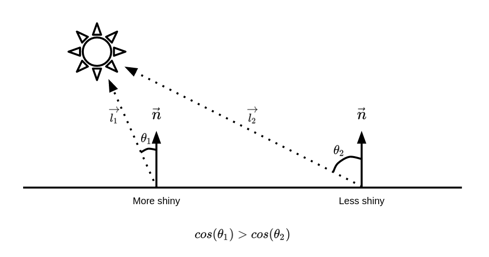

# See!

**Music of the chapter:** *Video Killed The Radio Star - By The Buggles*

Vision is my (Or probably all people's) favorite way of sensing the world. Imagine out of 6 humans senses, you only could have one of them, which one would you choose?

Vision allows you to find stuff around you, even when they are far enough that you can't access them by your hands. It guides you to things in a physical environment. It shows you the wild animal a coming to you before it's too late.

## History of colors

Human eyes are 2d-arrays of electromagnetic receptors that can recognize electromagnetic waves inside the visible spectrum, which are waves with wavelengths of 380-700 nanometers, or in terms of frequency, waves with frequencies of 400-790 terahertz. Theoritically, of you pick a magnet, and and shake it 400,000,000,000,000 times per second, you will see red light coming out of it. Shake it even faster and it will become violet, after that, it will become ultra violet which is not visible by human eyes.

Before studying how an human eye works, let's design one for ourself. As you may already know, electrical flows run a biological neural network. So external inputs need to be translated into electrical signals before they can be understood by your brain. We can use a linear mapping for this conversion. We can map the visible specturm into a voltage between 0.0 and 1.0, where 0.0 is red and 1.0 is violet:

\\(e=\frac{f-400tHZ}{390tHZ}\\)

Unfortunately, this mapping doesn't explain how black and white colors are represented in a brain. Well I have to tell you something. Black and white colors do not exist. (Or even light-red and dark-blue colors!) They are imaginary colors our brain has invented for itself in order to perceive darkness (Black) and presence of all waves (White). Well I have some bad news. A light beam doesn't necessarily have a single frequency in it. It can be a combination of multiple frequencies, and our mapping can only handle a single frequency. so we need a different represantation for a color of a pixel. A very naive solution is to have a lot of sensors sensing the strength of different frequencies in the visible spectrum for each pixel. I.e. we can have a set of sensors \\(e_{400}\\), \\(e_{401}\\), ..., \\(e_{790}\\), that can measure the presence of different frequencies (And the neighbour frequencies) as a voltage between 0 and 1. In this model, when all frequencies are 0, the brain will perceive it as black. When all frequencies are 1, the brain will perceive it as white. The problem with this model is that it will need a lot of cells for each pixel. If the human eye is a \\(n \times n\\) array, then we'll need \\(n \times n \times 390\\) cells in order to perceive an image.

We can get smarter than that. Imagine there are only two sensors per pixel, one will tell you how close the frequency is to \\(f_a\\) and another will tell you how close you are to \\(f_b\\) (Imagine \\(f_a=500tHZ\\) and \\(f_b=600tHZ\\)) 

If you are ok in math, you probably know that we can build such behavior using the exponetiation of the absolute difference. (Or squared difference, like a Gaussian distribution equation)

\\(e_a = s.e^{-abs(\frac{f - 500}{50})}\\)
\\(e_b = s.e^{-abs(\frac{f - 600}{50})}\\)

Now let's try different frequencies in this scheme (Let's assume the strength \\(s\\) of all frequencies is \\(1\\)):

\\(f=0\\) then \\(e_a \simeq 0\\) and \\(e_b \simeq 0\\)
\\(f=500\\) then \\(e_a = 1\\) and \\(e_b \simeq 0.13\\)
\\(f=550\\) then \\(e_a \simeq 0.36\\) and \\(e_b \simeq 0.36\\)
\\(f=600\\) then \\(e_a \simeq 0.13\\) and \\(e_b = 1\\)
\\(f=1000\\) then \\(e_a \simeq 0\\) and \\(e_b \simeq 0\\)

*It's much easier for a brain to analyze differences between outputs, rather than memorizing different values*

Now let's take advantage of this design and hack it! Let's say I have two light bulbs, one can emit \\(500tHZ\\) lights and one can emit \\(600tHZ\\) lights. Is there a way I can convince the eye that it is seeing a \\(550tHZ\\) light? Yes! Instead of emitting a \\(550tHZ\\) light with strength \\(1\\), I can emit a \\(500tHZ\\) light of strength \\(\simeq 0.32\\) and a \\(600tHZ\\) light of strength \\(\simeq 0.32\\) at the same time. This will make \\(e_a = e_b \simeq 0.36\\) which are the same values needed to convince the brain it is seeing a \\(550tHZ\\) light!

Now the brain's algorithm can be something like this:

- If both \\(e_a\\) and \\(e_b\\) are zero, then there is no color (Darkness, infrared or ultraviolet)
- If \\(e_a\\) is much higher than \\(e_b\\) then the color is orange.
- If \\(e_b\\) is much higher than \\(e_a\\) then the color is green.
- If \\(e_a\\) and \\(e_b\\) are relatively equal, then the color is yellow.

Enough imagination! These numbers and formulas are all invented by me to explain the concept. Let's talk about the actual design of human eyes. So the human eyes is designed very much similar to the artifical eye we designed in the previous section. The only difference is that the human eye has receptors for 3 colors instead of 2. I'm sure you can guess what these three colors are! Red, Green and Blue. This fact was discovered in 1802 by Thomas Young (British polymath) and Hermann von Helmholtz (German physicist). They argued that there are 3 kinds of photoreceptors (Now known as cone-cells) in the eye, and they also mentioned that these cells have overlapping response to different wavelengths, allowing our brains to also recognize colors in-between red, green and blue wavelengths. They also mentioned that human eye is not perfect, because it is not able distinguish between yellow, and a mixture of red and blue. If our brains were able to distinguish between those two, it would be much much harder to build computer screens that we have today (Might be even impossible!). That's when God says, this is a feature, not a bug! It's also kind of sad that we are actually blind since our vision (Even in the visible specturm) is very limited and we can only observe very few combinations of light waves.


## The trade-off

Light and sound, are both results of disturbances that propagate through different contexts. They are both waves, the former is electromagnetic, and the latter is mechanical. So, if they are actually are very similar to each other, why don't we listen through our eyes and see through our ears? Isn't that theoritically possible? Well, not only theoritically, it is even technically possible to see through hearing! You may already know that part of the bats\ navigation strategy depends on producing high-frequency sounds and hearing them back (Notice how similar the generated sound is with a light-source!). Humans have themselves built devices that can see through hearing. The sonography machine, which is used for taking pictures from the inside of your body, is basically a 2D array of ears which can "see" by litting your body with ultrasonic waves and hearing them back.

There are probably reasons the evolution has not decided to make humans hear through electromagnetic waves:

- If that was the case, the sun (Or any other light-source) could disrupt human communications (Imagine hearing the sun!)
- Nature has not been able to find a way to convert neural impulses into electromagnetic waves (I.e it has been very hard for the nature to build a electromagnetic larynx!)

Also, light is much faster than sound, that's why you can see mountains that are hundreds or even thousands of kilometers away from you and be sure that what you see is not something from the past (That's not the case with sound. Even the sound of thunderstorms surprisingly take seconds to reach to our ears). Also, since we need light-sources for seeing stuff, hearing through sound would also need "audio-sources". There isn't a gigantic source of audio on the earth helping us to see through hearing, that's why bats need to produce sounds themselves in order to see their surroundings. Even if humans could produce the audio needed for seeing themselves, it would take enormous amount of energy in order to produce sounds strong enough that could reach places that are thousands of kilometers away. Sun spreads its wave everywhere for free, so why bother seeing through sound? Mechanical waves are just not good candidates for vision.

Besides all these, there is also another big difference between an eye and an ear:

- A human ear is a single wave-receiver that is able to decode a large specturm of frequencies (20Hz-20000Hz)
- A human eye is a 2D array consisting of many wave-receivers that are able to decode very limited number of frequencies (Only three, red, green and blue! But with some tricks, as we discussed in the previous section humans are able to distinguish between electromagnetic frequencies in the range of 400THz-790THz)

A funny analogy: ears are like CPUs, they have a single core (cochlea!) that is able to execute (hear) many kinds of instructions (frequencies) whereas eyes are like GPUs, they consist of many cores (photoreceptors) that are able to execute (see) a limited set of instructions (frequencies). Strangely, GPUs are for calculating pixels that will reach to the corresponding photoreceptor of your eye!

## Memento

Years later, in 1826, a french inventor named Nicéphore Niépce had the dream of recording scenes of real life. Back then people knew that there are some chemical compounds that make chemical reactions when they are exposed to light. The chemical reaction would convert the compound to a different compound which fortunately had a different color. The more intense the light is, the stronger the chemical reaction is, applying stronger color changes to the compoound. Nicéphore took advantage of this, he made a plate coated with such a compound and put it inside a camera obscura. A camera obscura was a dark, isolated room with a small hole (Filled with a lense) on one side that projected the image of the outside on the wall. Nicéphore put his coated plate on the wall, and let it be there for a few days. After a few days, the image of the outside started to appear on the plate, which is the very first photography ever done in the world. The resulting picture wasn't perfect (What did you expect?) but the experiment was revolutionary enough to inspire other inventors for building the modern photography.

James Clerk Maxwell, you probably have heard his name before, because of the electromagnetic equations he discovered before, was only 24 years old when he discovered the importance of the trichromatic theory that Young and Helmholz proposed in 1802. The three-colour method, first proposed by Maxwell, was a method for taking colour photographs, given the fact that human eye is only sensetive to 3 ranges of colours. Redness, greenness, and blueness.

He argued that if we take three photographs of the same scene, one with a filter that only passes red light, one that only passes green light and one that only passes blue light, and then somehow combine these three photographs together on a plate, our eyes will be hacked to see a coloured version of that scene. 6 years later, he made the very first colour photography of the history.

You probably already know that when coloured movies came out, old fashioned movie makers were skeptical of them. Good to know that photographers back then also resisted to take coloured photos, but history has shown us that nobody can fight against advancement of technology.

## Digital era

Over a century passed before humans invented digital photography, and a lot of inventions and discoveries happened in between (E.g. people started to take pictures in very high speeds and record "movies"), and I would like skip the history and advancements of the analog photography industry in the next 100 years, because there are too many details that are unrelated to the core idea, and start talking about the digital era, the time when people started to store vision on a computer.

It's good to know that digital scanners came before digital cameras. It's also kind of obvious that they have a much simpler structure than digital cameras. The very first digital scanner was invented in 1957 by an american engineer named Russell Kirsch. His scanner could scan photos of size 5cmx5cm in the resoluion of 176x176 pixels (30976 pixels, i.e. ~30 kilopixels!). The bit-depth of his scanner was only 1-bit! The pixels could only be complete black or complete white, so there were no intermediate shades of gray.

In order to deeply understand how digital photography works, you first have to know there exist some materials that their electrical resistance change when they are exposed to light. They are called photoresistors. Their resistance typically decrease when they are exposed to light. So, if you connect a battery to them, when there is no light, no/small current will flow. But when there is light, current will flow. The more intense light is, the more current it will flow. Now how can we use this to measure light intensity of a physical point? Imagine we emit light to a black surface. A black surface will reflect no light, so a photoresistor nearby won't get excited. A white surface will reflect all the light. so the photoresistor will get excited and current will flow. Now imagine we have an electrical circuit that measures the electrical current in a photoresistor. If current is higher than a threshold \\(t\\), it will output 1, otherwise it will output 0.

What Russell Kirsch did in 1957, was something like this: He made a photoresistor that could move on a 2D grid with electrical motors. It would start on the point \\((0,0)\\) and scanned a complete row, by moving little by little (In case of a 5cmx5cm area, the distance between pixels is 5cm/176, which is around 0.28mm. Then it would move to the next row and scan another line of pixels. It would output 0 or 1 for each pixel. His scanner was so simple so it couldn't scan grayscale information. But he did a trick. Remember there was a threshold \\(t\\)? He scanned a point several times with different thresholds, (E.g. \\(t=0.1\\), \\(t=0.2\\), \\(t=0.3\\), ...) then he stored number of times he got the 1 output. This way, he could recognize how white a pixel is and store grayscale information too, without much change in the original design! Kirsch's very first digital scanning is one of the most important pictures taken in the history of photography.

Digital cameras are not scanners. It takes a very long time to takes photos by moving a photoactive subtance and taking samples from it. So what's the solution? Well, naively thinking, instead of a single photon sampler (Photoresistor or ...), we can have and array of a lot of them. In case of Kirsch's design, instead of one moving photoresistor moving on a 2D grid, we can have a plate of 176x176 (30976) photoresistors laying on a 2D grid, which can scan the whole thing in a single step. This design has a very important issue, and the issues is that we might need millions of wires coming out of such a plate, in order to get the outputs of all this resistors (Imagine we want to take a very high resolution image!), which is practically impossible. Engineering is all about giving solutions to challenging problem!

12 years later, in 1969, two Bell Labs physicist named George Smith and Willard Boyle invented the very first Charge-Coupled Device, while working on solutions to improve video-telephone technology. They sketched the first design of a CCD in an hour or so. CCDs are the main elements of modern digital photography. Just like our proposed design, they consist of an 2D array of very small cells that convert light causes to electrical effects. A very common technique is used in order to minimize the number of wires coming out of such an array. Instead of taking a wire out of every cell and reading the content of the cell directly, the cells are interconnected to each other through a single wire that passes through all the cells, and pass their contents to their neighbors in each time step (Shift-registers are used in order to store and pass the data). The CCD will actually output the contents of the image through one line, in a serial fashion.

Applying the trichromatic theory and Maxwell's colour photography idea, we can take colored digital photos too. There exists physical filters that you can put on a CCD array, allowing the neighbouring cells to independently capture the redness, blueness and greenness of a point. They are called Bayer filters. Sometimes, instead of putting a Bayer filter on a CCD array, they natively integrate 3 different CCDs on a CCD array, each of which take the RGB values for each pixel. The method is called, 3-CCD. Obviously using a Bayer filter has a much simpler design.

## Anatomy of a computer image

Knowing all this history and human anatomy, we can now tell that a computer image is a 2D array of pixels, where each pixel has 3 properties, red, green and blue. Typically, each color component can have 8-bit value (0 to 255). When the value is 0, that color component is completely off and when the values is 255, it means that color component has highest possible intensity. When all three components are 0, the pixel has complete darkness so we see it as black, and when all of them are 255, we see white (Our brains will be tricked that we are seeing all of the possible waves of the visible spectrum, but we are only seeing three colors!)

It is obvious that a colored computer image can be stored using \\(W \times H \times 3\\) bytes. (\\(W \times H\\) pixels, each having three 8-bit components). In order to get comfortable with digital computer images, we are going to manipulate and generate them. Since we don't want to bother ourselves with details of computer image formats (There is so much to learn about how PNG, JPEG and etc works), we are going to use a very simple file format named `PPM` (Portable PixMap) that emerged in 1980s. PPM stores the image in raw format and doesn't do any compression, that's why it's very simple to generate and manipulate these files. The only metadata that this file format holds is the width and height of the image.

Here is a spec of this file format:

```
P6 800 600 255
[800x600x3 bytes of data]
```

A PPM file starts with the magic string `P6`, then comes a width (As an ASCII string), then the height and then the maximum value of a color component. The metadata values are separated using whitespaces. After the metadata, there comes a whitespace and then we'll have the raw image data. In the example above, we are describing a 800x600 image in which each color component is between 0 to 255. It is worth noting again that the metadata comes as a human readable ASCII string and not bytes. The size of final file is:

`P6` (2 bytes) + whitespace (1 byte) + `800` (3 bytes) + whitespace (1 byte) + `255` (3 bytes) + whitespace (1 byte) + raw image data (1440000 bytes).

Before generating the PPM file, let's first create a Python class for storing colors.

```python=
class Color:
    def __init__(self, r, g, b):
        self.r = max(min(r, 1), 0)
        self.g = max(min(g, 1), 0)
        self.b = max(min(b, 1), 0)

    def __add__(self, other):
        return Color(self.r + other.r, self.g + other.g, self.b + other.b)

    def __mul__(self, other):
        if type(other) is Color:
            return Color(self.r * other.r, self.g * other.g, self.b * other.b)
        else:
            return Color(self.r * other, self.g * other, self.b * other)
```

Here colors are represented as tuples made of 3 components, each representing the intensity of the red, green and blue components as a floating point number between 0 and 1. In the constructor, we make sure that the component values will never get above 1 or below 0. We have also implemented the addition and multiplication operators for colors. We'll soon see when colors should be multiplied or added to each other in the next sections.

Assuming our generated image is stored as a 2D array of `Color`s, let's write a function in Python which is able to save a PPM file given the array:

```python=
import io

def save_ppm(rows):
    with io.open("output.ppm", "wb") as f:
        f.write(f"P6 {len(rows[0])} {len(rows)} 255\n".encode("ascii"))
        for row in rows:
            for col in row:
                f.write(bytes([int(col.r * 255), int(col.g * 255), int(col.b * 255)]))
```

In this function, the `rows` argument should be a list of `height` number of rows, in which each row has `width` number of pixels (tuples) of RGB triads. As an example on how to use this function, let's generate a 800x600 image that all pixels are red:

```python=
def color_of(x, y, width, height):
    return (255, 0, 0) # Always return red


WIDTH = 800
HEIGHT = 600
rows = []
for y in range(HEIGHT):
    row = []
    for x in range(WIDTH):
        row.append(color_of(x, y, WIDTH, HEIGHT))
    rows.append(row)

save_ppm(rows)
```

In order to make our future image generations easier, instead of calculating the color of the pixel directly in the loop, I made a function called `color_of` which returns the color of the \\((x,y)\\)th pixel in an image of size \\((width, height)\\). Currently, this function only returns red, so you may not see anything special in the output, but try this function instead:

```python=
import math


def color_of(x, y, width, height):
    xx = x / width
    yy = y / height

    r = (math.sin(x / width * 100) + 1) / 2 * 255
    g = (math.cos(x * y / height / width * 100) + 1) / 2 * 255
    b = (math.sin(y / height * 100) + 1) / 2 * 255
    return (int(r), int(g), int(b))
```

See what it generates, try different functions and play with it a bit. Guess how shocking it was for computer scientist back then to be able to generate vision using code. That opened doors for insane amount of creativity and the event was big enough to call it a revolution in my opinion!

## Emitters vs Absorbers

We are now convinced that the white color does not actually exist, and what we see and define as white is actually a combination of red, green and blue colors. Try litting a surface with red, green and blue light sources, what you will end up is white. But have you ever tried making the white color by combining red, green and blue ***paint*** colors? If you have experience in painting, you'll know that the white paint color cannot be made of other colors. In fact, by combining red, green and blue paint colors, you will end up with black! So, what is happening here? What make light sources and colored materials different?

A blue light-source looks blue, because it emits electromagnetic waves in the frequency range of the blue color, whereas a blue object looks blue, because it absorbs all visible electromagnetic waves, but the bluish ones!

By combining red, green and blue light-sources, you will end up with a combination that contains all three frequencies at the same time, so it looks white.

By combining red, green and blue paint colors, you will end up in some color that absorbs all visible electromagnetic waves, thus it looks black.

Drawing a line

Drawing a circle

 > Why do we use electrical cause effects? Because they are small and fast, and can easily be routed by metal wires Fastest cause effect type is light

## Having fun with the pixels

When learning computer graphics, before jumping to complicated algorithms like 3D rendering, there are some other stuff you can do to leverage your power of manipulating pixels.

There are plenty of things you can draw on a 2D surface. Let's start with drawing a simple 2D line. A 2d line may be defined by its slope and offset:

\\(y = ax + b\\)

Given two points, you can find the corresponding \\(a\\) and \\(b\\) that passes through this line too. Assuming the points are: \\(P_1 = (x_1, y_1)\\) and \\(P_2 = (x_2, y_2)\\):

\\(a = \frac{y_2 - y_1}{x_2 - x_1}\\)

\\(b = -ax_2 + y_2\\)

Let's have a class for working with lines!

```python=
class Line:
    def __init__(self, slope: float, offset: float):
        self.slope = slope
        self.offset = offset
    
    def get_y(self, x: float):
        return self.slope * x + self.offset

    @staticmethod
    def from_points(a: Vec2D, b: Vec2D) -> Line:
        slope = (b.y - a.y) / (b.x - a.x)
        offset = -slope * b.x + a.x
        return Line(slope, offset)

```

Here is something interesting to draw with simple lines:

[TODO]

## Circle

A circle can be defined given its center and radius. Just like the `Line` class, we may also have a `Circle` class:

```python=
class Circle:
    def __init__(self, center: Vec2D, radius: float):
        self.center = center
        self.radius = radius
```

## Fractals

One of them is to draw fractals! Fractals are patterns that repeat forever. If you zoom in what you see is very similar to the whole image. Let's draw a few of them:

## Serpinski Triangle

## Koch Snowflake

## Draw Mandelbrot-Set like a pro!

```python=
def is_stable(c, max_iters):
    z = 0
    for i in range(max_iters):
        z = z ** 2 + c
        if abs(z) > 2:
            break
    return i

center_x = -0.1528
center_y = 1.0397
size = 0.000001
max_iters = 100

def color_of(x, y, width, height):
    x = x / width
    y = y / height
    x = (center_x - size / 2) + size * x
    y = (center_y - size / 2) + size * y
    
    res = is_stable(x + y * 1j, max_iters) / max_iters
    return Color(1, 1, 1) * res
```

The code allows you to draw arbitrary locations of the Mandelbrot set.

## Ray Tracing

3D computer rendering is probably the most complicated and interesting way a computer
can stimulate our vision. Our perception is evolved in a way to understand our 3-dimensional
space and world. Being able to generate arbitrary 3D looking images with a computer brings 
us infinite possibilities. Nowadays people are trying to immerse themselves into virtual worlds
by putting computer screens really close to their eyes, which renders photorealistic images.
There are many methods and algorithms by which we can 3D computer images, we are going to 
implement two of the most important ones in this book. One of those methods will give you very
photorealistic outputs with high rendering times, while the other method gives you inaccurate 
outputs but is fast enough to generate images in real-time, making it perfect for 3D games.

Surprisingly (Or obviously for some!), the rendering algorithm that gives you real-looking
outputs is much simpler to implement, so let's dive in!

Ray-Tracing, as its name suggests is an algorithm, inspired by the science of physics, that
tries to generate 3D scenes by predicting and tracking the way photons move in imaginary
3D environements. Since there are infinite number of photons coming out of a light source,
it might seem infeasible to generate images with this method. But the fact is, most of
the photons coming out of a light source end up somewere that do not have any impact on
out final image (They do not reach our imaginary eyes). We only care about those photons
that reach our virtual eye/camera. Given this fact we can get clever and do this simulation
in a much more efficient way! We just need to go backwards. We will generate rays from our
virtual eye and see if they will end up on a lit source! This is the core idea behind the
Ray-Tracing algorithm!

The Ray-Tracing algorithm for generating 3D computer images is all about tracing 
the route a photon goes through when reaching our eyes. You can assume that photons 
are like particles that are emitted from light sources, as if a lamp is shooting out
a lot of ultra tiny balls. These balls change their colors when they hit objects and 
absorb their colors, and finally some of them reach our eyes, letting us to see the 
world around us. Since photons move on straight lines, we can study their behavior 
with mathematical vectors. Since we live in a 3D world, the movements of our photons
can be analyzed using 3D vectors. A 3D vector is nothing but a tuple of 3 floating-point
numbers. A 3D vector can be used for storing the position or direction of a photon.


```python=
class Vec3D:
    def __init__(self, x, y, z):
        self.x = x
        self.y = y
        self.z = z
```

The most basic operations that can be performed on two vectors is addition and subtraction. We can implement them by overriding the `__add__` and `__sub__` magic methods:

```python=
class Vec3D:
    # ...

    def __add__(self, other):
        return Vec(self.x + other.x, self.y + other.y, self.z + other.z)
    
    def __neg__(self):
        return Vec(-self.x, -self.y, -self.z)
    
    def __sub__(self, other):
        return self + (-other)
```

Besides addition/subtraction, there are two very special and interesting operations that can be done on 3D vectors:

1. Dot-product: Calculates how aligned the vectors are. The dot-product of two vectors 
   is in its maximum when both vectors are pointing at the same direction. The dot-product
   of two vectors is a scalar value, which can be calculated in two ways:
   * \\(\vec{A}.\vec{B} = A_x.B_x + A_y.B_y + A_z.B_z\\)
   * \\(\vec{A}.\vec{B} = |\vec{A}|.|\vec{B}|.sin(\theta)\\)
2. Cross-product: Calculates how perpendicular two vectors are. The length of cross-product
   of two vectors is in its maximum when the vectors are perpendicular with each other. The
   result of a cross-product is a vector, that is perpendicular to both vectors, and its length
   is equal with the product of length of the vectors multiplied with cosine of their angle.
   Assuming the cross-product of \\(\vec{A}\\) and \\(\vec{B}\\) is \\(\vec{C}\\), the elements of \\(\vec{C}\\)
   can can be calculated with the following formula:

   * \\(C_x = A_y.B_z - A_z.B_y\\)
   * \\(C_y = A_z.B_x - A_x.B_z\\)
   * \\(C_z = A_x.B_y - A_y.B_x\\)

   Alternatively, you can calculate the length of a cross-product using this formula:
   * \\(|\vec{C}| = |\vec{A}|.|\vec{B}|.cos(\theta)\\)

Let's go ahead and implement these operations as methods on our `Vec` class:

```python=
class Vec3D:
    # ...

    def dot(self, other):
        return self.x * other.x + self.y * other.y + self.z * other.z

    def cross(self, other):
        return Vec(
            self.y * other.z - self.z * other.y,
            self.z * other.x - self.x * other.z,
            self.x * other.y - self.y * other.x,
        )
```

Reminding you of high-school math, a 2D vector's length could be calculated by summing the square
of vector elements and taking its root, the length of a 3D vector can also be calculated using a
similar approach:

\\(|\vec{A}|=\sqrt{A_x^2 + A_y^2 + A_z^2}\\)

Alternatively, we can calculate the length of a vector by taking the square root of the vector, 
dotted with itself:

\\(|\vec{A}|=\sqrt{\vec{A}.\vec{A}}\\)

```python=
class Vec3D:
    # ...

    def length(self):
        return math.sqrt(self.dot(self))
```

Another useful operation is multiplication of a vector by an scalar. We are going to override the
multiplication operator in order to have this operation in our `Vec` class:

```python=
class Vec3D:
    # ...

    def __mul__(self, other):
        return Vec(
            self.x * other,
            self.y * other,
            self.z * other,
        )
```

Normal of a vector \\(\vec{A}\\) is defined as a vector with length \\(1\\) that has the same direction
as vector \\(\vec{A}\\). Based on the definition, we can calculate the normal vector by dividing the
elements of the vector by the length of the vector:

\\(norm(\vec{A})=\frac{\vec{A}}{|\vec{A}|}\\)

```python=
class Vec3D:
    # ...

    def norm(self):
        len_inv = 1 / self.length()
        return self * len_inv
```

Although your compiler's optimizer will do the job for you, it's generally better to calculate
the inverse of a number and multiply it with your variables, instead of dividing the variables
by a number, since multiplication is a much cheaper operation and will take much less clock 
cycles of your CPU compared to divisions.


Assuming our imaginary eye is located at \\(\vec{E}\\), looking at an object that is located on a
target \\(\vec{T}\\), we may assume what is being seen by the eye is reflected on a square plane 
located with a distance of \\(1\\), which its center is \\(\vec{C}\\). Obviously, the direction of 
\\(\vec{EC}\\) should be equal with \\(\vec{ET}\\). Since the size of \\(\vec{EC}\\) should be 1, we may
conclude that \\(\vec{EC}\\) is the normalized vesion of \\(\vec{ET}\\).

Now, assuming we have the position of the left-down corner of this plane (\\(\vec{LD}\\)), and we 
want to render a \\(W \times H\\) resolution image, we may loop through each of the pixels on the 
image and calculate the corresponding 3D point located on the 3D plane (Let's name it 
\\(\vec{P_{ij}}\\)), in order to calculate the ray that starts from \\(E\\)and goes in the direction 
of \\(\vec{EP_{ij}}\\).

\\(\vec{P_{ij}}=\vec{LD}+\frac{i}{W}\vec{R}+\frac{j}{H}\vec{U}\\)

Let's hold the position and direction of a ray in a seperate `Ray` class:

```python=
class Ray:
    def __init__(self, pos, dir):
        self.pos = pos
        self.dir = dir
```

The rays we are generating are going to propagate through an `Environment` and hit objects. Let's assume an `Environment` is made of objects and light-sources. The `Environment` class is going to have a `trace_ray` function, which accepts a ray as input, and will return the corresponding color as its output.

```python=
class Environment:
    def __init__(self, objs, lights):
        self.objs = objs
        self.lights = lights
    
    def trace_ray(self, ray: Ray):
        # ...
```

We can use the PPM image generator we developed in the previous sections in order to calculate a ray-traced scene. We just need to reimplement the `color_of` function to calculate each pixel according to the environment:

```python=
env = Environment([], [])

def color_of(x, y, width, height):
    p = ld + r * (x / width) + u * (y / height)
    direction = (p - e).norm()
    ray = Ray(e, direction)
    return env.trace_ray(ray)
```

-----

We just saw that we can calculate the initial rays coming out of an imaginary eye if we have the vectors \\(\vec{LD}\\), \\(\vec{U}\\) and \\(\vec{R}\\), but how can we can the vectors themselves?

Assuming our imaginary eye is located at \\(vec{E}\\) and the target object it is looking at is located at \\(vec{T}\\), the direction of the eye would be \\(norm(\vec{T} - \vec{E})\\). Adding this vector to \\(\vec{E}\\), we'll have a new point that is 1 unit far from the eye vector: \\(\vec{C} = \vec{E} + norm(\vec{T} - \vec{E})\\)

The vector \\(vec{C}\\) can be considered as the center of the square plane that we are going to pass our rays through.

Now, remember the definition of cross product: it's a vector that is prependicular to both input vectors. Let's calculate the cross-product of \\(vec{EC}\\) and a vector that if pointing up \\((0,1,0)\\) to see what happens. The result will be a vector that is prependicular to both \\(vec{EC}\\) and the up vector. It'll be pointing to the right of the camera plane (Read about the right-hand rule). The result is \\(\vec{R}\\). Now calculate the cross-product of \\(vec{R}\\) with \\(vec{EC}\\), and you will get another vector that is pointing to the top of the camera plane, it's \\(vec{U\\})!

Both of the \\(vec{R}\\) and \\(vec{U}\\) vectors will be of size 1. In case we want the size of the camera plane's edges to be 1, we can calculate the buttom-left vector as \\(vec{LD} = \vec(C) - \frac{\vec{U}}{2} - \frac{\vec{R}}{2}\\).

Finally, the resulting camera plane will be a unit square that is 1 unit far from \\(\vec{E}\\), pointing to target object \\(\vec{T}\\).

The vectors are visualized in figure X, but it's better to experiment with those vectors yourself and maybe even watch some videos and other ray-tracing tutorials to better get the idea.


Given the calculations described above, here is the final code calculating everything:

```python=
e = Vec(0, 50, 0) # Eye/Camera
t = Vec(0, 0, 100) # Target

ec = (t - e).norm()

c = e + ec # Center of cemera plane
r = ec.cross(Vec(0, 1, 0)) # Pointing to the right of the plane
u = r.cross(ec) # Pointing to the top of the plane
ld = c - r * 0.5 - u * 0.5 # Left-bottom of the plane

def color_of(x, y, width, height):
    p = ld + r * (x / width) + u * (y / height)
    direction = (p - e).norm()
    ray = Ray(e, direction)
    return env.trace_ray(ray)
```

We are ready to discuss the implementation of the `trace_ray` function! Let's start with a very simple one: we would like to check if the ray intersects with an sphere. If it does, we would like to return the red color, otherwise black. Since spheres are not the only kind of objects we are going to draw in our ray tracer, it's good to implement things in an object-oriented way already. We'll have an abstract base class `Object` which will have two abstract functions:

1. The `intersects` function, will accept a `Ray` and either return an intersection point (As a `Vec`) or `None` (If the ray doesn't intersect with the object).
2. `color_of` function will accept a point on the object (As a `Vec`) and returns the color of the given point on the object. This allows us to colorize objects.

```python=
class Shape:
    def intersects(self, ray: Ray):
        pass
    
    def color_of(self, pos: Vec):
        pass
```

```python=
class Sphere(Shape):
    def __init__(self, pos: Vec, radius, color):
        self.pos = pos
        self.radius = radius
        self.color = color

    def color_of(self):
        return self.color

    def intersects(self, ray: Ray):
        tca = (self.pos - ray.pos).dot(ray.dir)
        if tca < 0:
            return None
        d2 = (self.pos - ray.pos).dot(self.pos - ray.pos) - tca * tca
        if d2 > self.radius**2:
            return None
        thc = math.sqrt(self.radius**2 - d2)
        ret = min(tca - thc, tca + thc)
        if ret < 0:
            return None
        else:
            return ret
```

Now we can start seeing the sphere!

```python=
sphere = Sphere(Vec(0, 0, 100), 2, (255, 0, 0))

def trace_ray(ray):
    if sphere.intersects(ray):
        return Color(1, 0, 0)
    else:
        return Color(0, 0, 0)
```

If you render the sphere on a 800x600 image, you'll see that the sphere looks a bit skewed. That's because the imaginary camera-plane we calculated is a unit square, but the aspect ratio of the final image (In this case, 4/3), does not match with the aspect ratio of the camera plane. In order to solve this, you may just apply the ratio difference to the \\(vec{R}\\) vector:

```python=
ASPECT_RATIO = WIDTH / HEIGHT
r = ec.cross(Vec(0, 1, 0)).norm() * ASPECT_RATIO
```

After this, the sphere should appear like a perfect circle on the image.

## The checkerboard plane!

We just rendered an 3D sphere, but the result is not impressive, since it just looks like a 2D circle.

```python=
class Checkerboard:
    def __init__(self, normal, intercept, col1, col2, size):
        self.normal = normal
        self.intercept = intercept
        self.col1 = col1
        self.col2 = col2
        self.size = size

    def norm_at(self, pos):
        return self.normal

    def color_of(self, pos):
        if (math.floor(pos.x / self.size) + math.floor(pos.z / self.size)) % 2:
            return self.col1
        else:
            return self.col2

    def intersects(self, ray: Ray):
        div = ray.dir.dot(self.normal)
        if div == 0:  # Plane and ray are parallel!
            return None
        t = -(ray.pos.dot(self.normal) + self.intercept) / div
        if t > 0:
            return t
        else:
            return None
```

## Lighting

After adding the checkerboard plane, you can start to see the 3D-ness of the outputs, but the results are far from being natural yet. The most obvious reason that the outputs look ugly is that we don't have lighting yet. Every point of every object looks as lit as all other points. That's why the sphere we rendered doesn't look much different from a simple 2D circle. In this section, we are going to apply a few types of light-sources to are scenes.

Just like how we abstracted away `Shape`s, we can also define a base class for every `Light` we are going to implement like this:

```python=
class Light:
    def apply(self, ...)
        # ..
```

The `apply` function accepts a few different arguments that may come handy when calculating the light intensity of a point. Since we don't yet know what kind of data may be needed when calculating the light intensity, I put `...` instead of the actual arguments. Not all kind of light-sources are going to need all of them. For example, we may have `AmbientLight`s, which will just add a constant color to every point on the scene:

```python=
class AmbientLight(Light):
    def __init__(self, col: Color):
        self.col = col
    
    def apply(self, ...):
        return self.col
```

***Point lights***

Point-lights are light-sources that emit light to all directions from a fixed point. Before implementing point light, it's important to understand the ***Lambertian Reflectance*** model. The model simply states that: the reflectance of light on a surface is at its highest when the light ray is prependicular to the surface. We can formulate this as if the intensity of light on a point is equal with the cosine of the angle between the normal of that point and the vector looking from that point towards the light-source.



So how do we find \\(Since dot-products have the cosine factor in them, we can use them in order to calculate the cosine of the angle between two vectors.

```python=
class PointLight:
    def __init__(self, pos: Vec3D, col: Color):
        self.pos = pos
        self.col = col

    def apply(self, env: Environment, ray: Ray, point: Vec3D, norm: Vec3D):
        direction = (self.pos - point).norm()
        intensity = max(norm.dot(direction), 0)
        return self.col * intensity
```

----


## Rasterization

Rasterization is another effective technique in rendering 3D scenes and it is quite faster than ray-tracing (Or any other method involving simulation of Physics). Although the results are less accurate, it is the main technique used in real-time rendering applications (E.g Video games). You don't have much time to render the next frame in a game! (Although, games are slowly switching to ray-tracing in some parts nowadays, as our hardware becomes faster)

In the rasterization algorithm, instead of emitting rays abd finding the object that it intersects with and calculating its color, we will try to map the 3D points of an object into 2D points on your computer screen through mathematical formula. In other words, when rendering each frame, we loop through the objects in our scene, and all of the 3D points that make those objects, and we will apply a function which convert a triplet \\((x, y, z)\\) to a pair of floats \\((x,y)\\). We then fill those pixels on the screen!

Since it is impractical to represent a 3D object by its points (A 3D object it made of infinite number of points), we usually represent them by a bunch of 3D triangles. Looping through the triangles of an object, using the same 3D-to-2D point conversion formula, we can convert a 3D triangle to a 2D one. We just have to apply the function on all three 3D vertices of the triangle in order to get the respective 2D ones.

Filling a 2D triangle on an image is a straightforward process. Before getting into the more complicated parts, let's first draw a triangle on a PPM image, given the 2D position of its vertices. It's good to defined classes for storing 2D points and triangles, so let's first create a class named `Vec2D` which stores two floating point numbers and another class named `Triangle2D` for storing three `Vec2D`s. Our PPM triangle renderer should accept a `Triangle2D` and fill the pixels within that triangle.

```python=
class Vec2D:
    def __init__(self, x: float, y: float):
        self.x = x
        self.y = y


class Triangle2D:
    def __init__(self, a: Vec2D, b: Vec2D, c: Vec2D):
        self.a = a
        self.b = b
        self.c = c
```

## Matrices, programmable math objects!

When doing ray tracing, we exactly knew where are imaginary eye/camera is, but so far in the rasterization algorithm, we were assuming that the eye/camera is placed at the origin point \\((0,0,0)\\). So, how could we move in this 3D scene and see it from different perspectives? The solution is a bit different compared to what we were doing in a ray tracer. Here, instead of moving/rotating the camera around the world, we move/rotate all of the objects in that world, in order to make it feel like the camera is placed in a different location! Since we are working with 3D points, before passing the points to the rendering function, we have to apply a ***transformation*** function to put the point in a different location.

These transformations are done through matrices! There are matrices that apply certain geometric changes when being multiplicated with vectors.

Assuming our points are represented in 4D vectors where the last element is 1, we can invent a matrix that can move a point by adding a offset vector to it when multiplied with the original vector. This matrix is known as ***translation*** matrix. Assuming we want to move our vector \\((x, y, z)\\) by \\((T_x, T_y, T_z)\\), the translation matrix works as follows:

\\[\begin{bmatrix} 1 && 0 && 0 && T_x \\\\ 0 && 1 && 0 && T_y \\\\ 0 && 0 && 1 && T_z \\\\ 0 && 0 && 0 && 1 \end{bmatrix} \times \begin{bmatrix} x \\\\ y \\\\ z \\\\ 1 \end{bmatrix} = \begin{bmatrix} x + T_x \\\\ y + T_y \\\\ z + T_z \\\\ 1 \end{bmatrix}\\]

 (We have to add a fourth element in order to make these matrices work)

Nothing explains the concept better than a piece of code. Since all of the transformation matrices we use in this section are 4 by 4 matrices, let's define a `Matrix4x4` class for this use and add methods for creating different transformation matrices:

```python=
class Matrix4x4:
    def __init__(self, rows):
        self.rows = rows

    @staticmethod
    def translate(offset: Vec3D):
        return Matrix4x4([
            [1, 0, 0, offset.x],
            [0, 1, 0, offset.y],
            [0, 0, 1, offset.z],
            [0, 0, 0, 1]
        ])
    
    def apply(self, vec: Vec3D):
        # ...

```

Now, here is an interesting fact about transformation matrices: because of the *Associative Property of Multiplication* of matrices (\\(A \times (B \times C)=(A \times  B) \times C\\)), they combined with each other, resulting in new 4x4 transformation matrices that behave as if each matrix is applied to the vector independently. This literally means that you can compress infinite number of transformation matrices into a single matrix. As an example, if you multiply two translation matrices which move a point by \\((T_{x_1},T_{y_1},T_{z_1})\\) and \\((T_{x_2},T_{y_2},T_{z_2})\\) respectively, you will get a new translation matrix that moves a point by: \\((T_{x_1} + T_{x_2},T_{y_1} + T_{y_2},T_{z_1} + T_{z_2})\\).

Transformation matrices are not limited to moving points by an offset. There are transformation matrices for rotating objects around different axis too!

\\[R_x(\theta) = \begin{bmatrix}
1 && 0 && 0 && 0 \\\\
0 && cos(\theta) && -sin(\theta) && 0 \\\\
0 && sin(\theta) && cos(\theta) && 0 \\\\
0 && 0 && 0 && 1
\end{bmatrix}\\]

\\[R_y(\theta) = \begin{bmatrix}
 cos(\theta) && 0 && -sin(\theta) && 0 \\\\
0 && 1 && 0 && 0 \\\\
sin(\theta) && 0 && cos(\theta) && 0 \\\\
0 && 0 && 0 && 1
\end{bmatrix}\\]

\\[R_z(\theta) = \begin{bmatrix}
cos(\theta) && -sin(\theta) && 0 && 0 \\\\
sin(\theta) && cos(\theta) && 0 && 0 \\\\
0 && 0 && 1 && 0 \\\\
0 && 0 && 0 && 1
\end{bmatrix}\\]

## Camera matrix

Recall that we move/rotate the world around us instead of placing a camera in an arbitrary position rotation, there is a shortcut way for transforming the world as if a camera at \\(\vec{P}\\) is looking at a target \\(\vec{T}\\), and its upper-side is pointing at \\(\vec{U}\\). This matrix can be created as follows:

\\[T = \begin{bmatrix}
1 && 0 && 0 && 0 \\\\
0 && 1 && 0 && 0 \\\\
0 && 0 && 1 && 0 \\\\
-P_x && -P_y && -P_z && 1
\end{bmatrix}\\]

\\(F = normalize(T - P)\\)

\\(R = normalize(U \times F)\\)

\\(U = F \times R\\)

\\[O = \begin{bmatrix}
R_x && U_x && F_x && 0 \\\\
R_y && U_y && F_y && 0 \\\\
R_z && U_z && F_z && 0 \\\\
-P_x && -P_y && -P_z && 1
\end{bmatrix}\\]

Then the look-at matrix \\(L\\) can be calculated as follows:

\\(L = O \times T\\)

## The magical matrix

The perspective law says that the distance between 2 points look less when the points get farther of our eyes. There is a magical transformation matrix, called the ***perspective*** transformation matrix, which applies this effect for us:

\\[\begin{bmatrix}
\frac{1}{tan(\frac{FOV}{2})a} && 0 && 0 && 0 \\\\
0 && \frac{1}{tan(\frac{FOV}{2})} && 0 && 0 \\\\
0 && 0 && \frac{-(Z_{far} + Z_{near})}{Z_{far} - Z_{near}} && \frac{-2 Z_{far} Z_{near}}{Z_{far} - Z_{near}} \\\\
0 && 0 && -1 && 0
\end{bmatrix}\\]

Where \\(FOV\\) is field-of-view in radians (Normally \\(\frac{\pi}{4}\\)), \\(a\\) is the aspect ratio (Your screen width divided by height), and \\(Z_{near}\\) and \\(Z_{far}\\) the closest and farthest objects you can see in the rendered image.

Assuming the output of this multiplication is \\((x,y,z,w)\\), by dividing the \\(x\\) and \\(y\\) components by \\(w\\), you will get a pair of numbers between \\(-1\\) and \\(1\\), which tell you where on the computer screen should this point be rendered. We can map these numbers to points on screen with resolution \\(W \times H\\):

\\(P=(W\frac{\frac{x}{w}+1}{2},H\frac{\frac{y}{w}+1}{2})\\)

## 3D Cube

With the tools we created in the previous sections, we are now able to render a simple 3D cube. Each side of a cube is a square, and therefore consists of two triangles. We will be coloring each side of the cube with a unique color, so that sides are distinguishable with each other.

First, we will need a data structure for storing 3D shapes. Our data structure will be storing the 3D triangles making that object. Let's create a Python class for this purpose and call it `Mesh`. We will also implement different static-methods generating Mesh objects for different 3D shapes. Let's start with a simple cube-builder:

```python=
class Mesh:
    def __init__(self, trigs):
        self.trigs = trigs

    @staticmethod
    def cube(pos: Vec3D, size: Vec3D):
        return Mesh(
            [
                Vec3D(pos.x, pos.y, pos.z), Vec3D(pos.x + size.x, pos.y, pos.z), Vec3D(pos.x, pos.y + size.y, pos.z), 
                Vec3D(pos.x + size.x, pos.y, pos.z), Vec3D(pos.x, pos.y + size.y, pos.z), Vec3D(pos.x + size.x, pos.y + size.y, pos.z),
                Vec3D(pos.x, pos.y, pos.z), Vec3D(pos.x + size.x, pos.y, pos.z), Vec3D(pos.x, pos.y + size.y, pos.z + size.z), 
                Vec3D(pos.x + size.x, pos.y, pos.z), Vec3D(pos.x, pos.y + size.y, pos.z), Vec3D(pos.x + size.x, pos.y + size.y, pos.z + size.z),
                # TODO
            ]
        )
```

## Barycentric coordinates

In the previous section, we saw how to draw a boring 3D cube with each side filled with a single color. Sometimes you'll want to use an image instead of a plain color on the sides of your object.

Putting image textures on a triangle is a straightforward process: when drawing the 2D triangle, for each of the pixels you are putting on the screen, you must somehow calculate the respective location on an image that the color should be fetched from.